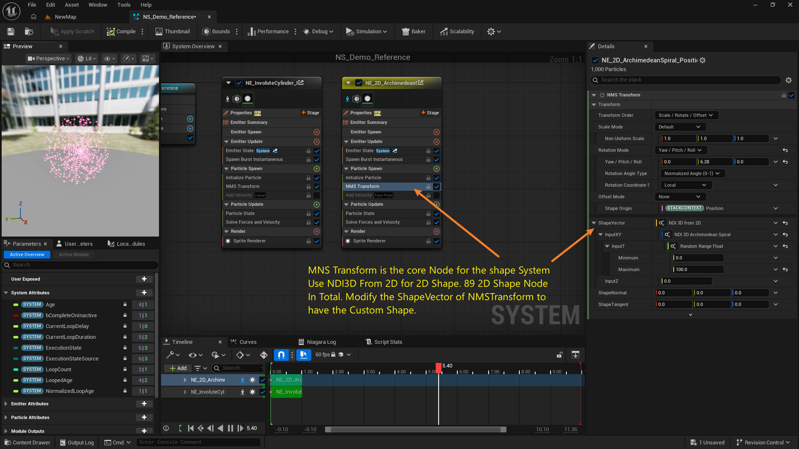
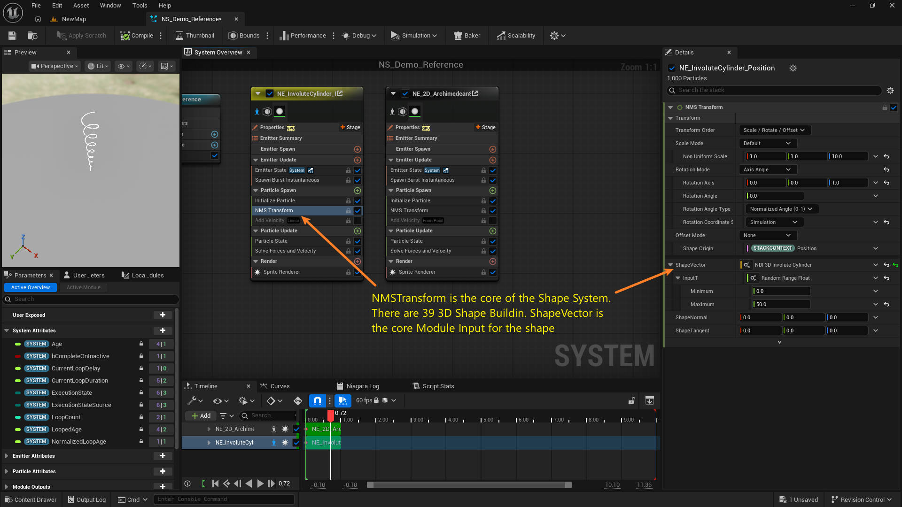
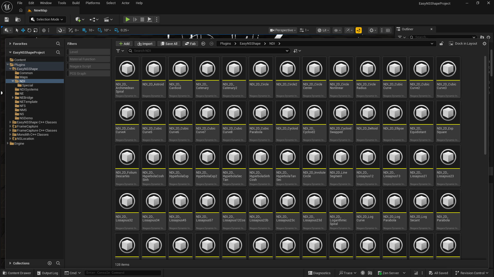
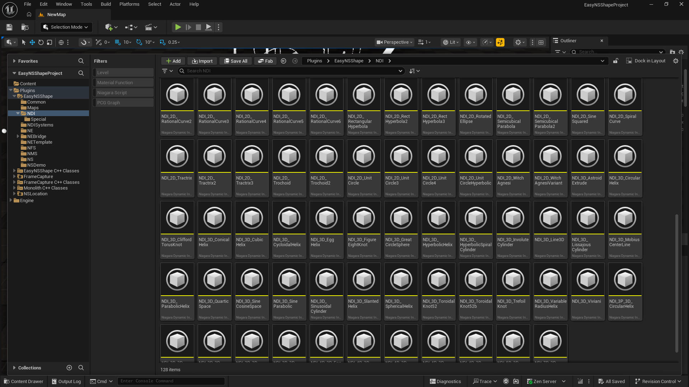

# EasyNSShape — Documentation

Documentation is available in two languages. 文档提供两种语言版本。

| Language / 语言 | Entry point / 入口 |
|---|---|
| English | [`en/`](en) — [`README.md`](en/README.md) · [`NDI_NE_Shapes.md`](en/NDI_NE_Shapes.md) · [`NETemplate_Assets.md`](en/NETemplate_Assets.md) |
| 中文 | [`cn/`](cn) — [`README.md`](cn/README.md) · [`NDI_NE_Shapes.md`](cn/NDI_NE_Shapes.md) · [`NETemplate_Assets.md`](cn/NETemplate_Assets.md) |

### Start here / 从这里开始

| Document | Contents |
|---|---|
| `README.md` | Plugin overview, pipeline, workflow, shape browser, console variables, output folders. |
| `NDI_NE_Shapes.md` | Catalogue of all 128 shapes — index + per-shape formula, assets, picture and video. |
| `NETemplate_Assets.md` | `NETemplate` template/module assets, `NMS_Transform`, and the 3 main node graphs. |

### Shared media / 共用媒体

The media below is shared by both languages and referenced from `en/` and `cn/` as `../<folder>/…`.
以下媒体由两种语言共用，`en/` 与 `cn/` 中通过 `../<目录>/…` 引用。

| Path | Contents |
|---|---|
| `Thumbs/` | 128 shape pictures — `<NS asset>.png`, 240×135, name burned in. 128 张形状图片。 |
| `Videos/` | 128 shape videos — `<NS asset>.mp4`, 1920×1080. 128 个形状视频。 |
| `TemplateNode/` | Node-graph screenshots of the 3 main nodes. 3 个主节点图截图。 |
| `AllShapes_Sheet01.png` · `AllShapes_Sheet02.png` | 8×8 contact sheets covering all 128 shapes (1920×1080). 覆盖全部形状的总览图。 |
| `AllShapes.mp4` | All 128 shapes merged into one 2:47 video. 全部形状的合并视频。 |

### Overview / 形状总览

### File type summary / 文件类型统计

| Type | Count |
|---|---|
| Niagara System | 134 |
| Niagara Emitter | 132 |
| Niagara Dynamic Input | 129 |
| Niagara Function Script | 128 |
| Niagara Module Script | 4 |
| **Total** | **527** |

### Node tutorials / 节点教程

### The replaceable NDI function list

Below the two templates' default dynamic inputs, the linked NDI function is the part you replace to change the shape.

| NDI function | Default template | Format |
|---|---|---|
| `NDI_2D_ArchimedeanSpiral` | `NE_2DShapeTemplate` (→ `FormularXY`) | Vector2D |
| `NDI_3D_AstroidExtrude` | `NE_3DShapeTemplate` (→ `Formular`) | Vector3D |

> Full list of all 128 replaceable NDI functions: see [`NDI_NE_Shapes.md`](en/NDI_NE_Shapes.md). 全部 128 个可替换 NDI 函数见 `NDI_NE_Shapes.md`。

### Watch online / 在线观看

- https://youtu.be/sP-1jeiqB6A
- https://www.bilibili.com/video/BV1GMhB6gEUE/
