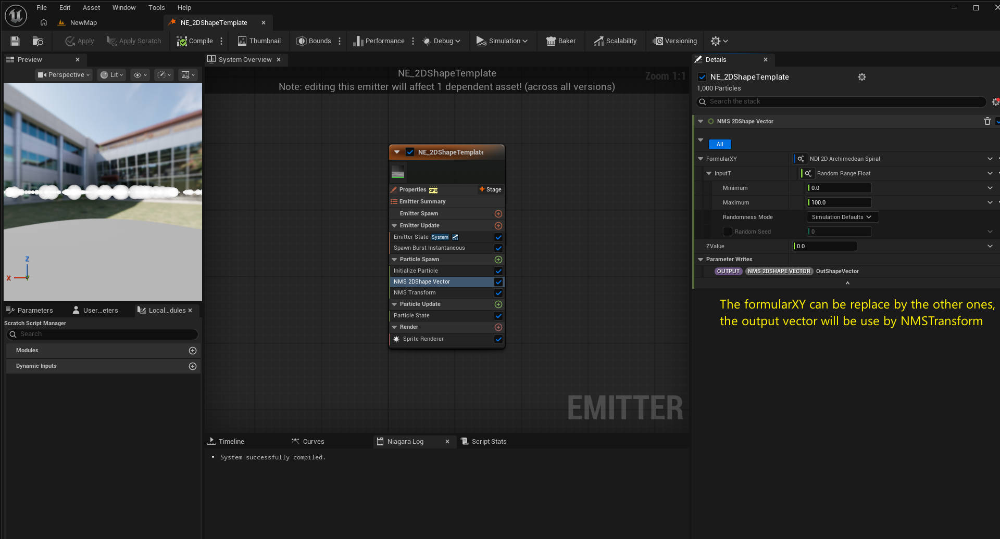
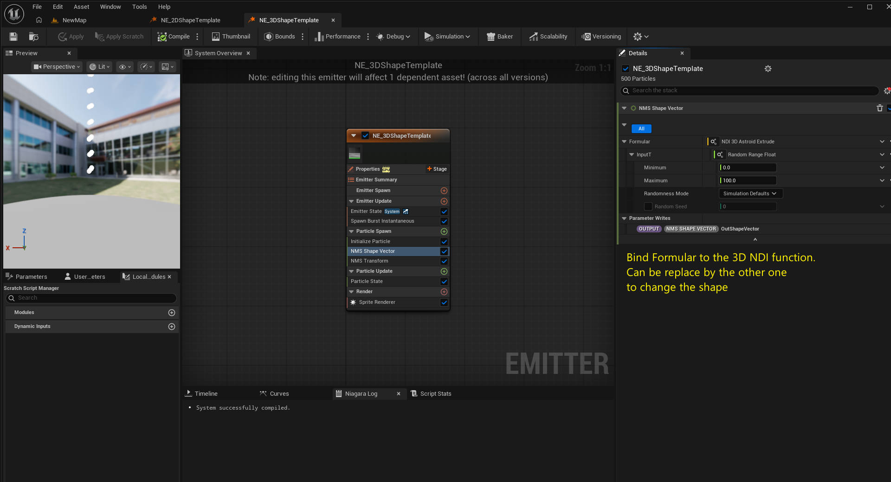
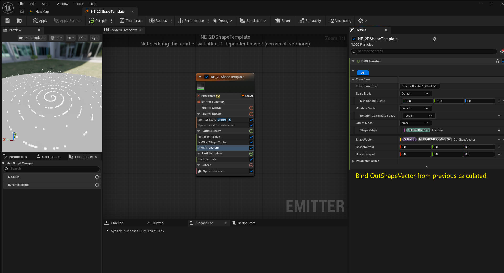

# EasyNSShape — `NETemplate` 资源参考

**NETemplate** · 模板资源参考

`Content/NETemplate/` 目录存放**所有形状共用的模板与驱动模块**。它本身不是一个形状，而是脚手架：
两个发射器模板、两个系统模板，以及两个读取 NDI 公式并写入形状向量的模块脚本。
第三个驱动模块 `NMS_Transform`（位于 `Content/Common/`）负责把该向量转换为最终的粒子位置。

| 资源 | 中文名称 | 类型 | 作用 |
|---|---|---|---|
| `NE_2DShapeTemplate` | 二维形状发射器模板 | Niagara Emitter | 二维发射器基础模板。 |
| `NE_3DShapeTemplate` | 三维形状发射器模板 | Niagara Emitter | 三维发射器基础模板。 |
| `NE_2DShapeTemplate_System` | 二维形状系统模板 | Niagara System | 承载二维发射器模板的系统。 |
| `NE_3DShapeTemplate_System` | 三维形状系统模板 | Niagara System | 承载三维发射器模板的系统。 |
| `NMS_2DShapeVector` | 二维形状向量模块 | Niagara Module Script | 读取二维动态输入，写入 `float2`。 |
| `NMS_ShapeVector` | 三维形状向量模块 | Niagara Module Script | 读取三维动态输入，写入 `float3`。 |
| `NMS_Transform` | 形状变换模块 | Niagara Module Script | 把形状向量转换为最终粒子位置（缩放 / 旋转 / 平移）。位于 `Content/Common/`。 |

> 每个形状的发射器（`NE_2DShapeTemplate_<Shape>` / `NE_3DShapeTemplate_<Shape>`）位于
> `Content/NEBridge/NE/`，由这些模板构建；NDI 脚本位于 `Content/NDI/`。
> 完整清单见 [`NDI_NE_Shapes.md`](NDI_NE_Shapes.md)。

---

## `NMS_2DShapeVector` — 二维形状向量模块

| 字段 | 值 |
|---|---|
| 路径 | `/EasyNSShape/NETemplate/NMS_2DShapeVector` |
| 类型 | Niagara Module Script (function script) |
| 有效阶段 | `particle_spawn`, `particle_update` |
| 分类 | `Default` |
| 模块用途位掩码 | `250` |

| 输入 | 类型 | 说明 |
|---|---|---|
| `Module.FormularXY` | Dynamic Input (Vector2D) | 每个形状的二维公式（连接的 `NDI_2D_<Shape>` 脚本）。 |
| `Module.ZValue` | float | 应用于二维结果的可选 Z 偏移。 |

**行为**：在 `InputT` 处采样动态输入，将结果 `float2`（加 `ZValue`）写入粒子位置。

---

## `NMS_ShapeVector` — 三维形状向量模块

| 字段 | 值 |
|---|---|
| 路径 | `/EasyNSShape/NETemplate/NMS_ShapeVector` |
| 类型 | Niagara Module Script (function script) |
| 有效阶段 | `particle_spawn`, `particle_update` |
| 分类 | `Default` |
| 模块用途位掩码 | `250` |

| 输入 | 类型 | 说明 |
|---|---|---|
| `Module.Formular` | Dynamic Input (Vector3D) | 每个形状的三维公式（连接的 `NDI_3D_<Shape>` 脚本）。 |

**行为**：在 `InputT` 处采样动态输入，将 `float3` 写入粒子位置。

> 浏览器子系统通过查找名为 `NMS_2DShapeVector`（引脚名以 `FormularXY` 结尾）或 `NMS_ShapeVector`
> （引脚名以 `Formular` 结尾）的函数调用节点，并读取其动态输入的 `CustomHlsl` 文本。

---

## `NMS_Transform` — 形状变换模块

| 字段 | 值 |
|---|---|
| 路径 | `/EasyNSShape/Common/NMS_Transform` |
| 类型 | Niagara Module Script (function script) |
| 有效阶段 | `particle_spawn`, `particle_update` |
| 分类 | `Default` |
| 库可见性 | `Library` |

第三个驱动模块。`NMS_2DShapeVector` / `NMS_ShapeVector` 产出**形状点**，`NMS_Transform`
通过缩放、旋转、平移把它转换为**最终粒子位置**并写回参数图。两个发射器模板都会调用它。

| 输入 | 类型 | 说明 |
|---|---|---|
| `Module.ShapeVector` | Vector | 来自 `NMS_2DShapeVector` / `NMS_ShapeVector` 的形状点。 |
| `Module.ShapeTangent` | Vector | 形状点处的切线（用于 ribbon / 切线对齐）。 |
| `Module.ShapeNormal` | Vector | 形状点处的法线。 |
| `Module.Offset` | Vector | 应用于形状的平移量。 |
| `Module.Offset Coordinate Space` | `ENiagara_OffsetMode` | 偏移量所应用的空间。 |
| `Module.Non Uniform Scale` | Vector | 逐轴缩放。 |
| `Module.Apply Owner Scale` | bool | 是否把所属对象的缩放计入结果。 |
| `Module.Rotation Matrix` | Matrix | 旋转模式为 Matrix 时使用的旋转。 |
| `Module.Rotation Quaternion` | Quaternion | 旋转模式为 Quaternion 时使用的旋转。 |
| `Module.Invert Rotation Quaternion` | bool | 反转传入的四元数。 |
| `Module.Custom Transform Matrix` | Matrix | 完整变换矩阵，供自定义矩阵路径使用。 |

| 输出 | 类型 | 说明 |
|---|---|---|
| `OutPosition` | Vector | 最终粒子位置。 |
| `OutVector` | Vector | 属性路径使用的变换后向量。 |

| 开关 | 选项 |
|---|---|
| `Apply` | `None`, `Apply To Particle Position`, `Apply To Attributes` |
| `Custom Matrix` | `Default`, `Custom Full Transform Matrix Position`, `Custom Full Transform Matrix Shape Attributes (Normal, etc)` |
| `Transform Order` | `Scale / Offset / Rotate`, `Scale / Rotate / Offset` (`ENiagara_TransformOrder`) |
| `Transform Method` | 变换栈 vs. 完整自定义矩阵（`ENiagara_TransformType`） |
| `Scale Mode` / `Offset Mode` / `Rotation Mode` | `ENiagara_ScaleMode` / `ENiagara_OffsetMode` / `ENiagara_RotationMode` |
| `Rotation Angle Type` | `ENiagara_AngleInput` |
| `Additional Yaw / Pitch / Roll` | 在主旋转之上叠加的额外欧拉旋转 |
| `Additional Quaternion Rotation` | 在主旋转之上叠加的额外四元数旋转 |

**行为**：缩放 → 旋转 → 平移的顺序执行；缩放总是最先执行（不支持错切）。`Transform Order`
决定平移发生在旋转之前还是之后：先平移后旋转可让旋转可预测，先旋转后平移可让平移方向可预测。
启用 `Custom Matrix` 时跳过变换栈，直接使用完整矩阵。

---

## `NE_2DShapeTemplate` — 二维形状发射器模板

| 字段 | 值 |
|---|---|
| 路径 | `/EasyNSShape/NETemplate/NE_2DShapeTemplate` |
| 类型 | Niagara Emitter |
| 作用 | 二维发射器基础模板：生成粒子、驱动 `NMS_2DShapeVector`、渲染曲线。 |
| 备注 | 使用 `Emitter.InterpolatedSpawn`。每个形状的发射器由它创建。 |

---

## `NE_3DShapeTemplate` — 三维形状发射器模板

| 字段 | 值 |
|---|---|
| 路径 | `/EasyNSShape/NETemplate/NE_3DShapeTemplate` |
| 类型 | Niagara Emitter |
| 作用 | 三维发射器基础模板：生成粒子、驱动 `NMS_ShapeVector`、渲染曲线。 |
| 备注 | 使用 `Emitter.InterpolatedSpawn`。每个形状的发射器由它创建。 |

---

## `NE_2DShapeTemplate_System` — 二维形状系统模板

| 字段 | 值 |
|---|---|
| 路径 | `/EasyNSShape/NETemplate/NE_2DShapeTemplate_System` |
| 类型 | Niagara System |
| 作用 | 承载二维发射器的最小系统，是 `NS_2D_<Shape>` 的起点。 |

---

## `NE_3DShapeTemplate_System` — 三维形状系统模板

| 字段 | 值 |
|---|---|
| 路径 | `/EasyNSShape/NETemplate/NE_3DShapeTemplate_System` |
| 类型 | Niagara System |
| 作用 | 承载三维发射器的最小系统，是 `NS_3D_<Shape>` 的起点。 |

---

## 节点图

这三个节点图是**整个系统的核心节点** — 两个发射器模板与共用的变换模块。
每个形状资源都是其中某个图的副本，只是连接了不同的 NDI。

### `NE_2DShapeTemplate`



二维形状发射器模板图：生成一批粒子，通过 `NMS_2DShapeVector` 求值所连接的二维 NDI，
再用 `NMS_Transform` 变换结果，最后由 sprite 渲染器绘制曲线。默认动态输入为 `NDI_2D_ArchimedeanSpiral`。

### `NE_3DShapeTemplate`



三维形状发射器模板图：结构与二维模板一致，但驱动的是 `NMS_ShapeVector`（返回 `float3`）。
默认动态输入为 `NDI_3D_AstroidExtrude`。

### `NMS_Transform`



变换模块图：接收 `Module.ShapeVector`（以及切线 / 法线），经过上文所述的
缩放 → 旋转 → 平移 流程后输出 `OutPosition` / `OutVector`。它是两个发射器模板唯一共用的模块。

### 模块栈

两个发射器模板的模块栈相同，区别仅在于调用的向量模块与连接的 NDI。

| 阶段 | 模块 | 说明 |
|---|---|---|
| Emitter Spawn | `EmitterState` | 发射器生命周期。 |
| Emitter Update | `SpawnBurst_Instantaneous` | 每个循环一次瞬时粒子爆发。 |
| Particle Spawn | `InitializeParticle` | 标准粒子初始化。 |
| Particle Spawn | `NMS_2DShapeVector` *(2D)* / `NMS_ShapeVector` *(3D)* | 在 `InputT` 处求值所连接的 NDI。 |
| Particle Spawn | `NMS_Transform` | 形状点 → 最终粒子位置。 |
| Particle Update | `ParticleState` | 生命周期 / 状态处理。 |

**渲染器**：`NiagaraSpriteRendererProperties` 与 `/Niagara/DefaultAssets/DefaultSpriteMaterial`。
两个模板均启用了 `Emitter.InterpolatedSpawn`。

---

## 模板关系

```
NE_2DShapeTemplate ──▶ NE_2DShapeTemplate_<Shape> ──▶ NS_2D_<Shape>
        (template)              (per-shape NE)             (per-shape NS)
              │
              ├─ NMS_2DShapeVector ◀── FormularXY ◀── NDI_2D_<Shape> ◀── NFS2D_<Shape>
              └─ NMS_Transform ──▶ OutPosition  (final particle position)

NE_3DShapeTemplate ──▶ NE_3DShapeTemplate_<Shape> ──▶ NS_3D_<Shape>
        (template)              (per-shape NE)             (per-shape NS)
              │
              ├─ NMS_ShapeVector ◀──── Formular ──── NDI_3D_<Shape> ◀── NFS3D_<Shape>
              └─ NMS_Transform ──▶ OutPosition  (final particle position)
```
