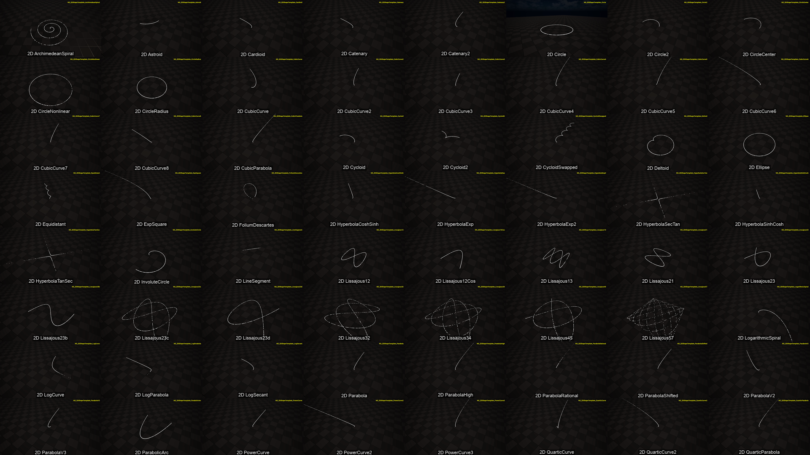
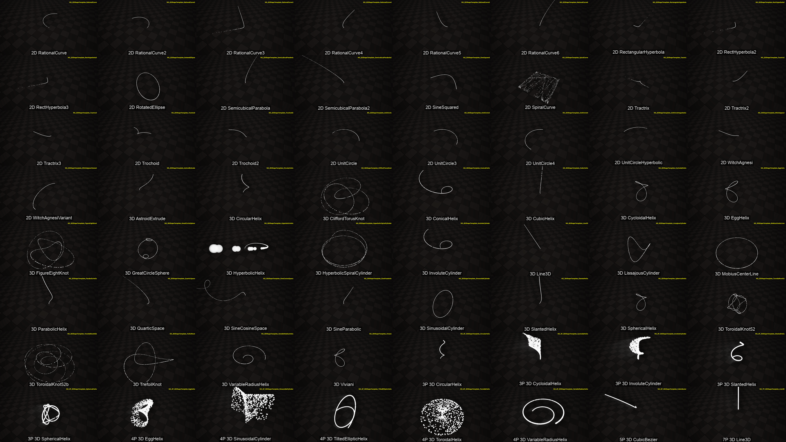

# EasyNSShape — 插件文档

**EasyNSShape** · 100+ Niagara 参数曲线形状插件

> 该插件把**参数方程**变成 Niagara GPU 粒子形状。每个形状都是一段 HLSL 表达式
> `f(t) -> position`，封装为 Niagara *动态输入（Dynamic Input）*，再由可复用的发射器
> 与系统消费，最终形成可浏览的 2D / 3D 曲线形状库。

形状清单见 [`NDI_NE_Shapes.md`](NDI_NE_Shapes.md)（共 128 个形状 — 2D 89 个、3D 27 个、多参数 3D 12 个）。

### 形状总览

全部 128 个形状的两张 8×8 总览图 — 每个形状一帧，图中已标注名称。

[](../AllShapes_Sheet01.png)

*图 1 — 第 1–64 格：2D 曲线 `ArchimedeanSpiral` → `UnitCircleHyperbolic`。*

[](../AllShapes_Sheet02.png)

*图 2 — 第 65–128 格：`WitchAgnesi` → 3D 形状 → 12 个多参数形状 → `7P Line3D`。*

完整合并视频：[`AllShapes.mp4`](../AllShapes.mp4) — 2:47，1920×1080，88 MB。

在线观看：https://youtu.be/sP-1jeiqB6A · https://www.bilibili.com/video/BV1GMhB6gEUE/

### 文档索引

| 文件                                                                                                      | 内容                                                                                          |
|-----------------------------------------------------------------------------------------------------------|-----------------------------------------------------------------------------------------------|
| [`README.md`](README.md)                                                                                  | 本文件 — 插件概览、管线、工作流、浏览器、控制台变量。                                              |
| [`NETemplate_Assets.md`](NETemplate_Assets.md)                                                            | `NETemplate` 模板/模块资源详解，以及 3 个主节点图。                                             |
| [`TemplateNode/`](../TemplateNode)                                                                        | 3 个主节点的节点图截图（`NE_2DShapeTemplate`、`NE_3DShapeTemplate`、`NMS_Transform`）。            |
| [`NDI_NE_Shapes.md`](NDI_NE_Shapes.md)                                                                    | 全部 128 个形状的索引与逐形状详情（图片 + 视频链接）。                                           |
| [`Thumbs/`](../Thumbs)                                                                                    | 128 张形状图片（`<NS asset>.png`，240×135，已标注名称），嵌入 `NDI_NE_Shapes.md` 并用于合成总览图。 |
| [`Videos/`](../Videos)                                                                                    | 128 个形状视频（`<NS asset>.mp4`，1920×1080）；需要 FrameCapture 插件才能生成新的视频。            |
| [`AllShapes_Sheet01.png`](../AllShapes_Sheet01.png) · [`AllShapes_Sheet02.png`](../AllShapes_Sheet02.png) | 覆盖全部 128 个形状的 8×8 总览图（1920×1080）。                                                  |

---

## 1. 运行要求

| 要求                        | 说明                                                                             |
|-----------------------------|----------------------------------------------------------------------------------|
| Unreal Engine 5.8           | 自定义构建；插件使用 `BuildSettingsVersion.V7`、`IncludeOrderVersion = Unreal5_8`。 |
| Niagara 插件                | 核心依赖 — 形状本身即 Niagara 发射器/系统。                                       |
| FrameCapture 插件（**可选**） | 仅录制视频时需要。缺失时模块仍可编译，浏览器控件的 **Record** 按钮会被隐藏。        |
| Slate / UMG / UnrealEd      | 编辑器模块（`EasyNSShapeEditor`）承载形状浏览器控件。                               |

`FrameCapture` 为**可选**依赖：缺少该插件时模块仍可编译，浏览器的 **Record** 按钮会被隐藏。

---

## 2. 模块结构

| 模块                | 类型    | 加载阶段         | 用途                                           |
|---------------------|---------|------------------|------------------------------------------------|
| `EasyNSShape`       | Runtime | `Default`        | 形状资源所需的运行时辅助代码。                  |
| `EasyNSShapeEditor` | Editor  | `PostEngineInit` | 形状浏览器子系统 + UMG 控件，以及截图/录制工具。 |

---

## 3. 资源类型

| 前缀         | 目录                   | Unreal 类型                    | 作用                                                                                                  |
|--------------|------------------------|--------------------------------|-------------------------------------------------------------------------------------------------------|
| `NFS`        | `Content/NFS/`         | Niagara Function Script        | 公式源函数（以节点图表示的公式）。                                                                       |
| `NDI`        | `Content/NDI/`         | Niagara Script (Dynamic Input) | 把公式封装为 `CustomHlsl` 节点；**每个形状一个**。                                                      |
| `NMS`        | `Content/NETemplate/`  | Niagara Module Script          | 通用驱动模块，采样 NDI 并写入形状向量。                                                                 |
| `NE`         | `Content/NEBridge/NE/` | Niagara Emitter                | 沿形状生成粒子的发射器；**每个形状一个**。                                                              |
| `NS`         | `Content/NEBridge/NS/` | Niagara System                 | 包裹一个 NE 的开箱即用系统；**每个形状一个**。                                                          |
| `NETemplate` | `Content/NETemplate/`  | 混合                           | 基础模板（`NE_2DShapeTemplate`、`NE_3DShapeTemplate`）与驱动模块（`NMS_2DShapeVector`、`NMS_ShapeVector`）。 |

`NFS` = 公式源函数；`NDI` = 动态输入脚本（每个形状一个）；`NMS` = 通用驱动模块；
`NE` = 发射器（每个形状一个）；`NS` = 系统（每个形状一个）。

12 个多参数 3D 形状（`3P` / `4P` / `5P` / `7P`）存放在 `Special/` 子目录中，除 `InputT` 外还暴露
`InputU`/`InputV`、`InputA`…`InputC`、`InputR`/`InputRho`/`InputN`、`InputP0`…`InputP3` 等额外输入。

### `Content/NETemplate/` 目录

| 资源                        | 类型                  | 作用                                                               |
|-----------------------------|-----------------------|--------------------------------------------------------------------|
| `NE_2DShapeTemplate`        | Niagara Emitter       | 二维发射器基础模板；各形状的 `NE_2DShapeTemplate_<Shape>` 由它构建。 |
| `NE_3DShapeTemplate`        | Niagara Emitter       | 三维发射器基础模板；各形状的 `NE_3DShapeTemplate_<Shape>` 由它构建。 |
| `NE_2DShapeTemplate_System` | Niagara System        | 承载二维发射器的系统模板。                                          |
| `NE_3DShapeTemplate_System` | Niagara System        | 承载三维发射器的系统模板。                                          |
| `NMS_2DShapeVector`         | Niagara Module Script | 读取二维动态输入并写入 `OutVector2D`。                              |
| `NMS_ShapeVector`           | Niagara Module Script | 读取三维动态输入并写入形状向量。                                    |

---

## 4. 数据流

```
        formula (HLSL)                       per-shape
  ┌──────────────────────┐        ┌──────────────────────────┐
  │ NFS2D_<Shape>        │        │ NDI_2D_<Shape>           │
  │ (function script)    │───────▶│ CustomHlsl: f(InputT)    │
  └──────────────────────┘        └────────────┬─────────────┘
                                               │ linked to "FormularXY" / "Formular"
                                               ▼
                              ┌────────────────────────────────┐
                              │ NMS_2DShapeVector              │  (NMS_ShapeVector for 3D)
                              │ driver module script           │
                              └───────────────┬────────────────┘
                                              ▼
                              ┌────────────────────────────────┐
                              │ NE_2DShapeTemplate_<Shape>     │  emitter
                              │  → NS_2D_<Shape>               │  system
                              └────────────────────────────────┘
```

- 二维形状从正上方俯视；三维形状以 `(-300,-300,250)` 一类的偏移环绕观察。
- `NMS_2DShapeVector` 的输入引脚为 `FormularXY`，`NMS_ShapeVector` 为 `Formular`；
  浏览器子系统通过读取动态输入的 `CustomHlsl` 文本显示公式。

---

## 5. 新增形状步骤

1. 编写公式：返回 `float2`（2D）或 `float3`（3D），参数使用 `InputT`。
2. 创建 **NDI** 动态输入（例如 `NDI_2D_MyCurve`）并写入公式。
3. 由 `NE_2DShapeTemplate` 创建 **NE** 发射器 `NE_2DShapeTemplate_MyCurve`，并把 NDI 连接到
   `NMS_2DShapeVector` 的 `FormularXY` 输入。
4. 创建 **NS** 系统 `NS_2D_MyCurve` 包裹该发射器。
5. 放入演示地图后重新生成形状清单 `NDI_NE_Shapes.md`。

---

## 6. 形状浏览器

`UEasyNSShapeBrowserSubsystem`（编辑器模块）把场景中的全部 `ANiagaraActor` 停在同一位置，
逐一切换显示并自动取景；`UEasyNSShapeBrowserWidget` 是屏幕 HUD：
**[Prev] [Snapshot] [AutoRotate] [Record] [Next]**，并显示当前形状名称与公式。

| 控件            | 作用                                                                 |
|-----------------|----------------------------------------------------------------------|
| `Prev` / `Next` | 切换形状                                                             |
| `Snapshot`      | 手动截图 → `NSShapeDocs/ScreenShots/<Name>_fix.png`                  |
| `AutoRotate`    | 切换 `EasyNSShape.CameraOrbit`                                       |
| `Record`        | 通过 FrameCapture 开始/停止录制 — **仅当安装了 FrameCapture 时显示** |

### 控制台变量与命令

| 名称                                 | 默认值 | 用途                                  |
|--------------------------------------|--------|---------------------------------------|
| `EasyNSShape.AutoCapture`            | `0`    | 遍历每个形状并各写出一张截图。         |
| `EasyNSShape.AutoRecord`             | `0`    | 与 AutoCapture 配合：录制视频而非截图。 |
| `EasyNSShape.CameraOrbit`            | `0`    | 自动环绕取景相机。                     |
| `EasyNSShape.CameraOrbitSpeed`       | `20`   | 环绕速度，度/秒。                       |
| `EasyNSShape.CameraMouseSensitivity` | `0.25` | 每像素拖拽对应的环绕角度。             |
| `EasyNSShape.Snapshot`               | —      | 控制台命令：手动截取当前形状。          |

`EasyNSShape.AutoCapture` 必须在进入 PIE **之前**设置：子系统在 `OnWorldBeginPlay` 中启用该流程，
因此在 PIE 期间输入命令不会启动新的遍历。

---

## 7. 可选录制

录制功能依赖第三方 **FrameCapture** 插件。该依赖在构建期是可选的：

- `EasyNSShapeEditor.Build.cs` 会查找 `Plugins/FrameCapture/FrameCapture.uplugin`（项目或引擎），
  并检查 `.uproject` 中是否被设为 `"Enabled": false`；只有满足条件时才定义
  `EASYNS_WITH_FRAMECAPTURE=1` 并链接该模块。
- 若该插件缺失或被禁用，`StartVideoRecording()` 返回 `false` 并输出警告，
  且 `UEasyNSShapeBrowserWidget` 不会创建 **Record** 按钮。

---

## 8. 输出目录

| 路径                                       | 内容                                                      |
|--------------------------------------------|-----------------------------------------------------------|
| `NSShapeDocs/ScreenShots/`                 | 每个形状一张 PNG（自动遍历）+ `<Name>_fix.png`（手动）。       |
| `NSShapeDocs/ScreenShots/Thumbnails/`      | 256×256 缩略图（居中裁剪）。                                 |
| `NSShapeDocs/Videos/`                      | 录制的 `.mp4` 文件（需要 FrameCapture）。                    |
| `NSShapeDocs/Thumbs/`                      | 每个视频一张 240×135 图片，每个形状一张（离线 ffmpeg 处理）。 |
| `NSShapeDocs/AllShapes_Sheet01.png` · `02` | 由 `Thumbs/` 合成的 8×8 总览图（1920×1080）。                |
