# EasyNSShape — NDI / NE Shape Reference


Complete reference for every shape shipped in the `EasyNSShape` plugin. Each shape is one **NDI** dynamic-input script (the parametric formula) plus one **NE** emitter that consumes it. Section 1 lists the plugin pipeline; the per-shape entries follow.


Legend: **Formula** = HLSL body of the NDI `CustomHlsl` node, **NDI** = dynamic input script, **NE** = emitter, **NS** = system, **NFS** = source function script.

## 1. Pipeline

```
formula (HLSL)  ->  NDI dynamic input  ->  NMS driver module  ->  NE emitter  ->  NS system
公式(HLSL)          NDI 动态输入            NMS 驱动模块          NE 发射器      NS 系统
```

| Asset type | Folder | Unreal type | Role |
|---|---|---|---|
| NDI (dynamic input) | `/EasyNSShape/NDI/` | Niagara Script | `CustomHlsl` node evaluating `f(InputT)`; **one per shape**. |
| NFS (source function) | `/EasyNSShape/NFS/` | Niagara Function Script | Source math function the NDI was derived from. |
| NMS (driver module) | `/EasyNSShape/NETemplate/` | Niagara Module Script | `NMS_2DShapeVector` (input `FormularXY`, `ZValue`) / `NMS_ShapeVector` (input `Formular`). |
| NE (emitter) | `/EasyNSShape/NEBridge/NE/` | Niagara Emitter | Spawns particles along the shape; **one per shape**. |
| NS (system) | `/EasyNSShape/NEBridge/NS/` | Niagara System | Ready-to-drop system wrapping one NE; **one per shape**. |


## 2D Shape Index (89)

| EN | Formula (HLSL) | NDI | NE | NS | NFS |
|---|---|---|---|---|---|
| Archimedean spiral — radius grows linearly with the angle. | `OutVector2D = float2(InputT * cos(InputT), InputT * sin(InputT))` | `NDI_2D_ArchimedeanSpiral` | `NE_2DShapeTemplate_ArchimedeanSpiral` | `NS_2D_ArchimedeanSpiral` | `NFS2D_ArchimedeanSpiral` |
| Four-cusped hypocycloid (star curve). | `float2(pow(cos(InputT), 3.0), pow(sin(InputT), 3.0))` | `NDI_2D_Astroid` | `NE_2DShapeTemplate_Astroid` | `NS_2D_Astroid` | `NFS2D_Astroid` |
| Cardioid (heart-shaped curve). | `float2(cosh(InputT), InputT)` | `NDI_2D_Cardioid` | `NE_2DShapeTemplate_Cardioid` | `NS_2D_Cardioid` | `NFS2D_Cardioid` |
| Catenary — the shape of a hanging chain (cosh). | `float2(cosh(InputT), InputT)` | `NDI_2D_Catenary` | `NE_2DShapeTemplate_Catenary` | `NS_2D_Catenary` | `NFS2D_Catenary` |
| Catenary with the axes swapped. | `float2(InputT, cosh(InputT))` | `NDI_2D_Catenary2` | `NE_2DShapeTemplate_Catenary2` | `NS_2D_Catenary2` | `NFS2D_Catenary2` |
| Unit circle traced by cos/sin. | `float2(cos(InputT), sin(InputT))` | `NDI_2D_Circle` | `NE_2DShapeTemplate_Circle` | `NS_2D_Circle` | `NFS2D_Circle` |
| Rational-parameterised circle. | `float2(1.0/(1.0+InputT*InputT), InputT/(1.0+InputT*InputT))` | `NDI_2D_Circle2` | `NE_2DShapeTemplate_Circle2` | `NS_2D_Circle2` | `NFS2D_Circle2` |
| Circle whose parameterisation is centred on the origin. | `float2(2.0*InputT*InputT/(1.0+InputT*InputT), 2.0*InputT/(1.0+InputT*InputT))` | `NDI_2D_CircleCenter` | `NE_2DShapeTemplate_CircleCenter` | `NS_2D_CircleCenter` | `NFS2D_CircleCenter` |
| Circle with a non-linear (quadratic) angle sweep. | `float2(sin(InputT*InputT), cos(InputT*InputT))` | `NDI_2D_CircleNonlinear` | `NE_2DShapeTemplate_CircleNonlinear` | `NS_2D_CircleNonlinear` | `NFS2D_CircleNonlinear` |
| Circle with a varying radius. | `float2(sin(InputT) + cos(InputT), sin(InputT) - cos(InputT))` | `NDI_2D_CircleRadius` | `NE_2DShapeTemplate_CircleRadius` | `NS_2D_CircleRadius` | `NFS2D_CircleRadius` |
| Cubic curve, standard form. | `float2(InputT*InputT*InputT-3.0*InputT, 3.0*InputT*InputT-3.0)` | `NDI_2D_CubicCurve` | `NE_2DShapeTemplate_CubicCurve` | `NS_2D_CubicCurve` | `NFS2D_CubicCurve` |
| Cubic curve, variant 2. | `float2(InputT*InputT+InputT, InputT*InputT*InputT+InputT)` | `NDI_2D_CubicCurve2` | `NE_2DShapeTemplate_CubicCurve2` | `NS_2D_CubicCurve2` | `NFS2D_CubicCurve2` |
| Cubic curve, variant 3. | `float2(InputT*InputT-InputT, InputT*InputT*InputT-InputT*InputT)` | `NDI_2D_CubicCurve3` | `NE_2DShapeTemplate_CubicCurve3` | `NS_2D_CubicCurve3` | `NFS2D_CubicCurve3` |
| Cubic curve, variant 4. | `float2(InputT * InputT, InputT * InputT * InputT - InputT)` | `NDI_2D_CubicCurve4` | `NE_2DShapeTemplate_CubicCurve4` | `NS_2D_CubicCurve4` | `NFS2D_CubicCurve4` |
| Cubic curve, variant 5. | `float2(InputT * InputT + 2.0, InputT * InputT * InputT + 3.0 * InputT)` | `NDI_2D_CubicCurve5` | `NE_2DShapeTemplate_CubicCurve5` | `NS_2D_CubicCurve5` | `NFS2D_CubicCurve5` |
| Cubic curve, variant 6. | `float2(InputT * InputT * InputT - InputT, InputT * InputT + 1.0)` | `NDI_2D_CubicCurve6` | `NE_2DShapeTemplate_CubicCurve6` | `NS_2D_CubicCurve6` | `NFS2D_CubicCurve6` |
| Cubic curve, variant 7. | `float2(InputT * InputT, InputT * InputT * InputT + InputT * InputT)` | `NDI_2D_CubicCurve7` | `NE_2DShapeTemplate_CubicCurve7` | `NS_2D_CubicCurve7` | `NFS2D_CubicCurve7` |
| Cubic curve, variant 8. | `float2(InputT * InputT * InputT + InputT, InputT * InputT - InputT)` | `NDI_2D_CubicCurve8` | `NE_2DShapeTemplate_CubicCurve8` | `NS_2D_CubicCurve8` | `NFS2D_CubicCurve8` |
| Cubic parabola (t, t^3). | `float2(InputT, InputT * InputT * InputT)` | `NDI_2D_CubicParabola` | `NE_2DShapeTemplate_CubicParabola` | `NS_2D_CubicParabola` | `NFS2D_CubicParabola` |
| Cycloid — path of a point on a rolling circle. | `float2(InputT-sin(InputT), 1.0-cos(InputT))` | `NDI_2D_Cycloid` | `NE_2DShapeTemplate_Cycloid` | `NS_2D_Cycloid` | `NFS2D_Cycloid` |
| Cycloid, variant with added sin/cos terms. | `float2(InputT+sin(InputT), 1.0+cos(InputT))` | `NDI_2D_Cycloid2` | `NE_2DShapeTemplate_Cycloid2` | `NS_2D_Cycloid2` | `NFS2D_Cycloid2` |
| Cycloid with the axes swapped. | `float2(1.0-cos(InputT), InputT-sin(InputT))` | `NDI_2D_CycloidSwapped` | `NE_2DShapeTemplate_CycloidSwapped` | `NS_2D_CycloidSwapped` | `NFS2D_CycloidSwapped` |
| Three-cusped hypocycloid (deltoid). | `float2(2.0*cos(InputT)-cos(2.0*InputT), 2.0*sin(InputT)-sin(2.0*InputT))` | `NDI_2D_Deltoid` | `NE_2DShapeTemplate_Deltoid` | `NS_2D_Deltoid` | `NFS2D_Deltoid` |
| Ellipse (here an axis-aligned unit circle parameterisation). | `float2(cos(InputT), sin(InputT))` | `NDI_2D_Ellipse` | `NE_2DShapeTemplate_Ellipse` | `NS_2D_Ellipse` | `NFS2D_Ellipse` |
| Equidistant curve (t + cos t, t + sin t). | `float2(InputT+cos(InputT), InputT+sin(InputT))` | `NDI_2D_Equidistant` | `NE_2DShapeTemplate_Equidistant` | `NS_2D_Equidistant` | `NFS2D_Equidistant` |
| Exponential vs. square curve. | `float2(exp(InputT), InputT*InputT)` | `NDI_2D_ExpSquare` | `NE_2DShapeTemplate_ExpSquare` | `NS_2D_ExpSquare` | `NFS2D_ExpSquare` |
| Folium of Descartes. | `float2(3.0*InputT/(1.0+InputT*InputT*InputT), 3.0*InputT*InputT/(1.0+InputT*InputT*InputT))` | `NDI_2D_FoliumDescartes` | `NE_2DShapeTemplate_FoliumDescartes` | `NS_2D_FoliumDescartes` | `NFS2D_FoliumDescartes` |
| Hyperbolic curve using cosh/sinh. | `float2(cosh(InputT), sinh(InputT))` | `NDI_2D_HyperbolaCoshSinh` | `NE_2DShapeTemplate_HyperbolaCoshSinh` | `NS_2D_HyperbolaCoshSinh` | `NFS2D_HyperbolaCoshSinh` |
| Hyperbola built from exp(t) and exp(-t). | `float2(exp(InputT), exp(-InputT))` | `NDI_2D_HyperbolaExp` | `NE_2DShapeTemplate_HyperbolaExp` | `NS_2D_HyperbolaExp` | `NFS2D_HyperbolaExp` |
| Hyperbola built from exp(t^2) and exp(-t^2). | `float2(exp(InputT * InputT), exp(-InputT * InputT))` | `NDI_2D_HyperbolaExp2` | `NE_2DShapeTemplate_HyperbolaExp2` | `NS_2D_HyperbolaExp2` | `NFS2D_HyperbolaExp2` |
| Hyperbolic curve using sec/tan. | `float2(1.0/cos(InputT), tan(InputT))` | `NDI_2D_HyperbolaSecTan` | `NE_2DShapeTemplate_HyperbolaSecTan` | `NS_2D_HyperbolaSecTan` | `NFS2D_HyperbolaSecTan` |
| Hyperbolic curve using sinh/cosh. | `float2(sinh(InputT), cosh(InputT))` | `NDI_2D_HyperbolaSinhCosh` | `NE_2DShapeTemplate_HyperbolaSinhCosh` | `NS_2D_HyperbolaSinhCosh` | `NFS2D_HyperbolaSinhCosh` |
| Hyperbolic curve using tan/sec. | `float2(tan(InputT), 1.0 / cos(InputT))` | `NDI_2D_HyperbolaTanSec` | `NE_2DShapeTemplate_HyperbolaTanSec` | `NS_2D_HyperbolaTanSec` | `NFS2D_HyperbolaTanSec` |
| Involute of a circle. | `float2(cos(InputT)+InputT*sin(InputT), sin(InputT)-InputT*cos(InputT))` | `NDI_2D_InvoluteCircle` | `NE_2DShapeTemplate_InvoluteCircle` | `NS_2D_InvoluteCircle` | `NFS2D_InvoluteCircle` |
| Line segment (asin/acos parameterisation). | `float2(asin(InputT), acos(InputT))` | `NDI_2D_LineSegment` | `NE_2DShapeTemplate_LineSegment` | `NS_2D_LineSegment` | `NFS2D_LineSegment` |
| Lissajous figure, frequency ratio 1:2. | `float2(sin(InputT), sin(2.0*InputT))` | `NDI_2D_Lissajous12` | `NE_2DShapeTemplate_Lissajous12` | `NS_2D_Lissajous12` | `NFS2D_Lissajous12` |
| Lissajous figure 1:2 using cosine. | `float2(sin(InputT), cos(2.0*InputT))` | `NDI_2D_Lissajous12Cos` | `NE_2DShapeTemplate_Lissajous12Cos` | `NS_2D_Lissajous12Cos` | `NFS2D_Lissajous12Cos` |
| Lissajous figure, frequency ratio 1:3. | `float2(sin(InputT), cos(3.0*InputT))` | `NDI_2D_Lissajous13` | `NE_2DShapeTemplate_Lissajous13` | `NS_2D_Lissajous13` | `NFS2D_Lissajous13` |
| Lissajous figure, frequency ratio 2:1. | `float2(sin(2.0*InputT), sin(InputT))` | `NDI_2D_Lissajous21` | `NE_2DShapeTemplate_Lissajous21` | `NS_2D_Lissajous21` | `NFS2D_Lissajous21` |
| Lissajous figure, frequency ratio 2:3. | `float2(cos(2.0*InputT), cos(3.0*InputT))` | `NDI_2D_Lissajous23` | `NE_2DShapeTemplate_Lissajous23` | `NS_2D_Lissajous23` | `NFS2D_Lissajous23` |
| Lissajous figure 2:3, variant B. | `float2(2.0*sin(InputT), sin(3.0*InputT))` | `NDI_2D_Lissajous23b` | `NE_2DShapeTemplate_Lissajous23b` | `NS_2D_Lissajous23b` | `NFS2D_Lissajous23b` |
| Lissajous figure 2:3, variant C. | `float2(sin(2.0*InputT), sin(3.0*InputT))` | `NDI_2D_Lissajous23c` | `NE_2DShapeTemplate_Lissajous23c` | `NS_2D_Lissajous23c` | `NFS2D_Lissajous23c` |
| Lissajous figure 2:3, variant D. | `float2(cos(2.0 * InputT), sin(3.0 * InputT))` | `NDI_2D_Lissajous23d` | `NE_2DShapeTemplate_Lissajous23d` | `NS_2D_Lissajous23d` | `NFS2D_Lissajous23d` |
| Lissajous figure, frequency ratio 3:2. | `float2(sin(3.0*InputT), sin(2.0*InputT))` | `NDI_2D_Lissajous32` | `NE_2DShapeTemplate_Lissajous32` | `NS_2D_Lissajous32` | `NFS2D_Lissajous32` |
| Lissajous figure, frequency ratio 3:4. | `float2(cos(3.0 * InputT), sin(4.0 * InputT))` | `NDI_2D_Lissajous34` | `NE_2DShapeTemplate_Lissajous34` | `NS_2D_Lissajous34` | `NFS2D_Lissajous34` |
| Lissajous figure, frequency ratio 4:5. | `float2(cos(4.0*InputT), sin(5.0*InputT))` | `NDI_2D_Lissajous45` | `NE_2DShapeTemplate_Lissajous45` | `NS_2D_Lissajous45` | `NFS2D_Lissajous45` |
| Lissajous figure, frequency ratio 5:7. | `float2(sin(5.0 * InputT), cos(7.0 * InputT))` | `NDI_2D_Lissajous57` | `NE_2DShapeTemplate_Lissajous57` | `NS_2D_Lissajous57` | `NFS2D_Lissajous57` |
| Logarithmic (equiangular) spiral. | `float2(exp(InputT) * cos(InputT), exp(InputT) * sin(InputT))` | `NDI_2D_LogarithmicSpiral` | `NE_2DShapeTemplate_LogarithmicSpiral` | `NS_2D_LogarithmicSpiral` | `NFS2D_LogarithmicSpiral` |
| Logarithmic curve (log t, t). | `float2(log(InputT), InputT)` | `NDI_2D_LogCurve` | `NE_2DShapeTemplate_LogCurve` | `NS_2D_LogCurve` | `NFS2D_LogCurve` |
| Log vs. parabolic curve (t^2, log t). | `float2(InputT*InputT, log(InputT))` | `NDI_2D_LogParabola` | `NE_2DShapeTemplate_LogParabola` | `NS_2D_LogParabola` | `NFS2D_LogParabola` |
| Log/arctangent curve. | `float2(log(InputT * InputT + 1.0), atan(InputT))` | `NDI_2D_LogSecant` | `NE_2DShapeTemplate_LogSecant` | `NS_2D_LogSecant` | `NFS2D_LogSecant` |
| Parabola (t, t^2). | `float2(InputT, InputT * InputT)` | `NDI_2D_Parabola` | `NE_2DShapeTemplate_Parabola` | `NS_2D_Parabola` | `NFS2D_Parabola` |
| High-order parabola (t^5, t^10). | `float2(pow(InputT, 5.0), pow(InputT, 10.0))` | `NDI_2D_ParabolaHigh` | `NE_2DShapeTemplate_ParabolaHigh` | `NS_2D_ParabolaHigh` | `NFS2D_ParabolaHigh` |
| Rational parabola with 1/t terms. | `float2(InputT + 1.0 / InputT, InputT * InputT + 1.0 / (InputT * InputT))` | `NDI_2D_ParabolaRational` | `NE_2DShapeTemplate_ParabolaRational` | `NS_2D_ParabolaRational` | `NFS2D_ParabolaRational` |
| Parabola shifted by +1 on both axes. | `float2(InputT + 1.0, (InputT + 1.0) * (InputT + 1.0))` | `NDI_2D_ParabolaShifted` | `NE_2DShapeTemplate_ParabolaShifted` | `NS_2D_ParabolaShifted` | `NFS2D_ParabolaShifted` |
| Parabola, variant 2. | `float2(InputT*InputT, InputT*InputT-2.0*InputT)` | `NDI_2D_ParabolaV2` | `NE_2DShapeTemplate_ParabolaV2` | `NS_2D_ParabolaV2` | `NFS2D_ParabolaV2` |
| Parabola, variant 3. | `float2(InputT, InputT*InputT-2.0*InputT)` | `NDI_2D_ParabolaV3` | `NE_2DShapeTemplate_ParabolaV3` | `NS_2D_ParabolaV3` | `NFS2D_ParabolaV3` |
| Parabolic arc (cos t, cos 2t). | `float2(cos(InputT), cos(2.0*InputT))` | `NDI_2D_ParabolicArc` | `NE_2DShapeTemplate_ParabolicArc` | `NS_2D_ParabolicArc` | `NFS2D_ParabolicArc` |
| Power curve (sqrt t, t^2). | `float2(sqrt(InputT), InputT*InputT)` | `NDI_2D_PowerCurve` | `NE_2DShapeTemplate_PowerCurve` | `NS_2D_PowerCurve` | `NFS2D_PowerCurve` |
| Power curve (t^3, sqrt t). | `float2(InputT*InputT*InputT, sqrt(InputT))` | `NDI_2D_PowerCurve2` | `NE_2DShapeTemplate_PowerCurve2` | `NS_2D_PowerCurve2` | `NFS2D_PowerCurve2` |
| Power curve (t^4, t^6). | `float2(pow(InputT, 4.0), pow(InputT, 6.0))` | `NDI_2D_PowerCurve3` | `NE_2DShapeTemplate_PowerCurve3` | `NS_2D_PowerCurve3` | `NFS2D_PowerCurve3` |
| Quartic curve. | `float2(InputT * InputT * InputT - 3.0 * InputT, pow(InputT, 4.0) - 2.0 * InputT * InputT)` | `NDI_2D_QuarticCurve` | `NE_2DShapeTemplate_QuarticCurve` | `NS_2D_QuarticCurve` | `NFS2D_QuarticCurve` |
| Quartic curve, variant 2. | `float2(pow(InputT, 4.0) - InputT * InputT, InputT * InputT * InputT)` | `NDI_2D_QuarticCurve2` | `NE_2DShapeTemplate_QuarticCurve2` | `NS_2D_QuarticCurve2` | `NFS2D_QuarticCurve2` |
| Quartic parabola (t^2, t^4). | `float2(InputT * InputT, pow(InputT, 4.0))` | `NDI_2D_QuarticParabola` | `NE_2DShapeTemplate_QuarticParabola` | `NS_2D_QuarticParabola` | `NFS2D_QuarticParabola` |
| Rational curve. | `float2(InputT/(1.0+InputT*InputT), InputT*InputT/(1.0+InputT*InputT))` | `NDI_2D_RationalCurve` | `NE_2DShapeTemplate_RationalCurve` | `NS_2D_RationalCurve` | `NFS2D_RationalCurve` |
| Rational curve, variant 2. | `float2(InputT*InputT/(1.0+InputT*InputT), InputT/(1.0+InputT*InputT))` | `NDI_2D_RationalCurve2` | `NE_2DShapeTemplate_RationalCurve2` | `NS_2D_RationalCurve2` | `NFS2D_RationalCurve2` |
| Rational curve, variant 3. | `float2(InputT*InputT+1.0/InputT, InputT*InputT-1.0/InputT)` | `NDI_2D_RationalCurve3` | `NE_2DShapeTemplate_RationalCurve3` | `NS_2D_RationalCurve3` | `NFS2D_RationalCurve3` |
| Rational curve, variant 4. | `float2(InputT*InputT/(1.0+InputT*InputT), InputT*InputT*InputT/(1.0+InputT*InputT))` | `NDI_2D_RationalCurve4` | `NE_2DShapeTemplate_RationalCurve4` | `NS_2D_RationalCurve4` | `NFS2D_RationalCurve4` |
| Rational curve, variant 5. | `float2((InputT*InputT*InputT-1.0)/(InputT*InputT+1.0), (InputT*InputT*InputT+1.0)/(InputT*InputT+1.0))` | `NDI_2D_RationalCurve5` | `NE_2DShapeTemplate_RationalCurve5` | `NS_2D_RationalCurve5` | `NFS2D_RationalCurve5` |
| Rational curve, variant 6. | `float2(InputT * InputT + 1.0 / (InputT * InputT), InputT * InputT * InputT + 1.0 / (InputT * InputT * InputT))` | `NDI_2D_RationalCurve6` | `NE_2DShapeTemplate_RationalCurve6` | `NS_2D_RationalCurve6` | `NFS2D_RationalCurve6` |
| Rectangular hyperbola (t, 1/t). | `float2(InputT, 1.0/InputT)` | `NDI_2D_RectangularHyperbola` | `NE_2DShapeTemplate_RectangularHyperbola` | `NS_2D_RectangularHyperbola` | `NFS2D_RectangularHyperbola` |
| Rectangular hyperbola, variant 2. | `float2(InputT+1.0/InputT, InputT-1.0/InputT)` | `NDI_2D_RectHyperbola2` | `NE_2DShapeTemplate_RectHyperbola2` | `NS_2D_RectHyperbola2` | `NFS2D_RectHyperbola2` |
| Rectangular hyperbola, variant 3. | `float2((InputT * InputT + 1.0) / InputT, (InputT * InputT - 1.0) / InputT)` | `NDI_2D_RectHyperbola3` | `NE_2DShapeTemplate_RectHyperbola3` | `NS_2D_RectHyperbola3` | `NFS2D_RectHyperbola3` |
| Rotated ellipse (sin t, sin(t + 60°)). | `float2(sin(InputT), sin(InputT + 1.0472))` | `NDI_2D_RotatedEllipse` | `NE_2DShapeTemplate_RotatedEllipse` | `NS_2D_RotatedEllipse` | `NFS2D_RotatedEllipse` |
| Semicubical parabola (t^2, t^3). | `float2(InputT * InputT, InputT * InputT * InputT)` | `NDI_2D_SemicubicalParabola` | `NE_2DShapeTemplate_SemicubicalParabola` | `NS_2D_SemicubicalParabola` | `NFS2D_SemicubicalParabola` |
| Semicubical parabola, axes swapped. | `float2(InputT*InputT*InputT, InputT*InputT)` | `NDI_2D_SemicubicalParabola2` | `NE_2DShapeTemplate_SemicubicalParabola2` | `NS_2D_SemicubicalParabola2` | `NFS2D_SemicubicalParabola2` |
| Sine-squared curve (cos t, sin²t). | `float2(cos(InputT), sin(InputT)*sin(InputT))` | `NDI_2D_SineSquared` | `NE_2DShapeTemplate_SineSquared` | `NS_2D_SineSquared` | `NFS2D_SineSquared` |
| Spiral curve (cos πt, sin πt²). | `float2(cos(3.14159 * InputT), sin(3.14159 * InputT * InputT))` | `NDI_2D_SpiralCurve` | `NE_2DShapeTemplate_SpiralCurve` | `NS_2D_SpiralCurve` | `NFS2D_SpiralCurve` |
| Tractrix (pursuit curve). | `float2(cos(InputT)+log(tan(InputT*0.5)), sin(InputT))` | `NDI_2D_Tractrix` | `NE_2DShapeTemplate_Tractrix` | `NS_2D_Tractrix` | `NFS2D_Tractrix` |
| Tractrix, variant 2. | `float2(1.0/cosh(InputT), InputT-tanh(InputT))` | `NDI_2D_Tractrix2` | `NE_2DShapeTemplate_Tractrix2` | `NS_2D_Tractrix2` | `NFS2D_Tractrix2` |
| Tractrix, variant 3. | `float2(InputT - tanh(InputT), 1.0 / cosh(InputT))` | `NDI_2D_Tractrix3` | `NE_2DShapeTemplate_Tractrix3` | `NS_2D_Tractrix3` | `NFS2D_Tractrix3` |
| Trochoid (extended cycloid). | `float2(InputT+sin(InputT), 1.0+cos(InputT))` | `NDI_2D_Trochoid` | `NE_2DShapeTemplate_Trochoid` | `NS_2D_Trochoid` | `NFS2D_Trochoid` |
| Trochoid, variant 2. | `float2(2.0*InputT-sin(InputT), 2.0-cos(InputT))` | `NDI_2D_Trochoid2` | `NE_2DShapeTemplate_Trochoid2` | `NS_2D_Trochoid2` | `NFS2D_Trochoid2` |
| Rational unit circle. | `float2((1.0-InputT*InputT)/(1.0+InputT*InputT), 2.0*InputT/(1.0+InputT*InputT))` | `NDI_2D_UnitCircle` | `NE_2DShapeTemplate_UnitCircle` | `NS_2D_UnitCircle` | `NFS2D_UnitCircle` |
| Rational unit circle, variant 3. | `float2((InputT * InputT - 1.0) / (InputT * InputT + 1.0), 2.0 * InputT / (InputT * InputT + 1.0))` | `NDI_2D_UnitCircle3` | `NE_2DShapeTemplate_UnitCircle3` | `NS_2D_UnitCircle3` | `NFS2D_UnitCircle3` |
| Rational unit circle, variant 4. | `float2(2.0 * InputT / (InputT * InputT + 1.0), (InputT * InputT - 1.0) / (InputT * InputT + 1.0))` | `NDI_2D_UnitCircle4` | `NE_2DShapeTemplate_UnitCircle4` | `NS_2D_UnitCircle4` | `NFS2D_UnitCircle4` |
| Hyperbolic unit circle (tanh, sech). | `float2(tanh(InputT), 1.0 / cosh(InputT))` | `NDI_2D_UnitCircleHyperbolic` | `NE_2DShapeTemplate_UnitCircleHyperbolic` | `NS_2D_UnitCircleHyperbolic` | `NFS2D_UnitCircleHyperbolic` |
| Witch of Agnesi. | `float2(InputT, 1.0 / (1.0 + InputT * InputT))` | `NDI_2D_WitchAgnesi` | `NE_2DShapeTemplate_WitchAgnesi` | `NS_2D_WitchAgnesi` | `NFS2D_WitchAgnesi` |
| Witch of Agnesi, variant. | `float2(InputT / (InputT * InputT + 1.0), (InputT * InputT - 1.0) / (InputT * InputT + 1.0))` | `NDI_2D_WitchAgnesiVariant` | `NE_2DShapeTemplate_WitchAgnesiVariant` | `NS_2D_WitchAgnesiVariant` | `NFS2D_WitchAgnesiVariant` |

## 3D Shape Index (27)

| EN | Formula (HLSL) | NDI | NE | NS | NFS |
|---|---|---|---|---|---|
| Astroid extruded along Z. | `float3(pow(cos(InputT),3.0), pow(sin(InputT),3.0), InputT)` | `NDI_3D_AstroidExtrude` | `NE_3DShapeTemplate_AstroidExtrude` | `NS_3D_AstroidExtrude` | `NFS3D_AstroidExtrude` |
| Circular helix (constant radius). | `float3(cos(InputT), sin(InputT), InputT)` | `NDI_3D_CircularHelix` | `NE_3DShapeTemplate_CircularHelix` | `NS_3D_CircularHelix` | `NFS3D_CircularHelix` |
| Clifford torus knot. | `float3((2.0+cos(2.0*InputT))*cos(3.0*InputT), (2.0+cos(2.0*InputT))*sin(3.0*InputT), sin(2.0*InputT))` | `NDI_3D_CliffordTorusKnot` | `NE_3DShapeTemplate_CliffordTorusKnot` | `NS_3D_CliffordTorusKnot` | `NFS3D_CliffordTorusKnot` |
| Conical helix — radius grows with t. | `float3(InputT * cos(InputT), InputT * sin(InputT), InputT)` | `NDI_3D_ConicalHelix` | `NE_3DShapeTemplate_ConicalHelix` | `NS_3D_ConicalHelix` | `NFS3D_ConicalHelix` |
| Cubic helix (t, t², t³). | `float3(InputT, InputT*InputT, InputT*InputT*InputT)` | `NDI_3D_CubicHelix` | `NE_3DShapeTemplate_CubicHelix` | `NS_3D_CubicHelix` | `NFS3D_CubicHelix` |
| Cycloidal helix. | `float3(cos(InputT)*sin(InputT), sin(InputT)*sin(InputT), cos(InputT))` | `NDI_3D_CycloidalHelix` | `NE_3DShapeTemplate_CycloidalHelix` | `NS_3D_CycloidalHelix` | `NFS3D_CycloidalHelix` |
| Egg-shaped helix. | `float3(cos(InputT)*cos(InputT), cos(InputT)*sin(InputT), sin(InputT))` | `NDI_3D_EggHelix` | `NE_3DShapeTemplate_EggHelix` | `NS_3D_EggHelix` | `NFS3D_EggHelix` |
| Figure-eight knot. | `float3((2.0+cos(2.0*InputT))*cos(3.0*InputT), (2.0+cos(2.0*InputT))*sin(3.0*InputT), sin(4.0*InputT))` | `NDI_3D_FigureEightKnot` | `NE_3DShapeTemplate_FigureEightKnot` | `NS_3D_FigureEightKnot` | `NFS3D_FigureEightKnot` |
| Great circle on a sphere. | `float3(cos(InputT*0.5)*cos(InputT), cos(InputT*0.5)*sin(InputT), sin(InputT*0.5))` | `NDI_3D_GreatCircleSphere` | `NE_3DShapeTemplate_GreatCircleSphere` | `NS_3D_GreatCircleSphere` | `NFS3D_GreatCircleSphere` |
| Hyperbolic helix (cosh/sinh). | `float3(cosh(InputT)*cos(InputT), cosh(InputT)*sin(InputT), sinh(InputT))` | `NDI_3D_HyperbolicHelix` | `NE_3DShapeTemplate_HyperbolicHelix` | `NS_3D_HyperbolicHelix` | `NFS3D_HyperbolicHelix` |
| Hyperbolic spiral wrapped on a cylinder. | `float3(cos(InputT), sin(InputT), InputT/(InputT*InputT+1.0))` | `NDI_3D_HyperbolicSpiralCylinder` | `NE_3DShapeTemplate_HyperbolicSpiralCylinder` | `NS_3D_HyperbolicSpiralCylinder` | `NFS3D_HyperbolicSpiralCylinder` |
| Involute wrapped on a cylinder. | `float3(cos(InputT)+InputT*sin(InputT), sin(InputT)-InputT*cos(InputT), InputT)` | `NDI_3D_InvoluteCylinder` | `NE_3DShapeTemplate_InvoluteCylinder` | `NS_3D_InvoluteCylinder` | `NFS3D_InvoluteCylinder` |
| Straight 3D line. | `float3(InputT, InputT*0.5, InputT*0.3)` | `NDI_3D_Line3D` | `NE_3DShapeTemplate_Line3D` | `NS_3D_Line3D` | `NFS3D_Line3D` |
| Lissajous figure wrapped on a cylinder. | `float3(cos(InputT), sin(InputT), cos(2.0*InputT))` | `NDI_3D_LissajousCylinder` | `NE_3DShapeTemplate_LissajousCylinder` | `NS_3D_LissajousCylinder` | `NFS3D_LissajousCylinder` |
| Centre line of a Mobius strip. | `float3(cos(InputT), sin(InputT), 0.0)` | `NDI_3D_MobiusCenterLine` | `NE_3DShapeTemplate_MobiusCenterLine` | `NS_3D_MobiusCenterLine` | `NFS3D_MobiusCenterLine` |
| Parabolic helix — radius and height grow with t. | `float3(InputT*cos(InputT), InputT*sin(InputT), InputT*InputT)` | `NDI_3D_ParabolicHelix` | `NE_3DShapeTemplate_ParabolicHelix` | `NS_3D_ParabolicHelix` | `NFS3D_ParabolicHelix` |
| Quartic space curve. | `float3(pow(InputT,4.0)-2.0*InputT*InputT, InputT*InputT*InputT, InputT*InputT)` | `NDI_3D_QuarticSpace` | `NE_3DShapeTemplate_QuarticSpace` | `NS_3D_QuarticSpace` | `NFS3D_QuarticSpace` |
| Sine/cosine space curve. | `float3(InputT, sin(InputT), cos(InputT))` | `NDI_3D_SineCosineSpace` | `NE_3DShapeTemplate_SineCosineSpace` | `NS_3D_SineCosineSpace` | `NFS3D_SineCosineSpace` |
| Sine/parabolic space curve. | `float3(InputT, InputT*InputT, sin(InputT))` | `NDI_3D_SineParabolic` | `NE_3DShapeTemplate_SineParabolic` | `NS_3D_SineParabolic` | `NFS3D_SineParabolic` |
| Sinusoidal cylinder. | `float3(cos(InputT), sin(InputT), sin(InputT))` | `NDI_3D_SinusoidalCylinder` | `NE_3DShapeTemplate_SinusoidalCylinder` | `NS_3D_SinusoidalCylinder` | `NFS3D_SinusoidalCylinder` |
| Helix with a quadratic Z rise. | `float3(cos(InputT), sin(InputT), InputT*InputT)` | `NDI_3D_SlantedHelix` | `NE_3DShapeTemplate_SlantedHelix` | `NS_3D_SlantedHelix` | `NFS3D_SlantedHelix` |
| Spherical helix. | `float3(cos(InputT)*sin(InputT), sin(InputT)*sin(InputT), cos(InputT))` | `NDI_3D_SphericalHelix` | `NE_3DShapeTemplate_SphericalHelix` | `NS_3D_SphericalHelix` | `NFS3D_SphericalHelix` |
| Torus knot with p=5, q=2. | `float3(cos(3.0*InputT)*cos(2.0*InputT), cos(3.0*InputT)*sin(2.0*InputT), sin(3.0*InputT))` | `NDI_3D_ToroidalKnot52` | `NE_3DShapeTemplate_ToroidalKnot52` | `NS_3D_ToroidalKnot52` | `NFS3D_ToroidalKnot52` |
| Torus knot (5,2), variant. | `float3((2.0+cos(2.0*InputT))*cos(5.0*InputT), (2.0+cos(2.0*InputT))*sin(5.0*InputT), sin(2.0*InputT))` | `NDI_3D_ToroidalKnot52b` | `NE_3DShapeTemplate_ToroidalKnot52b` | `NS_3D_ToroidalKnot52b` | `NFS3D_ToroidalKnot52b` |
| Trefoil knot. | `float3(sin(InputT)+2.0*sin(2.0*InputT), cos(InputT)-2.0*cos(2.0*InputT), -sin(3.0*InputT))` | `NDI_3D_TrefoilKnot` | `NE_3DShapeTemplate_TrefoilKnot` | `NS_3D_TrefoilKnot` | `NFS3D_TrefoilKnot` |
| Helix whose radius grows with t. | `float3((1.0+0.5*InputT)*cos(InputT), (1.0+0.5*InputT)*sin(InputT), InputT*0.3)` | `NDI_3D_VariableRadiusHelix` | `NE_3DShapeTemplate_VariableRadiusHelix` | `NS_3D_VariableRadiusHelix` | `NFS3D_VariableRadiusHelix` |
| Viviani curve (sphere ∩ cylinder). | `float3(cos(InputT)*cos(InputT), cos(InputT)*sin(InputT), sin(InputT))` | `NDI_3D_Viviani` | `NE_3DShapeTemplate_Viviani` | `NS_3D_Viviani` | `NFS3D_Viviani` |

## 3D Special Shape Index (12)

Multi-parameter 3D shapes. Unlike the single-parameter `NDI_3D_*` set, these expose extra float (or `float3`) inputs — `InputU`/`InputV`, `InputA`…`InputC`, `InputR`/`InputRho`/`InputN`, `InputP0`…`InputP3` — so radius, twist rate, control points and so on can be driven independently. Assets live under the `Special/` sub-folders.


| EN | Formula (HLSL) | NDI | NE | NS | NFS |
|---|---|---|---|---|---|
| 3D circular helix — x=r*cos(t), y=r*sin(t), z=c*t. | `float3(InputU*cos(InputT), InputU*sin(InputT), InputV*InputT)` | `NDI_3P_3D_CircularHelix` | `NE_3P_3DShapeTemplate_CircularHelix` | `NS_3P_3DShapeTemplate_CircularHelix` | `NFS_3P_3D_CircularHelix` |
| 3D cycloidal helix — x=a*(t-sin(t)), y=a*(1-cos(t)), z=b*t. | `float3(InputU*(InputT-sin(InputT)), InputU*(1.0-cos(InputT)), InputV*InputT)` | `NDI_3P_3D_CycloidalHelix` | `NE_3P_3DShapeTemplate_CycloidalHelix` | `NS_3P_3DShapeTemplate_CycloidalHelix` | `NFS_3P_3D_CycloidalHelix` |
| 3D involute on cylinder — x=R*(cos(t)+t*sin(t)), y=R*(sin(t)-t*cos(t)), z=c*t. | `float3(InputU*(cos(InputT)+InputT*sin(InputT)), InputU*(sin(InputT)-InputT*cos(InputT)), InputV*InputT)` | `NDI_3P_3D_InvoluteCylinder` | `NE_3P_3DShapeTemplate_InvoluteCylinder` | `NS_3P_3DShapeTemplate_InvoluteCylinder` | `NFS_3P_3D_InvoluteCylinder` |
| 3D slanted helix — x=a*cos(t), y=a*sin(t), z=b*t^2. | `float3(InputU*cos(InputT), InputU*sin(InputT), InputV*InputT*InputT)` | `NDI_3P_3D_SlantedHelix` | `NE_3P_3DShapeTemplate_SlantedHelix` | `NS_3P_3DShapeTemplate_SlantedHelix` | `NFS_3P_3D_SlantedHelix` |
| 3D spherical helix — x=a*cos(t)*sin(c*t), y=a*sin(t)*sin(c*t), z=a*cos(c*t). | `float3(InputU*cos(InputT)*sin(InputV*InputT), InputU*sin(InputT)*sin(InputV*InputT), InputU*cos(InputV*InputT))` | `NDI_3P_3D_SphericalHelix` | `NE_3P_3DShapeTemplate_SphericalHelix` | `NS_3P_3DShapeTemplate_SphericalHelix` | `NFS_3P_3D_SphericalHelix` |
| 3D egg-shaped helix — x=(a+b*cos(t))*cos(t), y=(a+b*cos(t))*sin(t), z=c*sin(t). | `float3((InputA+InputB*cos(InputT))*cos(InputT), (InputA+InputB*cos(InputT))*sin(InputT), InputC*sin(InputT))` | `NDI_4P_3D_EggHelix` | `NE_4P_3DShapeTemplate_EggHelix` | `NS_4P_3DShapeTemplate_EggHelix` | `NFS_4P_3D_EggHelix` |
| 3D sinusoidal curve on cylinder — x=R*cos(t), y=R*sin(t), z=A*sin(k*t). | `float3(InputR*cos(InputT), InputR*sin(InputT), InputA*sin(InputK*InputT))` | `NDI_4P_3D_SinusoidalCylinder` | `NE_4P_3DShapeTemplate_SinusoidalCylinder` | `NS_4P_3DShapeTemplate_SinusoidalCylinder` | `NFS_4P_3D_SinusoidalCylinder` |
| 3D tilted elliptic helix — x=a*cos(t), y=b*sin(t), z=c*t*sin(t). | `float3(InputA*cos(InputT), InputB*sin(InputT), InputC*InputT*sin(InputT))` | `NDI_4P_3D_TiltedEllipticHelix` | `NE_4P_3DShapeTemplate_TiltedEllipticHelix` | `NS_4P_3DShapeTemplate_TiltedEllipticHelix` | `NFS_4P_3D_TiltedEllipticHelix` |
| 3D toroidal helix — x=(R+r*cos(n*t))*cos(t), y=(R+r*cos(n*t))*sin(t), z=r*sin(n*t). | `float3((InputR+InputRho*cos(InputN*InputT))*cos(InputT), (InputR+InputRho*cos(InputN*InputT))*sin(InputT), InputRho*sin(InputN*InputT))` | `NDI_4P_3D_ToroidalHelix` | `NE_4P_3DShapeTemplate_ToroidalHelix` | `NS_4P_3DShapeTemplate_ToroidalHelix` | `NFS_4P_3D_ToroidalHelix` |
| 3D variable-radius helix — x=(a+b*t)*cos(t), y=(a+b*t)*sin(t), z=c*t. | `float3((InputA+InputB*InputT)*cos(InputT), (InputA+InputB*InputT)*sin(InputT), InputC*InputT)` | `NDI_4P_3D_VariableRadiusHelix` | `NE_4P_3DShapeTemplate_VariableRadiusHelix` | `NS_4P_3DShapeTemplate_VariableRadiusHelix` | `NFS_4P_3D_VariableRadiusHelix` |
| 3D cubic Bezier curve — P(t)=(1-t)^3*P0+3*(1-t)^2*t*P1+3*(1-t)*t^2*P2+t^3*P3. | `pow(1.0-InputT,3.0)*InputP0 + 3.0*pow(1.0-InputT,2.0)*InputT*InputP1 + 3.0*(1.0-InputT)*InputT*InputT*InputP2 + InputT*InputT*InputT*InputP3` | `NDI_5P_3D_CubicBezier` | `NE_5P_3DShapeTemplate_CubicBezier` | `NS_5P_3DShapeTemplate_CubicBezier` | `NFS_5P_3D_CubicBezier` |
| 3D line — x=x0+a*t, y=y0+b*t, z=z0+c*t. | `float3(InputX0+InputA*InputT, InputY0+InputB*InputT, InputZ0+InputC*InputT)` | `NDI_7P_3D_Line3D` | `NE_7P_3DShapeTemplate_Line3D` | `NS_7P_3DShapeTemplate_Line3D` | `NFS_7P_3D_Line3D` |

## 2D Shape Details (89)

### NDI_2D_ArchimedeanSpiral — Archimedean spiral — radius grows linearly with the angle.

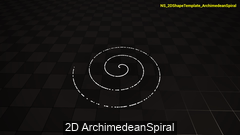

- **Type: 2D parametric curve
- **Formula: `OutVector2D = float2(InputT * cos(InputT), InputT * sin(InputT))`
- **Description: Archimedean spiral — radius grows linearly with the angle.
- **NDI: `/EasyNSShape/NDI/NDI_2D_ArchimedeanSpiral`
- **NE: `/EasyNSShape/NEBridge/NE/NE_2DShapeTemplate_ArchimedeanSpiral`
- **NS: `/EasyNSShape/NEBridge/NS/NS_2D_ArchimedeanSpiral`
- **NFS: `/EasyNSShape/NFS/NFS2D_ArchimedeanSpiral`
- **Snapshot: [NS_2DShapeTemplate_ArchimedeanSpiral.png](../Thumbs/NS_2DShapeTemplate_ArchimedeanSpiral.png)
- **Video: [NS_2DShapeTemplate_ArchimedeanSpiral.mp4](../Videos/NS_2DShapeTemplate_ArchimedeanSpiral.mp4)
- **Input: `Module.InputT` (float)
- **Output: `float2`

### NDI_2D_Astroid — Four-cusped hypocycloid (star curve).

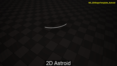

- **Type: 2D parametric curve
- **Formula: `float2(pow(cos(InputT), 3.0), pow(sin(InputT), 3.0))`
- **Description: Four-cusped hypocycloid (star curve).
- **NDI: `/EasyNSShape/NDI/NDI_2D_Astroid`
- **NE: `/EasyNSShape/NEBridge/NE/NE_2DShapeTemplate_Astroid`
- **NS: `/EasyNSShape/NEBridge/NS/NS_2D_Astroid`
- **NFS: `/EasyNSShape/NFS/NFS2D_Astroid`
- **Snapshot: [NS_2DShapeTemplate_Astroid.png](../Thumbs/NS_2DShapeTemplate_Astroid.png)
- **Video: [NS_2DShapeTemplate_Astroid.mp4](../Videos/NS_2DShapeTemplate_Astroid.mp4)
- **Input: `Module.InputT` (float)
- **Output: `float2`

### NDI_2D_Cardioid — Cardioid (heart-shaped curve).

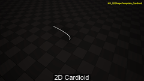

- **Type: 2D parametric curve
- **Formula: `float2(cosh(InputT), InputT)`
- **Description: Cardioid (heart-shaped curve).
- **NDI: `/EasyNSShape/NDI/NDI_2D_Cardioid`
- **NE: `/EasyNSShape/NEBridge/NE/NE_2DShapeTemplate_Cardioid`
- **NS: `/EasyNSShape/NEBridge/NS/NS_2D_Cardioid`
- **NFS: `/EasyNSShape/NFS/NFS2D_Cardioid`
- **Snapshot: [NS_2DShapeTemplate_Cardioid.png](../Thumbs/NS_2DShapeTemplate_Cardioid.png)
- **Video: [NS_2DShapeTemplate_Cardioid.mp4](../Videos/NS_2DShapeTemplate_Cardioid.mp4)
- **Input: `Module.InputT` (float)
- **Output: `float2`

### NDI_2D_Catenary — Catenary — the shape of a hanging chain (cosh).

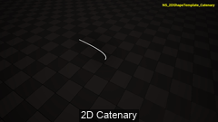

- **Type: 2D parametric curve
- **Formula: `float2(cosh(InputT), InputT)`
- **Description: Catenary — the shape of a hanging chain (cosh).
- **NDI: `/EasyNSShape/NDI/NDI_2D_Catenary`
- **NE: `/EasyNSShape/NEBridge/NE/NE_2DShapeTemplate_Catenary`
- **NS: `/EasyNSShape/NEBridge/NS/NS_2D_Catenary`
- **NFS: `/EasyNSShape/NFS/NFS2D_Catenary`
- **Snapshot: [NS_2DShapeTemplate_Catenary.png](../Thumbs/NS_2DShapeTemplate_Catenary.png)
- **Video: [NS_2DShapeTemplate_Catenary.mp4](../Videos/NS_2DShapeTemplate_Catenary.mp4)
- **Input: `Module.InputT` (float)
- **Output: `float2`

### NDI_2D_Catenary2 — Catenary with the axes swapped.

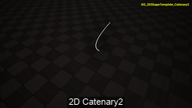

- **Type: 2D parametric curve
- **Formula: `float2(InputT, cosh(InputT))`
- **Description: Catenary with the axes swapped.
- **NDI: `/EasyNSShape/NDI/NDI_2D_Catenary2`
- **NE: `/EasyNSShape/NEBridge/NE/NE_2DShapeTemplate_Catenary2`
- **NS: `/EasyNSShape/NEBridge/NS/NS_2D_Catenary2`
- **NFS: `/EasyNSShape/NFS/NFS2D_Catenary2`
- **Snapshot: [NS_2DShapeTemplate_Catenary2.png](../Thumbs/NS_2DShapeTemplate_Catenary2.png)
- **Video: [NS_2DShapeTemplate_Catenary2.mp4](../Videos/NS_2DShapeTemplate_Catenary2.mp4)
- **Input: `Module.InputT` (float)
- **Output: `float2`

### NDI_2D_Circle — Unit circle traced by cos/sin.

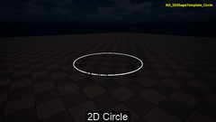

- **Type: 2D parametric curve
- **Formula: `float2(cos(InputT), sin(InputT))`
- **Description: Unit circle traced by cos/sin.
- **NDI: `/EasyNSShape/NDI/NDI_2D_Circle`
- **NE: `/EasyNSShape/NEBridge/NE/NE_2DShapeTemplate_Circle`
- **NS: `/EasyNSShape/NEBridge/NS/NS_2D_Circle`
- **NFS: `/EasyNSShape/NFS/NFS2D_Circle`
- **Snapshot: [NS_2DShapeTemplate_Circle.png](../Thumbs/NS_2DShapeTemplate_Circle.png)
- **Video: [NS_2DShapeTemplate_Circle.mp4](../Videos/NS_2DShapeTemplate_Circle.mp4)
- **Input: `Module.InputT` (float)
- **Output: `float2`

### NDI_2D_Circle2 — Rational-parameterised circle.

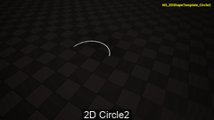

- **Type: 2D parametric curve
- **Formula: `float2(1.0/(1.0+InputT*InputT), InputT/(1.0+InputT*InputT))`
- **Description: Rational-parameterised circle.
- **NDI: `/EasyNSShape/NDI/NDI_2D_Circle2`
- **NE: `/EasyNSShape/NEBridge/NE/NE_2DShapeTemplate_Circle2`
- **NS: `/EasyNSShape/NEBridge/NS/NS_2D_Circle2`
- **NFS: `/EasyNSShape/NFS/NFS2D_Circle2`
- **Snapshot: [NS_2DShapeTemplate_Circle2.png](../Thumbs/NS_2DShapeTemplate_Circle2.png)
- **Video: [NS_2DShapeTemplate_Circle2.mp4](../Videos/NS_2DShapeTemplate_Circle2.mp4)
- **Input: `Module.InputT` (float)
- **Output: `float2`

### NDI_2D_CircleCenter — Circle whose parameterisation is centred on the origin.

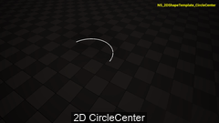

- **Type: 2D parametric curve
- **Formula: `float2(2.0*InputT*InputT/(1.0+InputT*InputT), 2.0*InputT/(1.0+InputT*InputT))`
- **Description: Circle whose parameterisation is centred on the origin.
- **NDI: `/EasyNSShape/NDI/NDI_2D_CircleCenter`
- **NE: `/EasyNSShape/NEBridge/NE/NE_2DShapeTemplate_CircleCenter`
- **NS: `/EasyNSShape/NEBridge/NS/NS_2D_CircleCenter`
- **NFS: `/EasyNSShape/NFS/NFS2D_CircleCenter`
- **Snapshot: [NS_2DShapeTemplate_CircleCenter.png](../Thumbs/NS_2DShapeTemplate_CircleCenter.png)
- **Video: [NS_2DShapeTemplate_CircleCenter.mp4](../Videos/NS_2DShapeTemplate_CircleCenter.mp4)
- **Input: `Module.InputT` (float)
- **Output: `float2`

### NDI_2D_CircleNonlinear — Circle with a non-linear (quadratic) angle sweep.

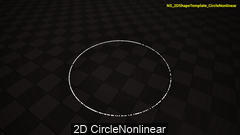

- **Type: 2D parametric curve
- **Formula: `float2(sin(InputT*InputT), cos(InputT*InputT))`
- **Description: Circle with a non-linear (quadratic) angle sweep.
- **NDI: `/EasyNSShape/NDI/NDI_2D_CircleNonlinear`
- **NE: `/EasyNSShape/NEBridge/NE/NE_2DShapeTemplate_CircleNonlinear`
- **NS: `/EasyNSShape/NEBridge/NS/NS_2D_CircleNonlinear`
- **NFS: `/EasyNSShape/NFS/NFS2D_CircleNonlinear`
- **Snapshot: [NS_2DShapeTemplate_CircleNonlinear.png](../Thumbs/NS_2DShapeTemplate_CircleNonlinear.png)
- **Video: [NS_2DShapeTemplate_CircleNonlinear.mp4](../Videos/NS_2DShapeTemplate_CircleNonlinear.mp4)
- **Input: `Module.InputT` (float)
- **Output: `float2`

### NDI_2D_CircleRadius — Circle with a varying radius.

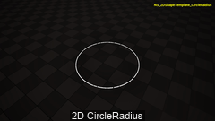

- **Type: 2D parametric curve
- **Formula: `float2(sin(InputT) + cos(InputT), sin(InputT) - cos(InputT))`
- **Description: Circle with a varying radius.
- **NDI: `/EasyNSShape/NDI/NDI_2D_CircleRadius`
- **NE: `/EasyNSShape/NEBridge/NE/NE_2DShapeTemplate_CircleRadius`
- **NS: `/EasyNSShape/NEBridge/NS/NS_2D_CircleRadius`
- **NFS: `/EasyNSShape/NFS/NFS2D_CircleRadius`
- **Snapshot: [NS_2DShapeTemplate_CircleRadius.png](../Thumbs/NS_2DShapeTemplate_CircleRadius.png)
- **Video: [NS_2DShapeTemplate_CircleRadius.mp4](../Videos/NS_2DShapeTemplate_CircleRadius.mp4)
- **Input: `Module.InputT` (float)
- **Output: `float2`

### NDI_2D_CubicCurve — Cubic curve, standard form.

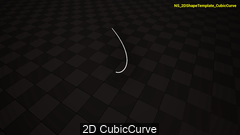

- **Type: 2D parametric curve
- **Formula: `float2(InputT*InputT*InputT-3.0*InputT, 3.0*InputT*InputT-3.0)`
- **Description: Cubic curve, standard form.
- **NDI: `/EasyNSShape/NDI/NDI_2D_CubicCurve`
- **NE: `/EasyNSShape/NEBridge/NE/NE_2DShapeTemplate_CubicCurve`
- **NS: `/EasyNSShape/NEBridge/NS/NS_2D_CubicCurve`
- **NFS: `/EasyNSShape/NFS/NFS2D_CubicCurve`
- **Snapshot: [NS_2DShapeTemplate_CubicCurve.png](../Thumbs/NS_2DShapeTemplate_CubicCurve.png)
- **Video: [NS_2DShapeTemplate_CubicCurve.mp4](../Videos/NS_2DShapeTemplate_CubicCurve.mp4)
- **Input: `Module.InputT` (float)
- **Output: `float2`

### NDI_2D_CubicCurve2 — Cubic curve, variant 2.


- **Type: 2D parametric curve
- **Formula: `float2(InputT*InputT+InputT, InputT*InputT*InputT+InputT)`
- **Description: Cubic curve, variant 2.
- **NDI: `/EasyNSShape/NDI/NDI_2D_CubicCurve2`
- **NE: `/EasyNSShape/NEBridge/NE/NE_2DShapeTemplate_CubicCurve2`
- **NS: `/EasyNSShape/NEBridge/NS/NS_2D_CubicCurve2`
- **NFS: `/EasyNSShape/NFS/NFS2D_CubicCurve2`
- **Snapshot: [NS_2DShapeTemplate_CubicCurve2.png](../Thumbs/NS_2DShapeTemplate_CubicCurve2.png)
- **Video: [NS_2DShapeTemplate_CubicCurve2.mp4](../Videos/NS_2DShapeTemplate_CubicCurve2.mp4)
- **Input: `Module.InputT` (float)
- **Output: `float2`

### NDI_2D_CubicCurve3 — Cubic curve, variant 3.

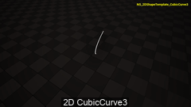

- **Type: 2D parametric curve
- **Formula: `float2(InputT*InputT-InputT, InputT*InputT*InputT-InputT*InputT)`
- **Description: Cubic curve, variant 3.
- **NDI: `/EasyNSShape/NDI/NDI_2D_CubicCurve3`
- **NE: `/EasyNSShape/NEBridge/NE/NE_2DShapeTemplate_CubicCurve3`
- **NS: `/EasyNSShape/NEBridge/NS/NS_2D_CubicCurve3`
- **NFS: `/EasyNSShape/NFS/NFS2D_CubicCurve3`
- **Snapshot: [NS_2DShapeTemplate_CubicCurve3.png](../Thumbs/NS_2DShapeTemplate_CubicCurve3.png)
- **Video: [NS_2DShapeTemplate_CubicCurve3.mp4](../Videos/NS_2DShapeTemplate_CubicCurve3.mp4)
- **Input: `Module.InputT` (float)
- **Output: `float2`

### NDI_2D_CubicCurve4 — Cubic curve, variant 4.

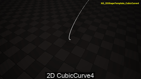

- **Type: 2D parametric curve
- **Formula: `float2(InputT * InputT, InputT * InputT * InputT - InputT)`
- **Description: Cubic curve, variant 4.
- **NDI: `/EasyNSShape/NDI/NDI_2D_CubicCurve4`
- **NE: `/EasyNSShape/NEBridge/NE/NE_2DShapeTemplate_CubicCurve4`
- **NS: `/EasyNSShape/NEBridge/NS/NS_2D_CubicCurve4`
- **NFS: `/EasyNSShape/NFS/NFS2D_CubicCurve4`
- **Snapshot: [NS_2DShapeTemplate_CubicCurve4.png](../Thumbs/NS_2DShapeTemplate_CubicCurve4.png)
- **Video: [NS_2DShapeTemplate_CubicCurve4.mp4](../Videos/NS_2DShapeTemplate_CubicCurve4.mp4)
- **Input: `Module.InputT` (float)
- **Output: `float2`

### NDI_2D_CubicCurve5 — Cubic curve, variant 5.

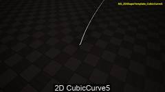

- **Type: 2D parametric curve
- **Formula: `float2(InputT * InputT + 2.0, InputT * InputT * InputT + 3.0 * InputT)`
- **Description: Cubic curve, variant 5.
- **NDI: `/EasyNSShape/NDI/NDI_2D_CubicCurve5`
- **NE: `/EasyNSShape/NEBridge/NE/NE_2DShapeTemplate_CubicCurve5`
- **NS: `/EasyNSShape/NEBridge/NS/NS_2D_CubicCurve5`
- **NFS: `/EasyNSShape/NFS/NFS2D_CubicCurve5`
- **Snapshot: [NS_2DShapeTemplate_CubicCurve5.png](../Thumbs/NS_2DShapeTemplate_CubicCurve5.png)
- **Video: [NS_2DShapeTemplate_CubicCurve5.mp4](../Videos/NS_2DShapeTemplate_CubicCurve5.mp4)
- **Input: `Module.InputT` (float)
- **Output: `float2`

### NDI_2D_CubicCurve6 — Cubic curve, variant 6.

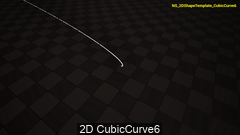

- **Type: 2D parametric curve
- **Formula: `float2(InputT * InputT * InputT - InputT, InputT * InputT + 1.0)`
- **Description: Cubic curve, variant 6.
- **NDI: `/EasyNSShape/NDI/NDI_2D_CubicCurve6`
- **NE: `/EasyNSShape/NEBridge/NE/NE_2DShapeTemplate_CubicCurve6`
- **NS: `/EasyNSShape/NEBridge/NS/NS_2D_CubicCurve6`
- **NFS: `/EasyNSShape/NFS/NFS2D_CubicCurve6`
- **Snapshot: [NS_2DShapeTemplate_CubicCurve6.png](../Thumbs/NS_2DShapeTemplate_CubicCurve6.png)
- **Video: [NS_2DShapeTemplate_CubicCurve6.mp4](../Videos/NS_2DShapeTemplate_CubicCurve6.mp4)
- **Input: `Module.InputT` (float)
- **Output: `float2`

### NDI_2D_CubicCurve7 — Cubic curve, variant 7.

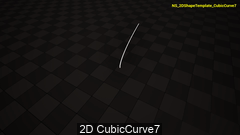

- **Type: 2D parametric curve
- **Formula: `float2(InputT * InputT, InputT * InputT * InputT + InputT * InputT)`
- **Description: Cubic curve, variant 7.
- **NDI: `/EasyNSShape/NDI/NDI_2D_CubicCurve7`
- **NE: `/EasyNSShape/NEBridge/NE/NE_2DShapeTemplate_CubicCurve7`
- **NS: `/EasyNSShape/NEBridge/NS/NS_2D_CubicCurve7`
- **NFS: `/EasyNSShape/NFS/NFS2D_CubicCurve7`
- **Snapshot: [NS_2DShapeTemplate_CubicCurve7.png](../Thumbs/NS_2DShapeTemplate_CubicCurve7.png)
- **Video: [NS_2DShapeTemplate_CubicCurve7.mp4](../Videos/NS_2DShapeTemplate_CubicCurve7.mp4)
- **Input: `Module.InputT` (float)
- **Output: `float2`

### NDI_2D_CubicCurve8 — Cubic curve, variant 8.

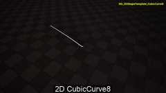

- **Type: 2D parametric curve
- **Formula: `float2(InputT * InputT * InputT + InputT, InputT * InputT - InputT)`
- **Description: Cubic curve, variant 8.
- **NDI: `/EasyNSShape/NDI/NDI_2D_CubicCurve8`
- **NE: `/EasyNSShape/NEBridge/NE/NE_2DShapeTemplate_CubicCurve8`
- **NS: `/EasyNSShape/NEBridge/NS/NS_2D_CubicCurve8`
- **NFS: `/EasyNSShape/NFS/NFS2D_CubicCurve8`
- **Snapshot: [NS_2DShapeTemplate_CubicCurve8.png](../Thumbs/NS_2DShapeTemplate_CubicCurve8.png)
- **Video: [NS_2DShapeTemplate_CubicCurve8.mp4](../Videos/NS_2DShapeTemplate_CubicCurve8.mp4)
- **Input: `Module.InputT` (float)
- **Output: `float2`

### NDI_2D_CubicParabola — Cubic parabola (t, t^3).

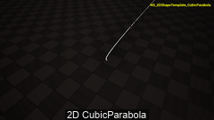

- **Type: 2D parametric curve
- **Formula: `float2(InputT, InputT * InputT * InputT)`
- **Description: Cubic parabola (t, t^3).
- **NDI: `/EasyNSShape/NDI/NDI_2D_CubicParabola`
- **NE: `/EasyNSShape/NEBridge/NE/NE_2DShapeTemplate_CubicParabola`
- **NS: `/EasyNSShape/NEBridge/NS/NS_2D_CubicParabola`
- **NFS: `/EasyNSShape/NFS/NFS2D_CubicParabola`
- **Snapshot: [NS_2DShapeTemplate_CubicParabola.png](../Thumbs/NS_2DShapeTemplate_CubicParabola.png)
- **Video: [NS_2DShapeTemplate_CubicParabola.mp4](../Videos/NS_2DShapeTemplate_CubicParabola.mp4)
- **Input: `Module.InputT` (float)
- **Output: `float2`

### NDI_2D_Cycloid — Cycloid — path of a point on a rolling circle.

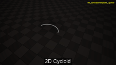

- **Type: 2D parametric curve
- **Formula: `float2(InputT-sin(InputT), 1.0-cos(InputT))`
- **Description: Cycloid — path of a point on a rolling circle.
- **NDI: `/EasyNSShape/NDI/NDI_2D_Cycloid`
- **NE: `/EasyNSShape/NEBridge/NE/NE_2DShapeTemplate_Cycloid`
- **NS: `/EasyNSShape/NEBridge/NS/NS_2D_Cycloid`
- **NFS: `/EasyNSShape/NFS/NFS2D_Cycloid`
- **Snapshot: [NS_2DShapeTemplate_Cycloid.png](../Thumbs/NS_2DShapeTemplate_Cycloid.png)
- **Video: [NS_2DShapeTemplate_Cycloid.mp4](../Videos/NS_2DShapeTemplate_Cycloid.mp4)
- **Input: `Module.InputT` (float)
- **Output: `float2`

### NDI_2D_Cycloid2 — Cycloid, variant with added sin/cos terms.

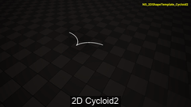

- **Type: 2D parametric curve
- **Formula: `float2(InputT+sin(InputT), 1.0+cos(InputT))`
- **Description: Cycloid, variant with added sin/cos terms.
- **NDI: `/EasyNSShape/NDI/NDI_2D_Cycloid2`
- **NE: `/EasyNSShape/NEBridge/NE/NE_2DShapeTemplate_Cycloid2`
- **NS: `/EasyNSShape/NEBridge/NS/NS_2D_Cycloid2`
- **NFS: `/EasyNSShape/NFS/NFS2D_Cycloid2`
- **Snapshot: [NS_2DShapeTemplate_Cycloid2.png](../Thumbs/NS_2DShapeTemplate_Cycloid2.png)
- **Video: [NS_2DShapeTemplate_Cycloid2.mp4](../Videos/NS_2DShapeTemplate_Cycloid2.mp4)
- **Input: `Module.InputT` (float)
- **Output: `float2`

### NDI_2D_CycloidSwapped — Cycloid with the axes swapped.

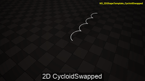

- **Type: 2D parametric curve
- **Formula: `float2(1.0-cos(InputT), InputT-sin(InputT))`
- **Description: Cycloid with the axes swapped.
- **NDI: `/EasyNSShape/NDI/NDI_2D_CycloidSwapped`
- **NE: `/EasyNSShape/NEBridge/NE/NE_2DShapeTemplate_CycloidSwapped`
- **NS: `/EasyNSShape/NEBridge/NS/NS_2D_CycloidSwapped`
- **NFS: `/EasyNSShape/NFS/NFS2D_CycloidSwapped`
- **Snapshot: [NS_2DShapeTemplate_CycloidSwapped.png](../Thumbs/NS_2DShapeTemplate_CycloidSwapped.png)
- **Video: [NS_2DShapeTemplate_CycloidSwapped.mp4](../Videos/NS_2DShapeTemplate_CycloidSwapped.mp4)
- **Input: `Module.InputT` (float)
- **Output: `float2`

### NDI_2D_Deltoid — Three-cusped hypocycloid (deltoid).

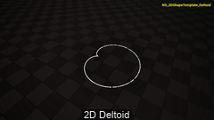

- **Type: 2D parametric curve
- **Formula: `float2(2.0*cos(InputT)-cos(2.0*InputT), 2.0*sin(InputT)-sin(2.0*InputT))`
- **Description: Three-cusped hypocycloid (deltoid).
- **NDI: `/EasyNSShape/NDI/NDI_2D_Deltoid`
- **NE: `/EasyNSShape/NEBridge/NE/NE_2DShapeTemplate_Deltoid`
- **NS: `/EasyNSShape/NEBridge/NS/NS_2D_Deltoid`
- **NFS: `/EasyNSShape/NFS/NFS2D_Deltoid`
- **Snapshot: [NS_2DShapeTemplate_Deltoid.png](../Thumbs/NS_2DShapeTemplate_Deltoid.png)
- **Video: [NS_2DShapeTemplate_Deltoid.mp4](../Videos/NS_2DShapeTemplate_Deltoid.mp4)
- **Input: `Module.InputT` (float)
- **Output: `float2`

### NDI_2D_Ellipse — Ellipse (here an axis-aligned unit circle parameterisation).

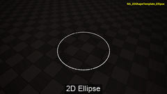

- **Type: 2D parametric curve
- **Formula: `float2(cos(InputT), sin(InputT))`
- **Description: Ellipse (here an axis-aligned unit circle parameterisation).
- **NDI: `/EasyNSShape/NDI/NDI_2D_Ellipse`
- **NE: `/EasyNSShape/NEBridge/NE/NE_2DShapeTemplate_Ellipse`
- **NS: `/EasyNSShape/NEBridge/NS/NS_2D_Ellipse`
- **NFS: `/EasyNSShape/NFS/NFS2D_Ellipse`
- **Snapshot: [NS_2DShapeTemplate_Ellipse.png](../Thumbs/NS_2DShapeTemplate_Ellipse.png)
- **Video: [NS_2DShapeTemplate_Ellipse.mp4](../Videos/NS_2DShapeTemplate_Ellipse.mp4)
- **Input: `Module.InputT` (float)
- **Output: `float2`

### NDI_2D_Equidistant — Equidistant curve (t + cos t, t + sin t).

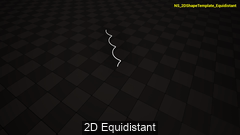

- **Type: 2D parametric curve
- **Formula: `float2(InputT+cos(InputT), InputT+sin(InputT))`
- **Description: Equidistant curve (t + cos t, t + sin t).
- **NDI: `/EasyNSShape/NDI/NDI_2D_Equidistant`
- **NE: `/EasyNSShape/NEBridge/NE/NE_2DShapeTemplate_Equidistant`
- **NS: `/EasyNSShape/NEBridge/NS/NS_2D_Equidistant`
- **NFS: `/EasyNSShape/NFS/NFS2D_Equidistant`
- **Snapshot: [NS_2DShapeTemplate_Equidistant.png](../Thumbs/NS_2DShapeTemplate_Equidistant.png)
- **Video: [NS_2DShapeTemplate_Equidistant.mp4](../Videos/NS_2DShapeTemplate_Equidistant.mp4)
- **Input: `Module.InputT` (float)
- **Output: `float2`

### NDI_2D_ExpSquare — Exponential vs. square curve.

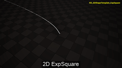

- **Type: 2D parametric curve
- **Formula: `float2(exp(InputT), InputT*InputT)`
- **Description: Exponential vs. square curve.
- **NDI: `/EasyNSShape/NDI/NDI_2D_ExpSquare`
- **NE: `/EasyNSShape/NEBridge/NE/NE_2DShapeTemplate_ExpSquare`
- **NS: `/EasyNSShape/NEBridge/NS/NS_2D_ExpSquare`
- **NFS: `/EasyNSShape/NFS/NFS2D_ExpSquare`
- **Snapshot: [NS_2DShapeTemplate_ExpSquare.png](../Thumbs/NS_2DShapeTemplate_ExpSquare.png)
- **Video: [NS_2DShapeTemplate_ExpSquare.mp4](../Videos/NS_2DShapeTemplate_ExpSquare.mp4)
- **Input: `Module.InputT` (float)
- **Output: `float2`

### NDI_2D_FoliumDescartes — Folium of Descartes.

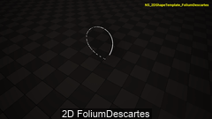

- **Type: 2D parametric curve
- **Formula: `float2(3.0*InputT/(1.0+InputT*InputT*InputT), 3.0*InputT*InputT/(1.0+InputT*InputT*InputT))`
- **Description: Folium of Descartes.
- **NDI: `/EasyNSShape/NDI/NDI_2D_FoliumDescartes`
- **NE: `/EasyNSShape/NEBridge/NE/NE_2DShapeTemplate_FoliumDescartes`
- **NS: `/EasyNSShape/NEBridge/NS/NS_2D_FoliumDescartes`
- **NFS: `/EasyNSShape/NFS/NFS2D_FoliumDescartes`
- **Snapshot: [NS_2DShapeTemplate_FoliumDescartes.png](../Thumbs/NS_2DShapeTemplate_FoliumDescartes.png)
- **Video: [NS_2DShapeTemplate_FoliumDescartes.mp4](../Videos/NS_2DShapeTemplate_FoliumDescartes.mp4)
- **Input: `Module.InputT` (float)
- **Output: `float2`

### NDI_2D_HyperbolaCoshSinh — Hyperbolic curve using cosh/sinh.

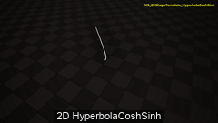

- **Type: 2D parametric curve
- **Formula: `float2(cosh(InputT), sinh(InputT))`
- **Description: Hyperbolic curve using cosh/sinh.
- **NDI: `/EasyNSShape/NDI/NDI_2D_HyperbolaCoshSinh`
- **NE: `/EasyNSShape/NEBridge/NE/NE_2DShapeTemplate_HyperbolaCoshSinh`
- **NS: `/EasyNSShape/NEBridge/NS/NS_2D_HyperbolaCoshSinh`
- **NFS: `/EasyNSShape/NFS/NFS2D_HyperbolaCoshSinh`
- **Snapshot: [NS_2DShapeTemplate_HyperbolaCoshSinh.png](../Thumbs/NS_2DShapeTemplate_HyperbolaCoshSinh.png)
- **Video: [NS_2DShapeTemplate_HyperbolaCoshSinh.mp4](../Videos/NS_2DShapeTemplate_HyperbolaCoshSinh.mp4)
- **Input: `Module.InputT` (float)
- **Output: `float2`

### NDI_2D_HyperbolaExp — Hyperbola built from exp(t) and exp(-t).

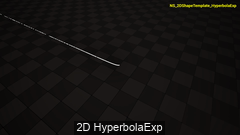

- **Type: 2D parametric curve
- **Formula: `float2(exp(InputT), exp(-InputT))`
- **Description: Hyperbola built from exp(t) and exp(-t).
- **NDI: `/EasyNSShape/NDI/NDI_2D_HyperbolaExp`
- **NE: `/EasyNSShape/NEBridge/NE/NE_2DShapeTemplate_HyperbolaExp`
- **NS: `/EasyNSShape/NEBridge/NS/NS_2D_HyperbolaExp`
- **NFS: `/EasyNSShape/NFS/NFS2D_HyperbolaExp`
- **Snapshot: [NS_2DShapeTemplate_HyperbolaExp.png](../Thumbs/NS_2DShapeTemplate_HyperbolaExp.png)
- **Video: [NS_2DShapeTemplate_HyperbolaExp.mp4](../Videos/NS_2DShapeTemplate_HyperbolaExp.mp4)
- **Input: `Module.InputT` (float)
- **Output: `float2`

### NDI_2D_HyperbolaExp2 — Hyperbola built from exp(t^2) and exp(-t^2).

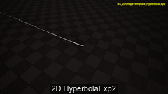

- **Type: 2D parametric curve
- **Formula: `float2(exp(InputT * InputT), exp(-InputT * InputT))`
- **Description: Hyperbola built from exp(t^2) and exp(-t^2).
- **NDI: `/EasyNSShape/NDI/NDI_2D_HyperbolaExp2`
- **NE: `/EasyNSShape/NEBridge/NE/NE_2DShapeTemplate_HyperbolaExp2`
- **NS: `/EasyNSShape/NEBridge/NS/NS_2D_HyperbolaExp2`
- **NFS: `/EasyNSShape/NFS/NFS2D_HyperbolaExp2`
- **Snapshot: [NS_2DShapeTemplate_HyperbolaExp2.png](../Thumbs/NS_2DShapeTemplate_HyperbolaExp2.png)
- **Video: [NS_2DShapeTemplate_HyperbolaExp2.mp4](../Videos/NS_2DShapeTemplate_HyperbolaExp2.mp4)
- **Input: `Module.InputT` (float)
- **Output: `float2`

### NDI_2D_HyperbolaSecTan — Hyperbolic curve using sec/tan.

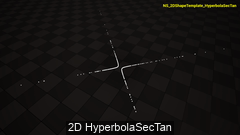

- **Type: 2D parametric curve
- **Formula: `float2(1.0/cos(InputT), tan(InputT))`
- **Description: Hyperbolic curve using sec/tan.
- **NDI: `/EasyNSShape/NDI/NDI_2D_HyperbolaSecTan`
- **NE: `/EasyNSShape/NEBridge/NE/NE_2DShapeTemplate_HyperbolaSecTan`
- **NS: `/EasyNSShape/NEBridge/NS/NS_2D_HyperbolaSecTan`
- **NFS: `/EasyNSShape/NFS/NFS2D_HyperbolaSecTan`
- **Snapshot: [NS_2DShapeTemplate_HyperbolaSecTan.png](../Thumbs/NS_2DShapeTemplate_HyperbolaSecTan.png)
- **Video: [NS_2DShapeTemplate_HyperbolaSecTan.mp4](../Videos/NS_2DShapeTemplate_HyperbolaSecTan.mp4)
- **Input: `Module.InputT` (float)
- **Output: `float2`

### NDI_2D_HyperbolaSinhCosh — Hyperbolic curve using sinh/cosh.

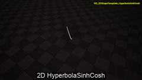

- **Type: 2D parametric curve
- **Formula: `float2(sinh(InputT), cosh(InputT))`
- **Description: Hyperbolic curve using sinh/cosh.
- **NDI: `/EasyNSShape/NDI/NDI_2D_HyperbolaSinhCosh`
- **NE: `/EasyNSShape/NEBridge/NE/NE_2DShapeTemplate_HyperbolaSinhCosh`
- **NS: `/EasyNSShape/NEBridge/NS/NS_2D_HyperbolaSinhCosh`
- **NFS: `/EasyNSShape/NFS/NFS2D_HyperbolaSinhCosh`
- **Snapshot: [NS_2DShapeTemplate_HyperbolaSinhCosh.png](../Thumbs/NS_2DShapeTemplate_HyperbolaSinhCosh.png)
- **Video: [NS_2DShapeTemplate_HyperbolaSinhCosh.mp4](../Videos/NS_2DShapeTemplate_HyperbolaSinhCosh.mp4)
- **Input: `Module.InputT` (float)
- **Output: `float2`

### NDI_2D_HyperbolaTanSec — Hyperbolic curve using tan/sec.

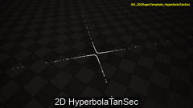

- **Type: 2D parametric curve
- **Formula: `float2(tan(InputT), 1.0 / cos(InputT))`
- **Description: Hyperbolic curve using tan/sec.
- **NDI: `/EasyNSShape/NDI/NDI_2D_HyperbolaTanSec`
- **NE: `/EasyNSShape/NEBridge/NE/NE_2DShapeTemplate_HyperbolaTanSec`
- **NS: `/EasyNSShape/NEBridge/NS/NS_2D_HyperbolaTanSec`
- **NFS: `/EasyNSShape/NFS/NFS2D_HyperbolaTanSec`
- **Snapshot: [NS_2DShapeTemplate_HyperbolaTanSec.png](../Thumbs/NS_2DShapeTemplate_HyperbolaTanSec.png)
- **Video: [NS_2DShapeTemplate_HyperbolaTanSec.mp4](../Videos/NS_2DShapeTemplate_HyperbolaTanSec.mp4)
- **Input: `Module.InputT` (float)
- **Output: `float2`

### NDI_2D_InvoluteCircle — Involute of a circle.

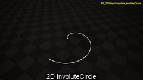

- **Type: 2D parametric curve
- **Formula: `float2(cos(InputT)+InputT*sin(InputT), sin(InputT)-InputT*cos(InputT))`
- **Description: Involute of a circle.
- **NDI: `/EasyNSShape/NDI/NDI_2D_InvoluteCircle`
- **NE: `/EasyNSShape/NEBridge/NE/NE_2DShapeTemplate_InvoluteCircle`
- **NS: `/EasyNSShape/NEBridge/NS/NS_2D_InvoluteCircle`
- **NFS: `/EasyNSShape/NFS/NFS2D_InvoluteCircle`
- **Snapshot: [NS_2DShapeTemplate_InvoluteCircle.png](../Thumbs/NS_2DShapeTemplate_InvoluteCircle.png)
- **Video: [NS_2DShapeTemplate_InvoluteCircle.mp4](../Videos/NS_2DShapeTemplate_InvoluteCircle.mp4)
- **Input: `Module.InputT` (float)
- **Output: `float2`

### NDI_2D_LineSegment — Line segment (asin/acos parameterisation).

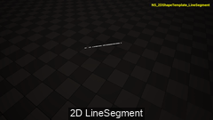

- **Type: 2D parametric curve
- **Formula: `float2(asin(InputT), acos(InputT))`
- **Description: Line segment (asin/acos parameterisation).
- **NDI: `/EasyNSShape/NDI/NDI_2D_LineSegment`
- **NE: `/EasyNSShape/NEBridge/NE/NE_2DShapeTemplate_LineSegment`
- **NS: `/EasyNSShape/NEBridge/NS/NS_2D_LineSegment`
- **NFS: `/EasyNSShape/NFS/NFS2D_LineSegment`
- **Snapshot: [NS_2DShapeTemplate_LineSegment.png](../Thumbs/NS_2DShapeTemplate_LineSegment.png)
- **Video: [NS_2DShapeTemplate_LineSegment.mp4](../Videos/NS_2DShapeTemplate_LineSegment.mp4)
- **Input: `Module.InputT` (float)
- **Output: `float2`

### NDI_2D_Lissajous12 — Lissajous figure, frequency ratio 1:2.


- **Type: 2D parametric curve
- **Formula: `float2(sin(InputT), sin(2.0*InputT))`
- **Description: Lissajous figure, frequency ratio 1:2.
- **NDI: `/EasyNSShape/NDI/NDI_2D_Lissajous12`
- **NE: `/EasyNSShape/NEBridge/NE/NE_2DShapeTemplate_Lissajous12`
- **NS: `/EasyNSShape/NEBridge/NS/NS_2D_Lissajous12`
- **NFS: `/EasyNSShape/NFS/NFS2D_Lissajous12`
- **Snapshot: [NS_2DShapeTemplate_Lissajous12.png](../Thumbs/NS_2DShapeTemplate_Lissajous12.png)
- **Video: [NS_2DShapeTemplate_Lissajous12.mp4](../Videos/NS_2DShapeTemplate_Lissajous12.mp4)
- **Input: `Module.InputT` (float)
- **Output: `float2`

### NDI_2D_Lissajous12Cos — Lissajous figure 1:2 using cosine.

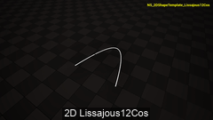

- **Type: 2D parametric curve
- **Formula: `float2(sin(InputT), cos(2.0*InputT))`
- **Description: Lissajous figure 1:2 using cosine.
- **NDI: `/EasyNSShape/NDI/NDI_2D_Lissajous12Cos`
- **NE: `/EasyNSShape/NEBridge/NE/NE_2DShapeTemplate_Lissajous12Cos`
- **NS: `/EasyNSShape/NEBridge/NS/NS_2D_Lissajous12Cos`
- **NFS: `/EasyNSShape/NFS/NFS2D_Lissajous12Cos`
- **Snapshot: [NS_2DShapeTemplate_Lissajous12Cos.png](../Thumbs/NS_2DShapeTemplate_Lissajous12Cos.png)
- **Video: [NS_2DShapeTemplate_Lissajous12Cos.mp4](../Videos/NS_2DShapeTemplate_Lissajous12Cos.mp4)
- **Input: `Module.InputT` (float)
- **Output: `float2`

### NDI_2D_Lissajous13 — Lissajous figure, frequency ratio 1:3.

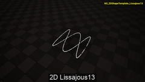

- **Type: 2D parametric curve
- **Formula: `float2(sin(InputT), cos(3.0*InputT))`
- **Description: Lissajous figure, frequency ratio 1:3.
- **NDI: `/EasyNSShape/NDI/NDI_2D_Lissajous13`
- **NE: `/EasyNSShape/NEBridge/NE/NE_2DShapeTemplate_Lissajous13`
- **NS: `/EasyNSShape/NEBridge/NS/NS_2D_Lissajous13`
- **NFS: `/EasyNSShape/NFS/NFS2D_Lissajous13`
- **Snapshot: [NS_2DShapeTemplate_Lissajous13.png](../Thumbs/NS_2DShapeTemplate_Lissajous13.png)
- **Video: [NS_2DShapeTemplate_Lissajous13.mp4](../Videos/NS_2DShapeTemplate_Lissajous13.mp4)
- **Input: `Module.InputT` (float)
- **Output: `float2`

### NDI_2D_Lissajous21 — Lissajous figure, frequency ratio 2:1.

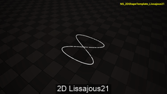

- **Type: 2D parametric curve
- **Formula: `float2(sin(2.0*InputT), sin(InputT))`
- **Description: Lissajous figure, frequency ratio 2:1.
- **NDI: `/EasyNSShape/NDI/NDI_2D_Lissajous21`
- **NE: `/EasyNSShape/NEBridge/NE/NE_2DShapeTemplate_Lissajous21`
- **NS: `/EasyNSShape/NEBridge/NS/NS_2D_Lissajous21`
- **NFS: `/EasyNSShape/NFS/NFS2D_Lissajous21`
- **Snapshot: [NS_2DShapeTemplate_Lissajous21.png](../Thumbs/NS_2DShapeTemplate_Lissajous21.png)
- **Video: [NS_2DShapeTemplate_Lissajous21.mp4](../Videos/NS_2DShapeTemplate_Lissajous21.mp4)
- **Input: `Module.InputT` (float)
- **Output: `float2`

### NDI_2D_Lissajous23 — Lissajous figure, frequency ratio 2:3.

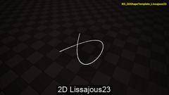

- **Type: 2D parametric curve
- **Formula: `float2(cos(2.0*InputT), cos(3.0*InputT))`
- **Description: Lissajous figure, frequency ratio 2:3.
- **NDI: `/EasyNSShape/NDI/NDI_2D_Lissajous23`
- **NE: `/EasyNSShape/NEBridge/NE/NE_2DShapeTemplate_Lissajous23`
- **NS: `/EasyNSShape/NEBridge/NS/NS_2D_Lissajous23`
- **NFS: `/EasyNSShape/NFS/NFS2D_Lissajous23`
- **Snapshot: [NS_2DShapeTemplate_Lissajous23.png](../Thumbs/NS_2DShapeTemplate_Lissajous23.png)
- **Video: [NS_2DShapeTemplate_Lissajous23.mp4](../Videos/NS_2DShapeTemplate_Lissajous23.mp4)
- **Input: `Module.InputT` (float)
- **Output: `float2`

### NDI_2D_Lissajous23b — Lissajous figure 2:3, variant B.

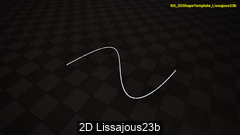

- **Type: 2D parametric curve
- **Formula: `float2(2.0*sin(InputT), sin(3.0*InputT))`
- **Description: Lissajous figure 2:3, variant B.
- **NDI: `/EasyNSShape/NDI/NDI_2D_Lissajous23b`
- **NE: `/EasyNSShape/NEBridge/NE/NE_2DShapeTemplate_Lissajous23b`
- **NS: `/EasyNSShape/NEBridge/NS/NS_2D_Lissajous23b`
- **NFS: `/EasyNSShape/NFS/NFS2D_Lissajous23b`
- **Snapshot: [NS_2DShapeTemplate_Lissajous23b.png](../Thumbs/NS_2DShapeTemplate_Lissajous23b.png)
- **Video: [NS_2DShapeTemplate_Lissajous23b.mp4](../Videos/NS_2DShapeTemplate_Lissajous23b.mp4)
- **Input: `Module.InputT` (float)
- **Output: `float2`

### NDI_2D_Lissajous23c — Lissajous figure 2:3, variant C.

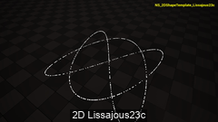

- **Type: 2D parametric curve
- **Formula: `float2(sin(2.0*InputT), sin(3.0*InputT))`
- **Description: Lissajous figure 2:3, variant C.
- **NDI: `/EasyNSShape/NDI/NDI_2D_Lissajous23c`
- **NE: `/EasyNSShape/NEBridge/NE/NE_2DShapeTemplate_Lissajous23c`
- **NS: `/EasyNSShape/NEBridge/NS/NS_2D_Lissajous23c`
- **NFS: `/EasyNSShape/NFS/NFS2D_Lissajous23c`
- **Snapshot: [NS_2DShapeTemplate_Lissajous23c.png](../Thumbs/NS_2DShapeTemplate_Lissajous23c.png)
- **Video: [NS_2DShapeTemplate_Lissajous23c.mp4](../Videos/NS_2DShapeTemplate_Lissajous23c.mp4)
- **Input: `Module.InputT` (float)
- **Output: `float2`

### NDI_2D_Lissajous23d — Lissajous figure 2:3, variant D.

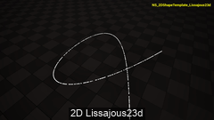

- **Type: 2D parametric curve
- **Formula: `float2(cos(2.0 * InputT), sin(3.0 * InputT))`
- **Description: Lissajous figure 2:3, variant D.
- **NDI: `/EasyNSShape/NDI/NDI_2D_Lissajous23d`
- **NE: `/EasyNSShape/NEBridge/NE/NE_2DShapeTemplate_Lissajous23d`
- **NS: `/EasyNSShape/NEBridge/NS/NS_2D_Lissajous23d`
- **NFS: `/EasyNSShape/NFS/NFS2D_Lissajous23d`
- **Snapshot: [NS_2DShapeTemplate_Lissajous23d.png](../Thumbs/NS_2DShapeTemplate_Lissajous23d.png)
- **Video: [NS_2DShapeTemplate_Lissajous23d.mp4](../Videos/NS_2DShapeTemplate_Lissajous23d.mp4)
- **Input: `Module.InputT` (float)
- **Output: `float2`

### NDI_2D_Lissajous32 — Lissajous figure, frequency ratio 3:2.

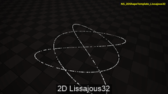

- **Type: 2D parametric curve
- **Formula: `float2(sin(3.0*InputT), sin(2.0*InputT))`
- **Description: Lissajous figure, frequency ratio 3:2.
- **NDI: `/EasyNSShape/NDI/NDI_2D_Lissajous32`
- **NE: `/EasyNSShape/NEBridge/NE/NE_2DShapeTemplate_Lissajous32`
- **NS: `/EasyNSShape/NEBridge/NS/NS_2D_Lissajous32`
- **NFS: `/EasyNSShape/NFS/NFS2D_Lissajous32`
- **Snapshot: [NS_2DShapeTemplate_Lissajous32.png](../Thumbs/NS_2DShapeTemplate_Lissajous32.png)
- **Video: [NS_2DShapeTemplate_Lissajous32.mp4](../Videos/NS_2DShapeTemplate_Lissajous32.mp4)
- **Input: `Module.InputT` (float)
- **Output: `float2`

### NDI_2D_Lissajous34 — Lissajous figure, frequency ratio 3:4.

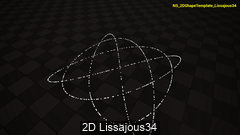

- **Type: 2D parametric curve
- **Formula: `float2(cos(3.0 * InputT), sin(4.0 * InputT))`
- **Description: Lissajous figure, frequency ratio 3:4.
- **NDI: `/EasyNSShape/NDI/NDI_2D_Lissajous34`
- **NE: `/EasyNSShape/NEBridge/NE/NE_2DShapeTemplate_Lissajous34`
- **NS: `/EasyNSShape/NEBridge/NS/NS_2D_Lissajous34`
- **NFS: `/EasyNSShape/NFS/NFS2D_Lissajous34`
- **Snapshot: [NS_2DShapeTemplate_Lissajous34.png](../Thumbs/NS_2DShapeTemplate_Lissajous34.png)
- **Video: [NS_2DShapeTemplate_Lissajous34.mp4](../Videos/NS_2DShapeTemplate_Lissajous34.mp4)
- **Input: `Module.InputT` (float)
- **Output: `float2`

### NDI_2D_Lissajous45 — Lissajous figure, frequency ratio 4:5.

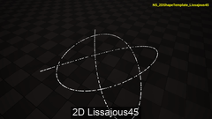

- **Type: 2D parametric curve
- **Formula: `float2(cos(4.0*InputT), sin(5.0*InputT))`
- **Description: Lissajous figure, frequency ratio 4:5.
- **NDI: `/EasyNSShape/NDI/NDI_2D_Lissajous45`
- **NE: `/EasyNSShape/NEBridge/NE/NE_2DShapeTemplate_Lissajous45`
- **NS: `/EasyNSShape/NEBridge/NS/NS_2D_Lissajous45`
- **NFS: `/EasyNSShape/NFS/NFS2D_Lissajous45`
- **Snapshot: [NS_2DShapeTemplate_Lissajous45.png](../Thumbs/NS_2DShapeTemplate_Lissajous45.png)
- **Video: [NS_2DShapeTemplate_Lissajous45.mp4](../Videos/NS_2DShapeTemplate_Lissajous45.mp4)
- **Input: `Module.InputT` (float)
- **Output: `float2`

### NDI_2D_Lissajous57 — Lissajous figure, frequency ratio 5:7.

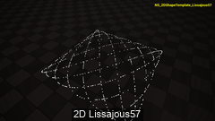

- **Type: 2D parametric curve
- **Formula: `float2(sin(5.0 * InputT), cos(7.0 * InputT))`
- **Description: Lissajous figure, frequency ratio 5:7.
- **NDI: `/EasyNSShape/NDI/NDI_2D_Lissajous57`
- **NE: `/EasyNSShape/NEBridge/NE/NE_2DShapeTemplate_Lissajous57`
- **NS: `/EasyNSShape/NEBridge/NS/NS_2D_Lissajous57`
- **NFS: `/EasyNSShape/NFS/NFS2D_Lissajous57`
- **Snapshot: [NS_2DShapeTemplate_Lissajous57.png](../Thumbs/NS_2DShapeTemplate_Lissajous57.png)
- **Video: [NS_2DShapeTemplate_Lissajous57.mp4](../Videos/NS_2DShapeTemplate_Lissajous57.mp4)
- **Input: `Module.InputT` (float)
- **Output: `float2`

### NDI_2D_LogarithmicSpiral — Logarithmic (equiangular) spiral.

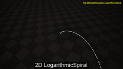

- **Type: 2D parametric curve
- **Formula: `float2(exp(InputT) * cos(InputT), exp(InputT) * sin(InputT))`
- **Description: Logarithmic (equiangular) spiral.
- **NDI: `/EasyNSShape/NDI/NDI_2D_LogarithmicSpiral`
- **NE: `/EasyNSShape/NEBridge/NE/NE_2DShapeTemplate_LogarithmicSpiral`
- **NS: `/EasyNSShape/NEBridge/NS/NS_2D_LogarithmicSpiral`
- **NFS: `/EasyNSShape/NFS/NFS2D_LogarithmicSpiral`
- **Snapshot: [NS_2DShapeTemplate_LogarithmicSpiral.png](../Thumbs/NS_2DShapeTemplate_LogarithmicSpiral.png)
- **Video: [NS_2DShapeTemplate_LogarithmicSpiral.mp4](../Videos/NS_2DShapeTemplate_LogarithmicSpiral.mp4)
- **Input: `Module.InputT` (float)
- **Output: `float2`

### NDI_2D_LogCurve — Logarithmic curve (log t, t).

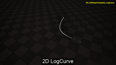

- **Type: 2D parametric curve
- **Formula: `float2(log(InputT), InputT)`
- **Description: Logarithmic curve (log t, t).
- **NDI: `/EasyNSShape/NDI/NDI_2D_LogCurve`
- **NE: `/EasyNSShape/NEBridge/NE/NE_2DShapeTemplate_LogCurve`
- **NS: `/EasyNSShape/NEBridge/NS/NS_2D_LogCurve`
- **NFS: `/EasyNSShape/NFS/NFS2D_LogCurve`
- **Snapshot: [NS_2DShapeTemplate_LogCurve.png](../Thumbs/NS_2DShapeTemplate_LogCurve.png)
- **Video: [NS_2DShapeTemplate_LogCurve.mp4](../Videos/NS_2DShapeTemplate_LogCurve.mp4)
- **Input: `Module.InputT` (float)
- **Output: `float2`

### NDI_2D_LogParabola — Log vs. parabolic curve (t^2, log t).

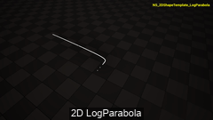

- **Type: 2D parametric curve
- **Formula: `float2(InputT*InputT, log(InputT))`
- **Description: Log vs. parabolic curve (t^2, log t).
- **NDI: `/EasyNSShape/NDI/NDI_2D_LogParabola`
- **NE: `/EasyNSShape/NEBridge/NE/NE_2DShapeTemplate_LogParabola`
- **NS: `/EasyNSShape/NEBridge/NS/NS_2D_LogParabola`
- **NFS: `/EasyNSShape/NFS/NFS2D_LogParabola`
- **Snapshot: [NS_2DShapeTemplate_LogParabola.png](../Thumbs/NS_2DShapeTemplate_LogParabola.png)
- **Video: [NS_2DShapeTemplate_LogParabola.mp4](../Videos/NS_2DShapeTemplate_LogParabola.mp4)
- **Input: `Module.InputT` (float)
- **Output: `float2`

### NDI_2D_LogSecant — Log/arctangent curve.

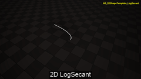

- **Type: 2D parametric curve
- **Formula: `float2(log(InputT * InputT + 1.0), atan(InputT))`
- **Description: Log/arctangent curve.
- **NDI: `/EasyNSShape/NDI/NDI_2D_LogSecant`
- **NE: `/EasyNSShape/NEBridge/NE/NE_2DShapeTemplate_LogSecant`
- **NS: `/EasyNSShape/NEBridge/NS/NS_2D_LogSecant`
- **NFS: `/EasyNSShape/NFS/NFS2D_LogSecant`
- **Snapshot: [NS_2DShapeTemplate_LogSecant.png](../Thumbs/NS_2DShapeTemplate_LogSecant.png)
- **Video: [NS_2DShapeTemplate_LogSecant.mp4](../Videos/NS_2DShapeTemplate_LogSecant.mp4)
- **Input: `Module.InputT` (float)
- **Output: `float2`

### NDI_2D_Parabola — Parabola (t, t^2).

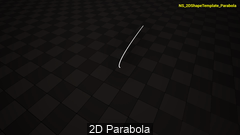

- **Type: 2D parametric curve
- **Formula: `float2(InputT, InputT * InputT)`
- **Description: Parabola (t, t^2).
- **NDI: `/EasyNSShape/NDI/NDI_2D_Parabola`
- **NE: `/EasyNSShape/NEBridge/NE/NE_2DShapeTemplate_Parabola`
- **NS: `/EasyNSShape/NEBridge/NS/NS_2D_Parabola`
- **NFS: `/EasyNSShape/NFS/NFS2D_Parabola`
- **Snapshot: [NS_2DShapeTemplate_Parabola.png](../Thumbs/NS_2DShapeTemplate_Parabola.png)
- **Video: [NS_2DShapeTemplate_Parabola.mp4](../Videos/NS_2DShapeTemplate_Parabola.mp4)
- **Input: `Module.InputT` (float)
- **Output: `float2`

### NDI_2D_ParabolaHigh — High-order parabola (t^5, t^10).


- **Type: 2D parametric curve
- **Formula: `float2(pow(InputT, 5.0), pow(InputT, 10.0))`
- **Description: High-order parabola (t^5, t^10).
- **NDI: `/EasyNSShape/NDI/NDI_2D_ParabolaHigh`
- **NE: `/EasyNSShape/NEBridge/NE/NE_2DShapeTemplate_ParabolaHigh`
- **NS: `/EasyNSShape/NEBridge/NS/NS_2D_ParabolaHigh`
- **NFS: `/EasyNSShape/NFS/NFS2D_ParabolaHigh`
- **Snapshot: [NS_2DShapeTemplate_ParabolaHigh.png](../Thumbs/NS_2DShapeTemplate_ParabolaHigh.png)
- **Video: [NS_2DShapeTemplate_ParabolaHigh.mp4](../Videos/NS_2DShapeTemplate_ParabolaHigh.mp4)
- **Input: `Module.InputT` (float)
- **Output: `float2`

### NDI_2D_ParabolaRational — Rational parabola with 1/t terms.


- **Type: 2D parametric curve
- **Formula: `float2(InputT + 1.0 / InputT, InputT * InputT + 1.0 / (InputT * InputT))`
- **Description: Rational parabola with 1/t terms.
- **NDI: `/EasyNSShape/NDI/NDI_2D_ParabolaRational`
- **NE: `/EasyNSShape/NEBridge/NE/NE_2DShapeTemplate_ParabolaRational`
- **NS: `/EasyNSShape/NEBridge/NS/NS_2D_ParabolaRational`
- **NFS: `/EasyNSShape/NFS/NFS2D_ParabolaRational`
- **Snapshot: [NS_2DShapeTemplate_ParabolaRational.png](../Thumbs/NS_2DShapeTemplate_ParabolaRational.png)
- **Video: [NS_2DShapeTemplate_ParabolaRational.mp4](../Videos/NS_2DShapeTemplate_ParabolaRational.mp4)
- **Input: `Module.InputT` (float)
- **Output: `float2`

### NDI_2D_ParabolaShifted — Parabola shifted by +1 on both axes.


- **Type: 2D parametric curve
- **Formula: `float2(InputT + 1.0, (InputT + 1.0) * (InputT + 1.0))`
- **Description: Parabola shifted by +1 on both axes.
- **NDI: `/EasyNSShape/NDI/NDI_2D_ParabolaShifted`
- **NE: `/EasyNSShape/NEBridge/NE/NE_2DShapeTemplate_ParabolaShifted`
- **NS: `/EasyNSShape/NEBridge/NS/NS_2D_ParabolaShifted`
- **NFS: `/EasyNSShape/NFS/NFS2D_ParabolaShifted`
- **Snapshot: [NS_2DShapeTemplate_ParabolaShifted.png](../Thumbs/NS_2DShapeTemplate_ParabolaShifted.png)
- **Video: [NS_2DShapeTemplate_ParabolaShifted.mp4](../Videos/NS_2DShapeTemplate_ParabolaShifted.mp4)
- **Input: `Module.InputT` (float)
- **Output: `float2`

### NDI_2D_ParabolaV2 — Parabola, variant 2.


- **Type: 2D parametric curve
- **Formula: `float2(InputT*InputT, InputT*InputT-2.0*InputT)`
- **Description: Parabola, variant 2.
- **NDI: `/EasyNSShape/NDI/NDI_2D_ParabolaV2`
- **NE: `/EasyNSShape/NEBridge/NE/NE_2DShapeTemplate_ParabolaV2`
- **NS: `/EasyNSShape/NEBridge/NS/NS_2D_ParabolaV2`
- **NFS: `/EasyNSShape/NFS/NFS2D_ParabolaV2`
- **Snapshot: [NS_2DShapeTemplate_ParabolaV2.png](../Thumbs/NS_2DShapeTemplate_ParabolaV2.png)
- **Video: [NS_2DShapeTemplate_ParabolaV2.mp4](../Videos/NS_2DShapeTemplate_ParabolaV2.mp4)
- **Input: `Module.InputT` (float)
- **Output: `float2`

### NDI_2D_ParabolaV3 — Parabola, variant 3.


- **Type: 2D parametric curve
- **Formula: `float2(InputT, InputT*InputT-2.0*InputT)`
- **Description: Parabola, variant 3.
- **NDI: `/EasyNSShape/NDI/NDI_2D_ParabolaV3`
- **NE: `/EasyNSShape/NEBridge/NE/NE_2DShapeTemplate_ParabolaV3`
- **NS: `/EasyNSShape/NEBridge/NS/NS_2D_ParabolaV3`
- **NFS: `/EasyNSShape/NFS/NFS2D_ParabolaV3`
- **Snapshot: [NS_2DShapeTemplate_ParabolaV3.png](../Thumbs/NS_2DShapeTemplate_ParabolaV3.png)
- **Video: [NS_2DShapeTemplate_ParabolaV3.mp4](../Videos/NS_2DShapeTemplate_ParabolaV3.mp4)
- **Input: `Module.InputT` (float)
- **Output: `float2`

### NDI_2D_ParabolicArc — Parabolic arc (cos t, cos 2t).


- **Type: 2D parametric curve
- **Formula: `float2(cos(InputT), cos(2.0*InputT))`
- **Description: Parabolic arc (cos t, cos 2t).
- **NDI: `/EasyNSShape/NDI/NDI_2D_ParabolicArc`
- **NE: `/EasyNSShape/NEBridge/NE/NE_2DShapeTemplate_ParabolicArc`
- **NS: `/EasyNSShape/NEBridge/NS/NS_2D_ParabolicArc`
- **NFS: `/EasyNSShape/NFS/NFS2D_ParabolicArc`
- **Snapshot: [NS_2DShapeTemplate_ParabolicArc.png](../Thumbs/NS_2DShapeTemplate_ParabolicArc.png)
- **Video: [NS_2DShapeTemplate_ParabolicArc.mp4](../Videos/NS_2DShapeTemplate_ParabolicArc.mp4)
- **Input: `Module.InputT` (float)
- **Output: `float2`

### NDI_2D_PowerCurve — Power curve (sqrt t, t^2).


- **Type: 2D parametric curve
- **Formula: `float2(sqrt(InputT), InputT*InputT)`
- **Description: Power curve (sqrt t, t^2).
- **NDI: `/EasyNSShape/NDI/NDI_2D_PowerCurve`
- **NE: `/EasyNSShape/NEBridge/NE/NE_2DShapeTemplate_PowerCurve`
- **NS: `/EasyNSShape/NEBridge/NS/NS_2D_PowerCurve`
- **NFS: `/EasyNSShape/NFS/NFS2D_PowerCurve`
- **Snapshot: [NS_2DShapeTemplate_PowerCurve.png](../Thumbs/NS_2DShapeTemplate_PowerCurve.png)
- **Video: [NS_2DShapeTemplate_PowerCurve.mp4](../Videos/NS_2DShapeTemplate_PowerCurve.mp4)
- **Input: `Module.InputT` (float)
- **Output: `float2`

### NDI_2D_PowerCurve2 — Power curve (t^3, sqrt t).


- **Type: 2D parametric curve
- **Formula: `float2(InputT*InputT*InputT, sqrt(InputT))`
- **Description: Power curve (t^3, sqrt t).
- **NDI: `/EasyNSShape/NDI/NDI_2D_PowerCurve2`
- **NE: `/EasyNSShape/NEBridge/NE/NE_2DShapeTemplate_PowerCurve2`
- **NS: `/EasyNSShape/NEBridge/NS/NS_2D_PowerCurve2`
- **NFS: `/EasyNSShape/NFS/NFS2D_PowerCurve2`
- **Snapshot: [NS_2DShapeTemplate_PowerCurve2.png](../Thumbs/NS_2DShapeTemplate_PowerCurve2.png)
- **Video: [NS_2DShapeTemplate_PowerCurve2.mp4](../Videos/NS_2DShapeTemplate_PowerCurve2.mp4)
- **Input: `Module.InputT` (float)
- **Output: `float2`

### NDI_2D_PowerCurve3 — Power curve (t^4, t^6).


- **Type: 2D parametric curve
- **Formula: `float2(pow(InputT, 4.0), pow(InputT, 6.0))`
- **Description: Power curve (t^4, t^6).
- **NDI: `/EasyNSShape/NDI/NDI_2D_PowerCurve3`
- **NE: `/EasyNSShape/NEBridge/NE/NE_2DShapeTemplate_PowerCurve3`
- **NS: `/EasyNSShape/NEBridge/NS/NS_2D_PowerCurve3`
- **NFS: `/EasyNSShape/NFS/NFS2D_PowerCurve3`
- **Snapshot: [NS_2DShapeTemplate_PowerCurve3.png](../Thumbs/NS_2DShapeTemplate_PowerCurve3.png)
- **Video: [NS_2DShapeTemplate_PowerCurve3.mp4](../Videos/NS_2DShapeTemplate_PowerCurve3.mp4)
- **Input: `Module.InputT` (float)
- **Output: `float2`

### NDI_2D_QuarticCurve — Quartic curve.


- **Type: 2D parametric curve
- **Formula: `float2(InputT * InputT * InputT - 3.0 * InputT, pow(InputT, 4.0) - 2.0 * InputT * InputT)`
- **Description: Quartic curve.
- **NDI: `/EasyNSShape/NDI/NDI_2D_QuarticCurve`
- **NE: `/EasyNSShape/NEBridge/NE/NE_2DShapeTemplate_QuarticCurve`
- **NS: `/EasyNSShape/NEBridge/NS/NS_2D_QuarticCurve`
- **NFS: `/EasyNSShape/NFS/NFS2D_QuarticCurve`
- **Snapshot: [NS_2DShapeTemplate_QuarticCurve.png](../Thumbs/NS_2DShapeTemplate_QuarticCurve.png)
- **Video: [NS_2DShapeTemplate_QuarticCurve.mp4](../Videos/NS_2DShapeTemplate_QuarticCurve.mp4)
- **Input: `Module.InputT` (float)
- **Output: `float2`

### NDI_2D_QuarticCurve2 — Quartic curve, variant 2.


- **Type: 2D parametric curve
- **Formula: `float2(pow(InputT, 4.0) - InputT * InputT, InputT * InputT * InputT)`
- **Description: Quartic curve, variant 2.
- **NDI: `/EasyNSShape/NDI/NDI_2D_QuarticCurve2`
- **NE: `/EasyNSShape/NEBridge/NE/NE_2DShapeTemplate_QuarticCurve2`
- **NS: `/EasyNSShape/NEBridge/NS/NS_2D_QuarticCurve2`
- **NFS: `/EasyNSShape/NFS/NFS2D_QuarticCurve2`
- **Snapshot: [NS_2DShapeTemplate_QuarticCurve2.png](../Thumbs/NS_2DShapeTemplate_QuarticCurve2.png)
- **Video: [NS_2DShapeTemplate_QuarticCurve2.mp4](../Videos/NS_2DShapeTemplate_QuarticCurve2.mp4)
- **Input: `Module.InputT` (float)
- **Output: `float2`

### NDI_2D_QuarticParabola — Quartic parabola (t^2, t^4).


- **Type: 2D parametric curve
- **Formula: `float2(InputT * InputT, pow(InputT, 4.0))`
- **Description: Quartic parabola (t^2, t^4).
- **NDI: `/EasyNSShape/NDI/NDI_2D_QuarticParabola`
- **NE: `/EasyNSShape/NEBridge/NE/NE_2DShapeTemplate_QuarticParabola`
- **NS: `/EasyNSShape/NEBridge/NS/NS_2D_QuarticParabola`
- **NFS: `/EasyNSShape/NFS/NFS2D_QuarticParabola`
- **Snapshot: [NS_2DShapeTemplate_QuarticParabola.png](../Thumbs/NS_2DShapeTemplate_QuarticParabola.png)
- **Video: [NS_2DShapeTemplate_QuarticParabola.mp4](../Videos/NS_2DShapeTemplate_QuarticParabola.mp4)
- **Input: `Module.InputT` (float)
- **Output: `float2`

### NDI_2D_RationalCurve — Rational curve.


- **Type: 2D parametric curve
- **Formula: `float2(InputT/(1.0+InputT*InputT), InputT*InputT/(1.0+InputT*InputT))`
- **Description: Rational curve.
- **NDI: `/EasyNSShape/NDI/NDI_2D_RationalCurve`
- **NE: `/EasyNSShape/NEBridge/NE/NE_2DShapeTemplate_RationalCurve`
- **NS: `/EasyNSShape/NEBridge/NS/NS_2D_RationalCurve`
- **NFS: `/EasyNSShape/NFS/NFS2D_RationalCurve`
- **Snapshot: [NS_2DShapeTemplate_RationalCurve.png](../Thumbs/NS_2DShapeTemplate_RationalCurve.png)
- **Video: [NS_2DShapeTemplate_RationalCurve.mp4](../Videos/NS_2DShapeTemplate_RationalCurve.mp4)
- **Input: `Module.InputT` (float)
- **Output: `float2`

### NDI_2D_RationalCurve2 — Rational curve, variant 2.


- **Type: 2D parametric curve
- **Formula: `float2(InputT*InputT/(1.0+InputT*InputT), InputT/(1.0+InputT*InputT))`
- **Description: Rational curve, variant 2.
- **NDI: `/EasyNSShape/NDI/NDI_2D_RationalCurve2`
- **NE: `/EasyNSShape/NEBridge/NE/NE_2DShapeTemplate_RationalCurve2`
- **NS: `/EasyNSShape/NEBridge/NS/NS_2D_RationalCurve2`
- **NFS: `/EasyNSShape/NFS/NFS2D_RationalCurve2`
- **Snapshot: [NS_2DShapeTemplate_RationalCurve2.png](../Thumbs/NS_2DShapeTemplate_RationalCurve2.png)
- **Video: [NS_2DShapeTemplate_RationalCurve2.mp4](../Videos/NS_2DShapeTemplate_RationalCurve2.mp4)
- **Input: `Module.InputT` (float)
- **Output: `float2`

### NDI_2D_RationalCurve3 — Rational curve, variant 3.


- **Type: 2D parametric curve
- **Formula: `float2(InputT*InputT+1.0/InputT, InputT*InputT-1.0/InputT)`
- **Description: Rational curve, variant 3.
- **NDI: `/EasyNSShape/NDI/NDI_2D_RationalCurve3`
- **NE: `/EasyNSShape/NEBridge/NE/NE_2DShapeTemplate_RationalCurve3`
- **NS: `/EasyNSShape/NEBridge/NS/NS_2D_RationalCurve3`
- **NFS: `/EasyNSShape/NFS/NFS2D_RationalCurve3`
- **Snapshot: [NS_2DShapeTemplate_RationalCurve3.png](../Thumbs/NS_2DShapeTemplate_RationalCurve3.png)
- **Video: [NS_2DShapeTemplate_RationalCurve3.mp4](../Videos/NS_2DShapeTemplate_RationalCurve3.mp4)
- **Input: `Module.InputT` (float)
- **Output: `float2`

### NDI_2D_RationalCurve4 — Rational curve, variant 4.


- **Type: 2D parametric curve
- **Formula: `float2(InputT*InputT/(1.0+InputT*InputT), InputT*InputT*InputT/(1.0+InputT*InputT))`
- **Description: Rational curve, variant 4.
- **NDI: `/EasyNSShape/NDI/NDI_2D_RationalCurve4`
- **NE: `/EasyNSShape/NEBridge/NE/NE_2DShapeTemplate_RationalCurve4`
- **NS: `/EasyNSShape/NEBridge/NS/NS_2D_RationalCurve4`
- **NFS: `/EasyNSShape/NFS/NFS2D_RationalCurve4`
- **Snapshot: [NS_2DShapeTemplate_RationalCurve4.png](../Thumbs/NS_2DShapeTemplate_RationalCurve4.png)
- **Video: [NS_2DShapeTemplate_RationalCurve4.mp4](../Videos/NS_2DShapeTemplate_RationalCurve4.mp4)
- **Input: `Module.InputT` (float)
- **Output: `float2`

### NDI_2D_RationalCurve5 — Rational curve, variant 5.


- **Type: 2D parametric curve
- **Formula: `float2((InputT*InputT*InputT-1.0)/(InputT*InputT+1.0), (InputT*InputT*InputT+1.0)/(InputT*InputT+1.0))`
- **Description: Rational curve, variant 5.
- **NDI: `/EasyNSShape/NDI/NDI_2D_RationalCurve5`
- **NE: `/EasyNSShape/NEBridge/NE/NE_2DShapeTemplate_RationalCurve5`
- **NS: `/EasyNSShape/NEBridge/NS/NS_2D_RationalCurve5`
- **NFS: `/EasyNSShape/NFS/NFS2D_RationalCurve5`
- **Snapshot: [NS_2DShapeTemplate_RationalCurve5.png](../Thumbs/NS_2DShapeTemplate_RationalCurve5.png)
- **Video: [NS_2DShapeTemplate_RationalCurve5.mp4](../Videos/NS_2DShapeTemplate_RationalCurve5.mp4)
- **Input: `Module.InputT` (float)
- **Output: `float2`

### NDI_2D_RationalCurve6 — Rational curve, variant 6.


- **Type: 2D parametric curve
- **Formula: `float2(InputT * InputT + 1.0 / (InputT * InputT), InputT * InputT * InputT + 1.0 / (InputT * InputT * InputT))`
- **Description: Rational curve, variant 6.
- **NDI: `/EasyNSShape/NDI/NDI_2D_RationalCurve6`
- **NE: `/EasyNSShape/NEBridge/NE/NE_2DShapeTemplate_RationalCurve6`
- **NS: `/EasyNSShape/NEBridge/NS/NS_2D_RationalCurve6`
- **NFS: `/EasyNSShape/NFS/NFS2D_RationalCurve6`
- **Snapshot: [NS_2DShapeTemplate_RationalCurve6.png](../Thumbs/NS_2DShapeTemplate_RationalCurve6.png)
- **Video: [NS_2DShapeTemplate_RationalCurve6.mp4](../Videos/NS_2DShapeTemplate_RationalCurve6.mp4)
- **Input: `Module.InputT` (float)
- **Output: `float2`

### NDI_2D_RectangularHyperbola — Rectangular hyperbola (t, 1/t).


- **Type: 2D parametric curve
- **Formula: `float2(InputT, 1.0/InputT)`
- **Description: Rectangular hyperbola (t, 1/t).
- **NDI: `/EasyNSShape/NDI/NDI_2D_RectangularHyperbola`
- **NE: `/EasyNSShape/NEBridge/NE/NE_2DShapeTemplate_RectangularHyperbola`
- **NS: `/EasyNSShape/NEBridge/NS/NS_2D_RectangularHyperbola`
- **NFS: `/EasyNSShape/NFS/NFS2D_RectangularHyperbola`
- **Snapshot: [NS_2DShapeTemplate_RectangularHyperbola.png](../Thumbs/NS_2DShapeTemplate_RectangularHyperbola.png)
- **Video: [NS_2DShapeTemplate_RectangularHyperbola.mp4](../Videos/NS_2DShapeTemplate_RectangularHyperbola.mp4)
- **Input: `Module.InputT` (float)
- **Output: `float2`

### NDI_2D_RectHyperbola2 — Rectangular hyperbola, variant 2.


- **Type: 2D parametric curve
- **Formula: `float2(InputT+1.0/InputT, InputT-1.0/InputT)`
- **Description: Rectangular hyperbola, variant 2.
- **NDI: `/EasyNSShape/NDI/NDI_2D_RectHyperbola2`
- **NE: `/EasyNSShape/NEBridge/NE/NE_2DShapeTemplate_RectHyperbola2`
- **NS: `/EasyNSShape/NEBridge/NS/NS_2D_RectHyperbola2`
- **NFS: `/EasyNSShape/NFS/NFS2D_RectHyperbola2`
- **Snapshot: [NS_2DShapeTemplate_RectHyperbola2.png](../Thumbs/NS_2DShapeTemplate_RectHyperbola2.png)
- **Video: [NS_2DShapeTemplate_RectHyperbola2.mp4](../Videos/NS_2DShapeTemplate_RectHyperbola2.mp4)
- **Input: `Module.InputT` (float)
- **Output: `float2`

### NDI_2D_RectHyperbola3 — Rectangular hyperbola, variant 3.


- **Type: 2D parametric curve
- **Formula: `float2((InputT * InputT + 1.0) / InputT, (InputT * InputT - 1.0) / InputT)`
- **Description: Rectangular hyperbola, variant 3.
- **NDI: `/EasyNSShape/NDI/NDI_2D_RectHyperbola3`
- **NE: `/EasyNSShape/NEBridge/NE/NE_2DShapeTemplate_RectHyperbola3`
- **NS: `/EasyNSShape/NEBridge/NS/NS_2D_RectHyperbola3`
- **NFS: `/EasyNSShape/NFS/NFS2D_RectHyperbola3`
- **Snapshot: [NS_2DShapeTemplate_RectHyperbola3.png](../Thumbs/NS_2DShapeTemplate_RectHyperbola3.png)
- **Video: [NS_2DShapeTemplate_RectHyperbola3.mp4](../Videos/NS_2DShapeTemplate_RectHyperbola3.mp4)
- **Input: `Module.InputT` (float)
- **Output: `float2`

### NDI_2D_RotatedEllipse — Rotated ellipse (sin t, sin(t + 60°)).


- **Type: 2D parametric curve
- **Formula: `float2(sin(InputT), sin(InputT + 1.0472))`
- **Description: Rotated ellipse (sin t, sin(t + 60°)).
- **NDI: `/EasyNSShape/NDI/NDI_2D_RotatedEllipse`
- **NE: `/EasyNSShape/NEBridge/NE/NE_2DShapeTemplate_RotatedEllipse`
- **NS: `/EasyNSShape/NEBridge/NS/NS_2D_RotatedEllipse`
- **NFS: `/EasyNSShape/NFS/NFS2D_RotatedEllipse`
- **Snapshot: [NS_2DShapeTemplate_RotatedEllipse.png](../Thumbs/NS_2DShapeTemplate_RotatedEllipse.png)
- **Video: [NS_2DShapeTemplate_RotatedEllipse.mp4](../Videos/NS_2DShapeTemplate_RotatedEllipse.mp4)
- **Input: `Module.InputT` (float)
- **Output: `float2`

### NDI_2D_SemicubicalParabola — Semicubical parabola (t^2, t^3).


- **Type: 2D parametric curve
- **Formula: `float2(InputT * InputT, InputT * InputT * InputT)`
- **Description: Semicubical parabola (t^2, t^3).
- **NDI: `/EasyNSShape/NDI/NDI_2D_SemicubicalParabola`
- **NE: `/EasyNSShape/NEBridge/NE/NE_2DShapeTemplate_SemicubicalParabola`
- **NS: `/EasyNSShape/NEBridge/NS/NS_2D_SemicubicalParabola`
- **NFS: `/EasyNSShape/NFS/NFS2D_SemicubicalParabola`
- **Snapshot: [NS_2DShapeTemplate_SemicubicalParabola.png](../Thumbs/NS_2DShapeTemplate_SemicubicalParabola.png)
- **Video: [NS_2DShapeTemplate_SemicubicalParabola.mp4](../Videos/NS_2DShapeTemplate_SemicubicalParabola.mp4)
- **Input: `Module.InputT` (float)
- **Output: `float2`

### NDI_2D_SemicubicalParabola2 — Semicubical parabola, axes swapped.


- **Type: 2D parametric curve
- **Formula: `float2(InputT*InputT*InputT, InputT*InputT)`
- **Description: Semicubical parabola, axes swapped.
- **NDI: `/EasyNSShape/NDI/NDI_2D_SemicubicalParabola2`
- **NE: `/EasyNSShape/NEBridge/NE/NE_2DShapeTemplate_SemicubicalParabola2`
- **NS: `/EasyNSShape/NEBridge/NS/NS_2D_SemicubicalParabola2`
- **NFS: `/EasyNSShape/NFS/NFS2D_SemicubicalParabola2`
- **Snapshot: [NS_2DShapeTemplate_SemicubicalParabola2.png](../Thumbs/NS_2DShapeTemplate_SemicubicalParabola2.png)
- **Video: [NS_2DShapeTemplate_SemicubicalParabola2.mp4](../Videos/NS_2DShapeTemplate_SemicubicalParabola2.mp4)
- **Input: `Module.InputT` (float)
- **Output: `float2`

### NDI_2D_SineSquared — Sine-squared curve (cos t, sin²t).


- **Type: 2D parametric curve
- **Formula: `float2(cos(InputT), sin(InputT)*sin(InputT))`
- **Description: Sine-squared curve (cos t, sin²t).
- **NDI: `/EasyNSShape/NDI/NDI_2D_SineSquared`
- **NE: `/EasyNSShape/NEBridge/NE/NE_2DShapeTemplate_SineSquared`
- **NS: `/EasyNSShape/NEBridge/NS/NS_2D_SineSquared`
- **NFS: `/EasyNSShape/NFS/NFS2D_SineSquared`
- **Snapshot: [NS_2DShapeTemplate_SineSquared.png](../Thumbs/NS_2DShapeTemplate_SineSquared.png)
- **Video: [NS_2DShapeTemplate_SineSquared.mp4](../Videos/NS_2DShapeTemplate_SineSquared.mp4)
- **Input: `Module.InputT` (float)
- **Output: `float2`

### NDI_2D_SpiralCurve — Spiral curve (cos πt, sin πt²).


- **Type: 2D parametric curve
- **Formula: `float2(cos(3.14159 * InputT), sin(3.14159 * InputT * InputT))`
- **Description: Spiral curve (cos πt, sin πt²).
- **NDI: `/EasyNSShape/NDI/NDI_2D_SpiralCurve`
- **NE: `/EasyNSShape/NEBridge/NE/NE_2DShapeTemplate_SpiralCurve`
- **NS: `/EasyNSShape/NEBridge/NS/NS_2D_SpiralCurve`
- **NFS: `/EasyNSShape/NFS/NFS2D_SpiralCurve`
- **Snapshot: [NS_2DShapeTemplate_SpiralCurve.png](../Thumbs/NS_2DShapeTemplate_SpiralCurve.png)
- **Video: [NS_2DShapeTemplate_SpiralCurve.mp4](../Videos/NS_2DShapeTemplate_SpiralCurve.mp4)
- **Input: `Module.InputT` (float)
- **Output: `float2`

### NDI_2D_Tractrix — Tractrix (pursuit curve).


- **Type: 2D parametric curve
- **Formula: `float2(cos(InputT)+log(tan(InputT*0.5)), sin(InputT))`
- **Description: Tractrix (pursuit curve).
- **NDI: `/EasyNSShape/NDI/NDI_2D_Tractrix`
- **NE: `/EasyNSShape/NEBridge/NE/NE_2DShapeTemplate_Tractrix`
- **NS: `/EasyNSShape/NEBridge/NS/NS_2D_Tractrix`
- **NFS: `/EasyNSShape/NFS/NFS2D_Tractrix`
- **Snapshot: [NS_2DShapeTemplate_Tractrix.png](../Thumbs/NS_2DShapeTemplate_Tractrix.png)
- **Video: [NS_2DShapeTemplate_Tractrix.mp4](../Videos/NS_2DShapeTemplate_Tractrix.mp4)
- **Input: `Module.InputT` (float)
- **Output: `float2`

### NDI_2D_Tractrix2 — Tractrix, variant 2.


- **Type: 2D parametric curve
- **Formula: `float2(1.0/cosh(InputT), InputT-tanh(InputT))`
- **Description: Tractrix, variant 2.
- **NDI: `/EasyNSShape/NDI/NDI_2D_Tractrix2`
- **NE: `/EasyNSShape/NEBridge/NE/NE_2DShapeTemplate_Tractrix2`
- **NS: `/EasyNSShape/NEBridge/NS/NS_2D_Tractrix2`
- **NFS: `/EasyNSShape/NFS/NFS2D_Tractrix2`
- **Snapshot: [NS_2DShapeTemplate_Tractrix2.png](../Thumbs/NS_2DShapeTemplate_Tractrix2.png)
- **Video: [NS_2DShapeTemplate_Tractrix2.mp4](../Videos/NS_2DShapeTemplate_Tractrix2.mp4)
- **Input: `Module.InputT` (float)
- **Output: `float2`

### NDI_2D_Tractrix3 — Tractrix, variant 3.


- **Type: 2D parametric curve
- **Formula: `float2(InputT - tanh(InputT), 1.0 / cosh(InputT))`
- **Description: Tractrix, variant 3.
- **NDI: `/EasyNSShape/NDI/NDI_2D_Tractrix3`
- **NE: `/EasyNSShape/NEBridge/NE/NE_2DShapeTemplate_Tractrix3`
- **NS: `/EasyNSShape/NEBridge/NS/NS_2D_Tractrix3`
- **NFS: `/EasyNSShape/NFS/NFS2D_Tractrix3`
- **Snapshot: [NS_2DShapeTemplate_Tractrix3.png](../Thumbs/NS_2DShapeTemplate_Tractrix3.png)
- **Video: [NS_2DShapeTemplate_Tractrix3.mp4](../Videos/NS_2DShapeTemplate_Tractrix3.mp4)
- **Input: `Module.InputT` (float)
- **Output: `float2`

### NDI_2D_Trochoid — Trochoid (extended cycloid).


- **Type: 2D parametric curve
- **Formula: `float2(InputT+sin(InputT), 1.0+cos(InputT))`
- **Description: Trochoid (extended cycloid).
- **NDI: `/EasyNSShape/NDI/NDI_2D_Trochoid`
- **NE: `/EasyNSShape/NEBridge/NE/NE_2DShapeTemplate_Trochoid`
- **NS: `/EasyNSShape/NEBridge/NS/NS_2D_Trochoid`
- **NFS: `/EasyNSShape/NFS/NFS2D_Trochoid`
- **Snapshot: [NS_2DShapeTemplate_Trochoid.png](../Thumbs/NS_2DShapeTemplate_Trochoid.png)
- **Video: [NS_2DShapeTemplate_Trochoid.mp4](../Videos/NS_2DShapeTemplate_Trochoid.mp4)
- **Input: `Module.InputT` (float)
- **Output: `float2`

### NDI_2D_Trochoid2 — Trochoid, variant 2.


- **Type: 2D parametric curve
- **Formula: `float2(2.0*InputT-sin(InputT), 2.0-cos(InputT))`
- **Description: Trochoid, variant 2.
- **NDI: `/EasyNSShape/NDI/NDI_2D_Trochoid2`
- **NE: `/EasyNSShape/NEBridge/NE/NE_2DShapeTemplate_Trochoid2`
- **NS: `/EasyNSShape/NEBridge/NS/NS_2D_Trochoid2`
- **NFS: `/EasyNSShape/NFS/NFS2D_Trochoid2`
- **Snapshot: [NS_2DShapeTemplate_Trochoid2.png](../Thumbs/NS_2DShapeTemplate_Trochoid2.png)
- **Video: [NS_2DShapeTemplate_Trochoid2.mp4](../Videos/NS_2DShapeTemplate_Trochoid2.mp4)
- **Input: `Module.InputT` (float)
- **Output: `float2`

### NDI_2D_UnitCircle — Rational unit circle.


- **Type: 2D parametric curve
- **Formula: `float2((1.0-InputT*InputT)/(1.0+InputT*InputT), 2.0*InputT/(1.0+InputT*InputT))`
- **Description: Rational unit circle.
- **NDI: `/EasyNSShape/NDI/NDI_2D_UnitCircle`
- **NE: `/EasyNSShape/NEBridge/NE/NE_2DShapeTemplate_UnitCircle`
- **NS: `/EasyNSShape/NEBridge/NS/NS_2D_UnitCircle`
- **NFS: `/EasyNSShape/NFS/NFS2D_UnitCircle`
- **Snapshot: [NS_2DShapeTemplate_UnitCircle.png](../Thumbs/NS_2DShapeTemplate_UnitCircle.png)
- **Video: [NS_2DShapeTemplate_UnitCircle.mp4](../Videos/NS_2DShapeTemplate_UnitCircle.mp4)
- **Input: `Module.InputT` (float)
- **Output: `float2`

### NDI_2D_UnitCircle3 — Rational unit circle, variant 3.


- **Type: 2D parametric curve
- **Formula: `float2((InputT * InputT - 1.0) / (InputT * InputT + 1.0), 2.0 * InputT / (InputT * InputT + 1.0))`
- **Description: Rational unit circle, variant 3.
- **NDI: `/EasyNSShape/NDI/NDI_2D_UnitCircle3`
- **NE: `/EasyNSShape/NEBridge/NE/NE_2DShapeTemplate_UnitCircle3`
- **NS: `/EasyNSShape/NEBridge/NS/NS_2D_UnitCircle3`
- **NFS: `/EasyNSShape/NFS/NFS2D_UnitCircle3`
- **Snapshot: [NS_2DShapeTemplate_UnitCircle3.png](../Thumbs/NS_2DShapeTemplate_UnitCircle3.png)
- **Video: [NS_2DShapeTemplate_UnitCircle3.mp4](../Videos/NS_2DShapeTemplate_UnitCircle3.mp4)
- **Input: `Module.InputT` (float)
- **Output: `float2`

### NDI_2D_UnitCircle4 — Rational unit circle, variant 4.


- **Type: 2D parametric curve
- **Formula: `float2(2.0 * InputT / (InputT * InputT + 1.0), (InputT * InputT - 1.0) / (InputT * InputT + 1.0))`
- **Description: Rational unit circle, variant 4.
- **NDI: `/EasyNSShape/NDI/NDI_2D_UnitCircle4`
- **NE: `/EasyNSShape/NEBridge/NE/NE_2DShapeTemplate_UnitCircle4`
- **NS: `/EasyNSShape/NEBridge/NS/NS_2D_UnitCircle4`
- **NFS: `/EasyNSShape/NFS/NFS2D_UnitCircle4`
- **Snapshot: [NS_2DShapeTemplate_UnitCircle4.png](../Thumbs/NS_2DShapeTemplate_UnitCircle4.png)
- **Video: [NS_2DShapeTemplate_UnitCircle4.mp4](../Videos/NS_2DShapeTemplate_UnitCircle4.mp4)
- **Input: `Module.InputT` (float)
- **Output: `float2`

### NDI_2D_UnitCircleHyperbolic — Hyperbolic unit circle (tanh, sech).


- **Type: 2D parametric curve
- **Formula: `float2(tanh(InputT), 1.0 / cosh(InputT))`
- **Description: Hyperbolic unit circle (tanh, sech).
- **NDI: `/EasyNSShape/NDI/NDI_2D_UnitCircleHyperbolic`
- **NE: `/EasyNSShape/NEBridge/NE/NE_2DShapeTemplate_UnitCircleHyperbolic`
- **NS: `/EasyNSShape/NEBridge/NS/NS_2D_UnitCircleHyperbolic`
- **NFS: `/EasyNSShape/NFS/NFS2D_UnitCircleHyperbolic`
- **Snapshot: [NS_2DShapeTemplate_UnitCircleHyperbolic.png](../Thumbs/NS_2DShapeTemplate_UnitCircleHyperbolic.png)
- **Video: [NS_2DShapeTemplate_UnitCircleHyperbolic.mp4](../Videos/NS_2DShapeTemplate_UnitCircleHyperbolic.mp4)
- **Input: `Module.InputT` (float)
- **Output: `float2`

### NDI_2D_WitchAgnesi — Witch of Agnesi.


- **Type: 2D parametric curve
- **Formula: `float2(InputT, 1.0 / (1.0 + InputT * InputT))`
- **Description: Witch of Agnesi.
- **NDI: `/EasyNSShape/NDI/NDI_2D_WitchAgnesi`
- **NE: `/EasyNSShape/NEBridge/NE/NE_2DShapeTemplate_WitchAgnesi`
- **NS: `/EasyNSShape/NEBridge/NS/NS_2D_WitchAgnesi`
- **NFS: `/EasyNSShape/NFS/NFS2D_WitchAgnesi`
- **Snapshot: [NS_2DShapeTemplate_WitchAgnesi.png](../Thumbs/NS_2DShapeTemplate_WitchAgnesi.png)
- **Video: [NS_2DShapeTemplate_WitchAgnesi.mp4](../Videos/NS_2DShapeTemplate_WitchAgnesi.mp4)
- **Input: `Module.InputT` (float)
- **Output: `float2`

### NDI_2D_WitchAgnesiVariant — Witch of Agnesi, variant.


- **Type: 2D parametric curve
- **Formula: `float2(InputT / (InputT * InputT + 1.0), (InputT * InputT - 1.0) / (InputT * InputT + 1.0))`
- **Description: Witch of Agnesi, variant.
- **NDI: `/EasyNSShape/NDI/NDI_2D_WitchAgnesiVariant`
- **NE: `/EasyNSShape/NEBridge/NE/NE_2DShapeTemplate_WitchAgnesiVariant`
- **NS: `/EasyNSShape/NEBridge/NS/NS_2D_WitchAgnesiVariant`
- **NFS: `/EasyNSShape/NFS/NFS2D_WitchAgnesiVariant`
- **Snapshot: [NS_2DShapeTemplate_WitchAgnesiVariant.png](../Thumbs/NS_2DShapeTemplate_WitchAgnesiVariant.png)
- **Video: [NS_2DShapeTemplate_WitchAgnesiVariant.mp4](../Videos/NS_2DShapeTemplate_WitchAgnesiVariant.mp4)
- **Input: `Module.InputT` (float)
- **Output: `float2`

## 3D Shape Details (27)

### NDI_3D_AstroidExtrude — Astroid extruded along Z.


- **Type: 3D parametric curve
- **Formula: `float3(pow(cos(InputT),3.0), pow(sin(InputT),3.0), InputT)`
- **Description: Astroid extruded along Z.
- **NDI: `/EasyNSShape/NDI/NDI_3D_AstroidExtrude`
- **NE: `/EasyNSShape/NEBridge/NE/NE_3DShapeTemplate_AstroidExtrude`
- **NS: `/EasyNSShape/NEBridge/NS/NS_3D_AstroidExtrude`
- **NFS: `/EasyNSShape/NFS/NFS3D_AstroidExtrude`
- **Snapshot: [NS_3DShapeTemplate_AstroidExtrude.png](../Thumbs/NS_3DShapeTemplate_AstroidExtrude.png)
- **Video: [NS_3DShapeTemplate_AstroidExtrude.mp4](../Videos/NS_3DShapeTemplate_AstroidExtrude.mp4)
- **Input: `Module.InputT` (float)
- **Output: `float3`

### NDI_3D_CircularHelix — Circular helix (constant radius).


- **Type: 3D parametric curve
- **Formula: `float3(cos(InputT), sin(InputT), InputT)`
- **Description: Circular helix (constant radius).
- **NDI: `/EasyNSShape/NDI/NDI_3D_CircularHelix`
- **NE: `/EasyNSShape/NEBridge/NE/NE_3DShapeTemplate_CircularHelix`
- **NS: `/EasyNSShape/NEBridge/NS/NS_3D_CircularHelix`
- **NFS: `/EasyNSShape/NFS/NFS3D_CircularHelix`
- **Snapshot: [NS_3DShapeTemplate_CircularHelix.png](../Thumbs/NS_3DShapeTemplate_CircularHelix.png)
- **Video: [NS_3DShapeTemplate_CircularHelix.mp4](../Videos/NS_3DShapeTemplate_CircularHelix.mp4)
- **Input: `Module.InputT` (float)
- **Output: `float3`

### NDI_3D_CliffordTorusKnot — Clifford torus knot.


- **Type: 3D parametric curve
- **Formula: `float3((2.0+cos(2.0*InputT))*cos(3.0*InputT), (2.0+cos(2.0*InputT))*sin(3.0*InputT), sin(2.0*InputT))`
- **Description: Clifford torus knot.
- **NDI: `/EasyNSShape/NDI/NDI_3D_CliffordTorusKnot`
- **NE: `/EasyNSShape/NEBridge/NE/NE_3DShapeTemplate_CliffordTorusKnot`
- **NS: `/EasyNSShape/NEBridge/NS/NS_3D_CliffordTorusKnot`
- **NFS: `/EasyNSShape/NFS/NFS3D_CliffordTorusKnot`
- **Snapshot: [NS_3DShapeTemplate_CliffordTorusKnot.png](../Thumbs/NS_3DShapeTemplate_CliffordTorusKnot.png)
- **Video: [NS_3DShapeTemplate_CliffordTorusKnot.mp4](../Videos/NS_3DShapeTemplate_CliffordTorusKnot.mp4)
- **Input: `Module.InputT` (float)
- **Output: `float3`

### NDI_3D_ConicalHelix — Conical helix — radius grows with t.


- **Type: 3D parametric curve
- **Formula: `float3(InputT * cos(InputT), InputT * sin(InputT), InputT)`
- **Description: Conical helix — radius grows with t.
- **NDI: `/EasyNSShape/NDI/NDI_3D_ConicalHelix`
- **NE: `/EasyNSShape/NEBridge/NE/NE_3DShapeTemplate_ConicalHelix`
- **NS: `/EasyNSShape/NEBridge/NS/NS_3D_ConicalHelix`
- **NFS: `/EasyNSShape/NFS/NFS3D_ConicalHelix`
- **Snapshot: [NS_3DShapeTemplate_ConicalHelix.png](../Thumbs/NS_3DShapeTemplate_ConicalHelix.png)
- **Video: [NS_3DShapeTemplate_ConicalHelix.mp4](../Videos/NS_3DShapeTemplate_ConicalHelix.mp4)
- **Input: `Module.InputT` (float)
- **Output: `float3`

### NDI_3D_CubicHelix — Cubic helix (t, t², t³).


- **Type: 3D parametric curve
- **Formula: `float3(InputT, InputT*InputT, InputT*InputT*InputT)`
- **Description: Cubic helix (t, t², t³).
- **NDI: `/EasyNSShape/NDI/NDI_3D_CubicHelix`
- **NE: `/EasyNSShape/NEBridge/NE/NE_3DShapeTemplate_CubicHelix`
- **NS: `/EasyNSShape/NEBridge/NS/NS_3D_CubicHelix`
- **NFS: `/EasyNSShape/NFS/NFS3D_CubicHelix`
- **Snapshot: [NS_3DShapeTemplate_CubicHelix.png](../Thumbs/NS_3DShapeTemplate_CubicHelix.png)
- **Video: [NS_3DShapeTemplate_CubicHelix.mp4](../Videos/NS_3DShapeTemplate_CubicHelix.mp4)
- **Input: `Module.InputT` (float)
- **Output: `float3`

### NDI_3D_CycloidalHelix — Cycloidal helix.


- **Type: 3D parametric curve
- **Formula: `float3(cos(InputT)*sin(InputT), sin(InputT)*sin(InputT), cos(InputT))`
- **Description: Cycloidal helix.
- **NDI: `/EasyNSShape/NDI/NDI_3D_CycloidalHelix`
- **NE: `/EasyNSShape/NEBridge/NE/NE_3DShapeTemplate_CycloidalHelix`
- **NS: `/EasyNSShape/NEBridge/NS/NS_3D_CycloidalHelix`
- **NFS: `/EasyNSShape/NFS/NFS3D_CycloidalHelix`
- **Snapshot: [NS_3DShapeTemplate_CycloidalHelix.png](../Thumbs/NS_3DShapeTemplate_CycloidalHelix.png)
- **Video: [NS_3DShapeTemplate_CycloidalHelix.mp4](../Videos/NS_3DShapeTemplate_CycloidalHelix.mp4)
- **Input: `Module.InputT` (float)
- **Output: `float3`

### NDI_3D_EggHelix — Egg-shaped helix.


- **Type: 3D parametric curve
- **Formula: `float3(cos(InputT)*cos(InputT), cos(InputT)*sin(InputT), sin(InputT))`
- **Description: Egg-shaped helix.
- **NDI: `/EasyNSShape/NDI/NDI_3D_EggHelix`
- **NE: `/EasyNSShape/NEBridge/NE/NE_3DShapeTemplate_EggHelix`
- **NS: `/EasyNSShape/NEBridge/NS/NS_3D_EggHelix`
- **NFS: `/EasyNSShape/NFS/NFS3D_EggHelix`
- **Snapshot: [NS_3DShapeTemplate_EggHelix.png](../Thumbs/NS_3DShapeTemplate_EggHelix.png)
- **Video: [NS_3DShapeTemplate_EggHelix.mp4](../Videos/NS_3DShapeTemplate_EggHelix.mp4)
- **Input: `Module.InputT` (float)
- **Output: `float3`

### NDI_3D_FigureEightKnot — Figure-eight knot.


- **Type: 3D parametric curve
- **Formula: `float3((2.0+cos(2.0*InputT))*cos(3.0*InputT), (2.0+cos(2.0*InputT))*sin(3.0*InputT), sin(4.0*InputT))`
- **Description: Figure-eight knot.
- **NDI: `/EasyNSShape/NDI/NDI_3D_FigureEightKnot`
- **NE: `/EasyNSShape/NEBridge/NE/NE_3DShapeTemplate_FigureEightKnot`
- **NS: `/EasyNSShape/NEBridge/NS/NS_3D_FigureEightKnot`
- **NFS: `/EasyNSShape/NFS/NFS3D_FigureEightKnot`
- **Snapshot: [NS_3DShapeTemplate_FigureEightKnot.png](../Thumbs/NS_3DShapeTemplate_FigureEightKnot.png)
- **Video: [NS_3DShapeTemplate_FigureEightKnot.mp4](../Videos/NS_3DShapeTemplate_FigureEightKnot.mp4)
- **Input: `Module.InputT` (float)
- **Output: `float3`

### NDI_3D_GreatCircleSphere — Great circle on a sphere.


- **Type: 3D parametric curve
- **Formula: `float3(cos(InputT*0.5)*cos(InputT), cos(InputT*0.5)*sin(InputT), sin(InputT*0.5))`
- **Description: Great circle on a sphere.
- **NDI: `/EasyNSShape/NDI/NDI_3D_GreatCircleSphere`
- **NE: `/EasyNSShape/NEBridge/NE/NE_3DShapeTemplate_GreatCircleSphere`
- **NS: `/EasyNSShape/NEBridge/NS/NS_3D_GreatCircleSphere`
- **NFS: `/EasyNSShape/NFS/NFS3D_GreatCircleSphere`
- **Snapshot: [NS_3DShapeTemplate_GreatCircleSphere.png](../Thumbs/NS_3DShapeTemplate_GreatCircleSphere.png)
- **Video: [NS_3DShapeTemplate_GreatCircleSphere.mp4](../Videos/NS_3DShapeTemplate_GreatCircleSphere.mp4)
- **Input: `Module.InputT` (float)
- **Output: `float3`

### NDI_3D_HyperbolicHelix — Hyperbolic helix (cosh/sinh).


- **Type: 3D parametric curve
- **Formula: `float3(cosh(InputT)*cos(InputT), cosh(InputT)*sin(InputT), sinh(InputT))`
- **Description: Hyperbolic helix (cosh/sinh).
- **NDI: `/EasyNSShape/NDI/NDI_3D_HyperbolicHelix`
- **NE: `/EasyNSShape/NEBridge/NE/NE_3DShapeTemplate_HyperbolicHelix`
- **NS: `/EasyNSShape/NEBridge/NS/NS_3D_HyperbolicHelix`
- **NFS: `/EasyNSShape/NFS/NFS3D_HyperbolicHelix`
- **Snapshot: [NS_3DShapeTemplate_HyperbolicHelix.png](../Thumbs/NS_3DShapeTemplate_HyperbolicHelix.png)
- **Video: [NS_3DShapeTemplate_HyperbolicHelix.mp4](../Videos/NS_3DShapeTemplate_HyperbolicHelix.mp4)
- **Input: `Module.InputT` (float)
- **Output: `float3`

### NDI_3D_HyperbolicSpiralCylinder — Hyperbolic spiral wrapped on a cylinder.


- **Type: 3D parametric curve
- **Formula: `float3(cos(InputT), sin(InputT), InputT/(InputT*InputT+1.0))`
- **Description: Hyperbolic spiral wrapped on a cylinder.
- **NDI: `/EasyNSShape/NDI/NDI_3D_HyperbolicSpiralCylinder`
- **NE: `/EasyNSShape/NEBridge/NE/NE_3DShapeTemplate_HyperbolicSpiralCylinder`
- **NS: `/EasyNSShape/NEBridge/NS/NS_3D_HyperbolicSpiralCylinder`
- **NFS: `/EasyNSShape/NFS/NFS3D_HyperbolicSpiralCylinder`
- **Snapshot: [NS_3DShapeTemplate_HyperbolicSpiralCylinder.png](../Thumbs/NS_3DShapeTemplate_HyperbolicSpiralCylinder.png)
- **Video: [NS_3DShapeTemplate_HyperbolicSpiralCylinder.mp4](../Videos/NS_3DShapeTemplate_HyperbolicSpiralCylinder.mp4)
- **Input: `Module.InputT` (float)
- **Output: `float3`

### NDI_3D_InvoluteCylinder — Involute wrapped on a cylinder.


- **Type: 3D parametric curve
- **Formula: `float3(cos(InputT)+InputT*sin(InputT), sin(InputT)-InputT*cos(InputT), InputT)`
- **Description: Involute wrapped on a cylinder.
- **NDI: `/EasyNSShape/NDI/NDI_3D_InvoluteCylinder`
- **NE: `/EasyNSShape/NEBridge/NE/NE_3DShapeTemplate_InvoluteCylinder`
- **NS: `/EasyNSShape/NEBridge/NS/NS_3D_InvoluteCylinder`
- **NFS: `/EasyNSShape/NFS/NFS3D_InvoluteCylinder`
- **Snapshot: [NS_3DShapeTemplate_InvoluteCylinder.png](../Thumbs/NS_3DShapeTemplate_InvoluteCylinder.png)
- **Video: [NS_3DShapeTemplate_InvoluteCylinder.mp4](../Videos/NS_3DShapeTemplate_InvoluteCylinder.mp4)
- **Input: `Module.InputT` (float)
- **Output: `float3`

### NDI_3D_Line3D — Straight 3D line.


- **Type: 3D parametric curve
- **Formula: `float3(InputT, InputT*0.5, InputT*0.3)`
- **Description: Straight 3D line.
- **NDI: `/EasyNSShape/NDI/NDI_3D_Line3D`
- **NE: `/EasyNSShape/NEBridge/NE/NE_3DShapeTemplate_Line3D`
- **NS: `/EasyNSShape/NEBridge/NS/NS_3D_Line3D`
- **NFS: `/EasyNSShape/NFS/NFS3D_Line3D`
- **Snapshot: [NS_3DShapeTemplate_Line3D.png](../Thumbs/NS_3DShapeTemplate_Line3D.png)
- **Video: [NS_3DShapeTemplate_Line3D.mp4](../Videos/NS_3DShapeTemplate_Line3D.mp4)
- **Input: `Module.InputT` (float)
- **Output: `float3`

### NDI_3D_LissajousCylinder — Lissajous figure wrapped on a cylinder.


- **Type: 3D parametric curve
- **Formula: `float3(cos(InputT), sin(InputT), cos(2.0*InputT))`
- **Description: Lissajous figure wrapped on a cylinder.
- **NDI: `/EasyNSShape/NDI/NDI_3D_LissajousCylinder`
- **NE: `/EasyNSShape/NEBridge/NE/NE_3DShapeTemplate_LissajousCylinder`
- **NS: `/EasyNSShape/NEBridge/NS/NS_3D_LissajousCylinder`
- **NFS: `/EasyNSShape/NFS/NFS3D_LissajousCylinder`
- **Snapshot: [NS_3DShapeTemplate_LissajousCylinder.png](../Thumbs/NS_3DShapeTemplate_LissajousCylinder.png)
- **Video: [NS_3DShapeTemplate_LissajousCylinder.mp4](../Videos/NS_3DShapeTemplate_LissajousCylinder.mp4)
- **Input: `Module.InputT` (float)
- **Output: `float3`

### NDI_3D_MobiusCenterLine — Centre line of a Mobius strip.


- **Type: 3D parametric curve
- **Formula: `float3(cos(InputT), sin(InputT), 0.0)`
- **Description: Centre line of a Mobius strip.
- **NDI: `/EasyNSShape/NDI/NDI_3D_MobiusCenterLine`
- **NE: `/EasyNSShape/NEBridge/NE/NE_3DShapeTemplate_MobiusCenterLine`
- **NS: `/EasyNSShape/NEBridge/NS/NS_3D_MobiusCenterLine`
- **NFS: `/EasyNSShape/NFS/NFS3D_MobiusCenterLine`
- **Snapshot: [NS_3DShapeTemplate_MobiusCenterLine.png](../Thumbs/NS_3DShapeTemplate_MobiusCenterLine.png)
- **Video: [NS_3DShapeTemplate_MobiusCenterLine.mp4](../Videos/NS_3DShapeTemplate_MobiusCenterLine.mp4)
- **Input: `Module.InputT` (float)
- **Output: `float3`

### NDI_3D_ParabolicHelix — Parabolic helix — radius and height grow with t.


- **Type: 3D parametric curve
- **Formula: `float3(InputT*cos(InputT), InputT*sin(InputT), InputT*InputT)`
- **Description: Parabolic helix — radius and height grow with t.
- **NDI: `/EasyNSShape/NDI/NDI_3D_ParabolicHelix`
- **NE: `/EasyNSShape/NEBridge/NE/NE_3DShapeTemplate_ParabolicHelix`
- **NS: `/EasyNSShape/NEBridge/NS/NS_3D_ParabolicHelix`
- **NFS: `/EasyNSShape/NFS/NFS3D_ParabolicHelix`
- **Snapshot: [NS_3DShapeTemplate_ParabolicHelix.png](../Thumbs/NS_3DShapeTemplate_ParabolicHelix.png)
- **Video: [NS_3DShapeTemplate_ParabolicHelix.mp4](../Videos/NS_3DShapeTemplate_ParabolicHelix.mp4)
- **Input: `Module.InputT` (float)
- **Output: `float3`

### NDI_3D_QuarticSpace — Quartic space curve.


- **Type: 3D parametric curve
- **Formula: `float3(pow(InputT,4.0)-2.0*InputT*InputT, InputT*InputT*InputT, InputT*InputT)`
- **Description: Quartic space curve.
- **NDI: `/EasyNSShape/NDI/NDI_3D_QuarticSpace`
- **NE: `/EasyNSShape/NEBridge/NE/NE_3DShapeTemplate_QuarticSpace`
- **NS: `/EasyNSShape/NEBridge/NS/NS_3D_QuarticSpace`
- **NFS: `/EasyNSShape/NFS/NFS3D_QuarticSpace`
- **Snapshot: [NS_3DShapeTemplate_QuarticSpace.png](../Thumbs/NS_3DShapeTemplate_QuarticSpace.png)
- **Video: [NS_3DShapeTemplate_QuarticSpace.mp4](../Videos/NS_3DShapeTemplate_QuarticSpace.mp4)
- **Input: `Module.InputT` (float)
- **Output: `float3`

### NDI_3D_SineCosineSpace — Sine/cosine space curve.


- **Type: 3D parametric curve
- **Formula: `float3(InputT, sin(InputT), cos(InputT))`
- **Description: Sine/cosine space curve.
- **NDI: `/EasyNSShape/NDI/NDI_3D_SineCosineSpace`
- **NE: `/EasyNSShape/NEBridge/NE/NE_3DShapeTemplate_SineCosineSpace`
- **NS: `/EasyNSShape/NEBridge/NS/NS_3D_SineCosineSpace`
- **NFS: `/EasyNSShape/NFS/NFS3D_SineCosineSpace`
- **Snapshot: [NS_3DShapeTemplate_SineCosineSpace.png](../Thumbs/NS_3DShapeTemplate_SineCosineSpace.png)
- **Video: [NS_3DShapeTemplate_SineCosineSpace.mp4](../Videos/NS_3DShapeTemplate_SineCosineSpace.mp4)
- **Input: `Module.InputT` (float)
- **Output: `float3`

### NDI_3D_SineParabolic — Sine/parabolic space curve.


- **Type: 3D parametric curve
- **Formula: `float3(InputT, InputT*InputT, sin(InputT))`
- **Description: Sine/parabolic space curve.
- **NDI: `/EasyNSShape/NDI/NDI_3D_SineParabolic`
- **NE: `/EasyNSShape/NEBridge/NE/NE_3DShapeTemplate_SineParabolic`
- **NS: `/EasyNSShape/NEBridge/NS/NS_3D_SineParabolic`
- **NFS: `/EasyNSShape/NFS/NFS3D_SineParabolic`
- **Snapshot: [NS_3DShapeTemplate_SineParabolic.png](../Thumbs/NS_3DShapeTemplate_SineParabolic.png)
- **Video: [NS_3DShapeTemplate_SineParabolic.mp4](../Videos/NS_3DShapeTemplate_SineParabolic.mp4)
- **Input: `Module.InputT` (float)
- **Output: `float3`

### NDI_3D_SinusoidalCylinder — Sinusoidal cylinder.


- **Type: 3D parametric curve
- **Formula: `float3(cos(InputT), sin(InputT), sin(InputT))`
- **Description: Sinusoidal cylinder.
- **NDI: `/EasyNSShape/NDI/NDI_3D_SinusoidalCylinder`
- **NE: `/EasyNSShape/NEBridge/NE/NE_3DShapeTemplate_SinusoidalCylinder`
- **NS: `/EasyNSShape/NEBridge/NS/NS_3D_SinusoidalCylinder`
- **NFS: `/EasyNSShape/NFS/NFS3D_SinusoidalCylinder`
- **Snapshot: [NS_3DShapeTemplate_SinusoidalCylinder.png](../Thumbs/NS_3DShapeTemplate_SinusoidalCylinder.png)
- **Video: [NS_3DShapeTemplate_SinusoidalCylinder.mp4](../Videos/NS_3DShapeTemplate_SinusoidalCylinder.mp4)
- **Input: `Module.InputT` (float)
- **Output: `float3`

### NDI_3D_SlantedHelix — Helix with a quadratic Z rise.


- **Type: 3D parametric curve
- **Formula: `float3(cos(InputT), sin(InputT), InputT*InputT)`
- **Description: Helix with a quadratic Z rise.
- **NDI: `/EasyNSShape/NDI/NDI_3D_SlantedHelix`
- **NE: `/EasyNSShape/NEBridge/NE/NE_3DShapeTemplate_SlantedHelix`
- **NS: `/EasyNSShape/NEBridge/NS/NS_3D_SlantedHelix`
- **NFS: `/EasyNSShape/NFS/NFS3D_SlantedHelix`
- **Snapshot: [NS_3DShapeTemplate_SlantedHelix.png](../Thumbs/NS_3DShapeTemplate_SlantedHelix.png)
- **Video: [NS_3DShapeTemplate_SlantedHelix.mp4](../Videos/NS_3DShapeTemplate_SlantedHelix.mp4)
- **Input: `Module.InputT` (float)
- **Output: `float3`

### NDI_3D_SphericalHelix — Spherical helix.


- **Type: 3D parametric curve
- **Formula: `float3(cos(InputT)*sin(InputT), sin(InputT)*sin(InputT), cos(InputT))`
- **Description: Spherical helix.
- **NDI: `/EasyNSShape/NDI/NDI_3D_SphericalHelix`
- **NE: `/EasyNSShape/NEBridge/NE/NE_3DShapeTemplate_SphericalHelix`
- **NS: `/EasyNSShape/NEBridge/NS/NS_3D_SphericalHelix`
- **NFS: `/EasyNSShape/NFS/NFS3D_SphericalHelix`
- **Snapshot: [NS_3DShapeTemplate_SphericalHelix.png](../Thumbs/NS_3DShapeTemplate_SphericalHelix.png)
- **Video: [NS_3DShapeTemplate_SphericalHelix.mp4](../Videos/NS_3DShapeTemplate_SphericalHelix.mp4)
- **Input: `Module.InputT` (float)
- **Output: `float3`

### NDI_3D_ToroidalKnot52 — Torus knot with p=5, q=2.


- **Type: 3D parametric curve
- **Formula: `float3(cos(3.0*InputT)*cos(2.0*InputT), cos(3.0*InputT)*sin(2.0*InputT), sin(3.0*InputT))`
- **Description: Torus knot with p=5, q=2.
- **NDI: `/EasyNSShape/NDI/NDI_3D_ToroidalKnot52`
- **NE: `/EasyNSShape/NEBridge/NE/NE_3DShapeTemplate_ToroidalKnot52`
- **NS: `/EasyNSShape/NEBridge/NS/NS_3D_ToroidalKnot52`
- **NFS: `/EasyNSShape/NFS/NFS3D_ToroidalKnot52`
- **Snapshot: [NS_3DShapeTemplate_ToroidalKnot52.png](../Thumbs/NS_3DShapeTemplate_ToroidalKnot52.png)
- **Video: [NS_3DShapeTemplate_ToroidalKnot52.mp4](../Videos/NS_3DShapeTemplate_ToroidalKnot52.mp4)
- **Input: `Module.InputT` (float)
- **Output: `float3`

### NDI_3D_ToroidalKnot52b — Torus knot (5,2), variant.


- **Type: 3D parametric curve
- **Formula: `float3((2.0+cos(2.0*InputT))*cos(5.0*InputT), (2.0+cos(2.0*InputT))*sin(5.0*InputT), sin(2.0*InputT))`
- **Description: Torus knot (5,2), variant.
- **NDI: `/EasyNSShape/NDI/NDI_3D_ToroidalKnot52b`
- **NE: `/EasyNSShape/NEBridge/NE/NE_3DShapeTemplate_ToroidalKnot52b`
- **NS: `/EasyNSShape/NEBridge/NS/NS_3D_ToroidalKnot52b`
- **NFS: `/EasyNSShape/NFS/NFS3D_ToroidalKnot52b`
- **Snapshot: [NS_3DShapeTemplate_ToroidalKnot52b.png](../Thumbs/NS_3DShapeTemplate_ToroidalKnot52b.png)
- **Video: [NS_3DShapeTemplate_ToroidalKnot52b.mp4](../Videos/NS_3DShapeTemplate_ToroidalKnot52b.mp4)
- **Input: `Module.InputT` (float)
- **Output: `float3`

### NDI_3D_TrefoilKnot — Trefoil knot.


- **Type: 3D parametric curve
- **Formula: `float3(sin(InputT)+2.0*sin(2.0*InputT), cos(InputT)-2.0*cos(2.0*InputT), -sin(3.0*InputT))`
- **Description: Trefoil knot.
- **NDI: `/EasyNSShape/NDI/NDI_3D_TrefoilKnot`
- **NE: `/EasyNSShape/NEBridge/NE/NE_3DShapeTemplate_TrefoilKnot`
- **NS: `/EasyNSShape/NEBridge/NS/NS_3D_TrefoilKnot`
- **NFS: `/EasyNSShape/NFS/NFS3D_TrefoilKnot`
- **Snapshot: [NS_3DShapeTemplate_TrefoilKnot.png](../Thumbs/NS_3DShapeTemplate_TrefoilKnot.png)
- **Video: [NS_3DShapeTemplate_TrefoilKnot.mp4](../Videos/NS_3DShapeTemplate_TrefoilKnot.mp4)
- **Input: `Module.InputT` (float)
- **Output: `float3`

### NDI_3D_VariableRadiusHelix — Helix whose radius grows with t.


- **Type: 3D parametric curve
- **Formula: `float3((1.0+0.5*InputT)*cos(InputT), (1.0+0.5*InputT)*sin(InputT), InputT*0.3)`
- **Description: Helix whose radius grows with t.
- **NDI: `/EasyNSShape/NDI/NDI_3D_VariableRadiusHelix`
- **NE: `/EasyNSShape/NEBridge/NE/NE_3DShapeTemplate_VariableRadiusHelix`
- **NS: `/EasyNSShape/NEBridge/NS/NS_3D_VariableRadiusHelix`
- **NFS: `/EasyNSShape/NFS/NFS3D_VariableRadiusHelix`
- **Snapshot: [NS_3DShapeTemplate_VariableRadiusHelix.png](../Thumbs/NS_3DShapeTemplate_VariableRadiusHelix.png)
- **Video: [NS_3DShapeTemplate_VariableRadiusHelix.mp4](../Videos/NS_3DShapeTemplate_VariableRadiusHelix.mp4)
- **Input: `Module.InputT` (float)
- **Output: `float3`

### NDI_3D_Viviani — Viviani curve (sphere ∩ cylinder).


- **Type: 3D parametric curve
- **Formula: `float3(cos(InputT)*cos(InputT), cos(InputT)*sin(InputT), sin(InputT))`
- **Description: Viviani curve (sphere ∩ cylinder).
- **NDI: `/EasyNSShape/NDI/NDI_3D_Viviani`
- **NE: `/EasyNSShape/NEBridge/NE/NE_3DShapeTemplate_Viviani`
- **NS: `/EasyNSShape/NEBridge/NS/NS_3D_Viviani`
- **NFS: `/EasyNSShape/NFS/NFS3D_Viviani`
- **Snapshot: [NS_3DShapeTemplate_Viviani.png](../Thumbs/NS_3DShapeTemplate_Viviani.png)
- **Video: [NS_3DShapeTemplate_Viviani.mp4](../Videos/NS_3DShapeTemplate_Viviani.mp4)
- **Input: `Module.InputT` (float)
- **Output: `float3`

## 3D Special Shape Details (12)


### NDI_3P_3D_CircularHelix — 3D circular helix.


- **Type: 3D parametric curve (3 parameters)
- **Formula: `float3(InputU*cos(InputT), InputU*sin(InputT), InputV*InputT)`
- **Description: 3D circular helix — x=r*cos(t), y=r*sin(t), z=c*t.
- **NDI: `/EasyNSShape/NDI/Special/NDI_3P_3D_CircularHelix`
- **NE: `/EasyNSShape/NEBridge/Special/NE_3P_3DShapeTemplate_CircularHelix`
- **NS: `/EasyNSShape/NEBridge/Special/NS_3P_3DShapeTemplate_CircularHelix`
- **NFS: `/EasyNSShape/NFS/NFS_3P_3D_CircularHelix`
- **Snapshot: [NS_3P_3DShapeTemplate_CircularHelix.png](../Thumbs/NS_3P_3DShapeTemplate_CircularHelix.png)
- **Video: [NS_3P_3DShapeTemplate_CircularHelix.mp4](../Videos/NS_3P_3DShapeTemplate_CircularHelix.mp4)
- **Input: `Module.InputT` (float, t), `Module.InputU` (float, r), `Module.InputV` (float, c)
- **Output: `float3`

### NDI_3P_3D_CycloidalHelix — 3D cycloidal helix.


- **Type: 3D parametric curve (3 parameters)
- **Formula: `float3(InputU*(InputT-sin(InputT)), InputU*(1.0-cos(InputT)), InputV*InputT)`
- **Description: 3D cycloidal helix — x=a*(t-sin(t)), y=a*(1-cos(t)), z=b*t.
- **NDI: `/EasyNSShape/NDI/Special/NDI_3P_3D_CycloidalHelix`
- **NE: `/EasyNSShape/NEBridge/Special/NE_3P_3DShapeTemplate_CycloidalHelix`
- **NS: `/EasyNSShape/NEBridge/Special/NS_3P_3DShapeTemplate_CycloidalHelix`
- **NFS: `/EasyNSShape/NFS/NFS_3P_3D_CycloidalHelix`
- **Snapshot: [NS_3P_3DShapeTemplate_CycloidalHelix.png](../Thumbs/NS_3P_3DShapeTemplate_CycloidalHelix.png)
- **Video: [NS_3P_3DShapeTemplate_CycloidalHelix.mp4](../Videos/NS_3P_3DShapeTemplate_CycloidalHelix.mp4)
- **Input: `Module.InputT` (float, t), `Module.InputU` (float, a), `Module.InputV` (float, b)
- **Output: `float3`

### NDI_3P_3D_InvoluteCylinder — 3D involute on cylinder.


- **Type: 3D parametric curve (3 parameters)
- **Formula: `float3(InputU*(cos(InputT)+InputT*sin(InputT)), InputU*(sin(InputT)-InputT*cos(InputT)), InputV*InputT)`
- **Description: 3D involute on cylinder — x=R*(cos(t)+t*sin(t)), y=R*(sin(t)-t*cos(t)), z=c*t.
- **NDI: `/EasyNSShape/NDI/Special/NDI_3P_3D_InvoluteCylinder`
- **NE: `/EasyNSShape/NEBridge/Special/NE_3P_3DShapeTemplate_InvoluteCylinder`
- **NS: `/EasyNSShape/NEBridge/Special/NS_3P_3DShapeTemplate_InvoluteCylinder`
- **NFS: `/EasyNSShape/NFS/NFS_3P_3D_InvoluteCylinder`
- **Snapshot: [NS_3P_3DShapeTemplate_InvoluteCylinder.png](../Thumbs/NS_3P_3DShapeTemplate_InvoluteCylinder.png)
- **Video: [NS_3P_3DShapeTemplate_InvoluteCylinder.mp4](../Videos/NS_3P_3DShapeTemplate_InvoluteCylinder.mp4)
- **Input: `Module.InputT` (float, t), `Module.InputU` (float, R), `Module.InputV` (float, c)
- **Output: `float3`

### NDI_3P_3D_SlantedHelix — 3D slanted helix.


- **Type: 3D parametric curve (3 parameters)
- **Formula: `float3(InputU*cos(InputT), InputU*sin(InputT), InputV*InputT*InputT)`
- **Description: 3D slanted helix — x=a*cos(t), y=a*sin(t), z=b*t^2.
- **NDI: `/EasyNSShape/NDI/Special/NDI_3P_3D_SlantedHelix`
- **NE: `/EasyNSShape/NEBridge/Special/NE_3P_3DShapeTemplate_SlantedHelix`
- **NS: `/EasyNSShape/NEBridge/Special/NS_3P_3DShapeTemplate_SlantedHelix`
- **NFS: `/EasyNSShape/NFS/NFS_3P_3D_SlantedHelix`
- **Snapshot: [NS_3P_3DShapeTemplate_SlantedHelix.png](../Thumbs/NS_3P_3DShapeTemplate_SlantedHelix.png)
- **Video: [NS_3P_3DShapeTemplate_SlantedHelix.mp4](../Videos/NS_3P_3DShapeTemplate_SlantedHelix.mp4)
- **Input: `Module.InputT` (float, t), `Module.InputU` (float, a), `Module.InputV` (float, b)
- **Output: `float3`

### NDI_3P_3D_SphericalHelix — 3D spherical helix.


- **Type: 3D parametric curve (3 parameters)
- **Formula: `float3(InputU*cos(InputT)*sin(InputV*InputT), InputU*sin(InputT)*sin(InputV*InputT), InputU*cos(InputV*InputT))`
- **Description: 3D spherical helix — x=a*cos(t)*sin(c*t), y=a*sin(t)*sin(c*t), z=a*cos(c*t).
- **NDI: `/EasyNSShape/NDI/Special/NDI_3P_3D_SphericalHelix`
- **NE: `/EasyNSShape/NEBridge/Special/NE_3P_3DShapeTemplate_SphericalHelix`
- **NS: `/EasyNSShape/NEBridge/Special/NS_3P_3DShapeTemplate_SphericalHelix`
- **NFS: `/EasyNSShape/NFS/NFS_3P_3D_SphericalHelix`
- **Snapshot: [NS_3P_3DShapeTemplate_SphericalHelix.png](../Thumbs/NS_3P_3DShapeTemplate_SphericalHelix.png)
- **Video: [NS_3P_3DShapeTemplate_SphericalHelix.mp4](../Videos/NS_3P_3DShapeTemplate_SphericalHelix.mp4)
- **Input: `Module.InputT` (float, t), `Module.InputU` (float, a), `Module.InputV` (float, c)
- **Output: `float3`

### NDI_4P_3D_EggHelix — 3D egg-shaped helix.


- **Type: 3D parametric curve (4 parameters)
- **Formula: `float3((InputA+InputB*cos(InputT))*cos(InputT), (InputA+InputB*cos(InputT))*sin(InputT), InputC*sin(InputT))`
- **Description: 3D egg-shaped helix — x=(a+b*cos(t))*cos(t), y=(a+b*cos(t))*sin(t), z=c*sin(t).
- **NDI: `/EasyNSShape/NDI/Special/NDI_4P_3D_EggHelix`
- **NE: `/EasyNSShape/NEBridge/Special/NE_4P_3DShapeTemplate_EggHelix`
- **NS: `/EasyNSShape/NEBridge/Special/NS_4P_3DShapeTemplate_EggHelix`
- **NFS: `/EasyNSShape/NFS/NFS_4P_3D_EggHelix`
- **Snapshot: [NS_4P_3DShapeTemplate_EggHelix.png](../Thumbs/NS_4P_3DShapeTemplate_EggHelix.png)
- **Video: [NS_4P_3DShapeTemplate_EggHelix.mp4](../Videos/NS_4P_3DShapeTemplate_EggHelix.mp4)
- **Input: `Module.InputT` (float, t), `Module.InputA` (float, a), `Module.InputB` (float, b), `Module.InputC` (float, c)
- **Output: `float3`

### NDI_4P_3D_SinusoidalCylinder — 3D sinusoidal curve on cylinder.


- **Type: 3D parametric curve (4 parameters)
- **Formula: `float3(InputR*cos(InputT), InputR*sin(InputT), InputA*sin(InputK*InputT))`
- **Description: 3D sinusoidal curve on cylinder — x=R*cos(t), y=R*sin(t), z=A*sin(k*t).
- **NDI: `/EasyNSShape/NDI/Special/NDI_4P_3D_SinusoidalCylinder`
- **NE: `/EasyNSShape/NEBridge/Special/NE_4P_3DShapeTemplate_SinusoidalCylinder`
- **NS: `/EasyNSShape/NEBridge/Special/NS_4P_3DShapeTemplate_SinusoidalCylinder`
- **NFS: `/EasyNSShape/NFS/NFS_4P_3D_SinusoidalCylinder`
- **Snapshot: [NS_4P_3DShapeTemplate_SinusoidalCylinder.png](../Thumbs/NS_4P_3DShapeTemplate_SinusoidalCylinder.png)
- **Video: [NS_4P_3DShapeTemplate_SinusoidalCylinder.mp4](../Videos/NS_4P_3DShapeTemplate_SinusoidalCylinder.mp4)
- **Input: `Module.InputT` (float, t), `Module.InputR` (float, R), `Module.InputA` (float, A), `Module.InputK` (float, k)
- **Output: `float3`

### NDI_4P_3D_TiltedEllipticHelix — 3D tilted elliptic helix.


- **Type: 3D parametric curve (4 parameters)
- **Formula: `float3(InputA*cos(InputT), InputB*sin(InputT), InputC*InputT*sin(InputT))`
- **Description: 3D tilted elliptic helix — x=a*cos(t), y=b*sin(t), z=c*t*sin(t).
- **NDI: `/EasyNSShape/NDI/Special/NDI_4P_3D_TiltedEllipticHelix`
- **NE: `/EasyNSShape/NEBridge/Special/NE_4P_3DShapeTemplate_TiltedEllipticHelix`
- **NS: `/EasyNSShape/NEBridge/Special/NS_4P_3DShapeTemplate_TiltedEllipticHelix`
- **NFS: `/EasyNSShape/NFS/NFS_4P_3D_TiltedEllipticHelix`
- **Snapshot: [NS_4P_3DShapeTemplate_TiltedEllipticHelix.png](../Thumbs/NS_4P_3DShapeTemplate_TiltedEllipticHelix.png)
- **Video: [NS_4P_3DShapeTemplate_TiltedEllipticHelix.mp4](../Videos/NS_4P_3DShapeTemplate_TiltedEllipticHelix.mp4)
- **Input: `Module.InputT` (float, t), `Module.InputA` (float, a), `Module.InputB` (float, b), `Module.InputC` (float, c)
- **Output: `float3`

### NDI_4P_3D_ToroidalHelix — 3D toroidal helix.


- **Type: 3D parametric curve (4 parameters)
- **Formula: `float3((InputR+InputRho*cos(InputN*InputT))*cos(InputT), (InputR+InputRho*cos(InputN*InputT))*sin(InputT), InputRho*sin(InputN*InputT))`
- **Description: 3D toroidal helix — x=(R+r*cos(n*t))*cos(t), y=(R+r*cos(n*t))*sin(t), z=r*sin(n*t).
- **NDI: `/EasyNSShape/NDI/Special/NDI_4P_3D_ToroidalHelix`
- **NE: `/EasyNSShape/NEBridge/Special/NE_4P_3DShapeTemplate_ToroidalHelix`
- **NS: `/EasyNSShape/NEBridge/Special/NS_4P_3DShapeTemplate_ToroidalHelix`
- **NFS: `/EasyNSShape/NFS/NFS_4P_3D_ToroidalHelix`
- **Snapshot: [NS_4P_3DShapeTemplate_ToroidalHelix.png](../Thumbs/NS_4P_3DShapeTemplate_ToroidalHelix.png)
- **Video: [NS_4P_3DShapeTemplate_ToroidalHelix.mp4](../Videos/NS_4P_3DShapeTemplate_ToroidalHelix.mp4)
- **Input: `Module.InputT` (float, t), `Module.InputR` (float, R), `Module.InputRho` (float, r), `Module.InputN` (float, n)
- **Output: `float3`

### NDI_4P_3D_VariableRadiusHelix — 3D variable-radius helix.


- **Type: 3D parametric curve (4 parameters)
- **Formula: `float3((InputA+InputB*InputT)*cos(InputT), (InputA+InputB*InputT)*sin(InputT), InputC*InputT)`
- **Description: 3D variable-radius helix — x=(a+b*t)*cos(t), y=(a+b*t)*sin(t), z=c*t.
- **NDI: `/EasyNSShape/NDI/Special/NDI_4P_3D_VariableRadiusHelix`
- **NE: `/EasyNSShape/NEBridge/Special/NE_4P_3DShapeTemplate_VariableRadiusHelix`
- **NS: `/EasyNSShape/NEBridge/Special/NS_4P_3DShapeTemplate_VariableRadiusHelix`
- **NFS: `/EasyNSShape/NFS/NFS_4P_3D_VariableRadiusHelix`
- **Snapshot: [NS_4P_3DShapeTemplate_VariableRadiusHelix.png](../Thumbs/NS_4P_3DShapeTemplate_VariableRadiusHelix.png)
- **Video: [NS_4P_3DShapeTemplate_VariableRadiusHelix.mp4](../Videos/NS_4P_3DShapeTemplate_VariableRadiusHelix.mp4)
- **Input: `Module.InputT` (float, t), `Module.InputA` (float, a), `Module.InputB` (float, b), `Module.InputC` (float, c)
- **Output: `float3`

### NDI_5P_3D_CubicBezier — 3D cubic Bezier curve.


- **Type: 3D parametric curve (5 parameters)
- **Formula: `pow(1.0-InputT,3.0)*InputP0 + 3.0*pow(1.0-InputT,2.0)*InputT*InputP1 + 3.0*(1.0-InputT)*InputT*InputT*InputP2 + InputT*InputT*InputT*InputP3`
- **Description: 3D cubic Bezier curve — P(t)=(1-t)^3*P0+3*(1-t)^2*t*P1+3*(1-t)*t^2*P2+t^3*P3.
- **NDI: `/EasyNSShape/NDI/Special/NDI_5P_3D_CubicBezier`
- **NE: `/EasyNSShape/NEBridge/Special/NE_5P_3DShapeTemplate_CubicBezier`
- **NS: `/EasyNSShape/NEBridge/Special/NS_5P_3DShapeTemplate_CubicBezier`
- **NFS: `/EasyNSShape/NFS/NFS_5P_3D_CubicBezier`
- **Snapshot: [NS_5P_3DShapeTemplate_CubicBezier.png](../Thumbs/NS_5P_3DShapeTemplate_CubicBezier.png)
- **Video: [NS_5P_3DShapeTemplate_CubicBezier.mp4](../Videos/NS_5P_3DShapeTemplate_CubicBezier.mp4)
- **Input: `Module.InputT` (float, t), `Module.InputP0`…`Module.InputP3` (float3, control points (vec3))
- **Output: `float3`

### NDI_7P_3D_Line3D — 3D line.


- **Type: 3D parametric curve (7 parameters)
- **Formula: `float3(InputX0+InputA*InputT, InputY0+InputB*InputT, InputZ0+InputC*InputT)`
- **Description: 3D line — x=x0+a*t, y=y0+b*t, z=z0+c*t.
- **NDI: `/EasyNSShape/NDI/Special/NDI_7P_3D_Line3D`
- **NE: `/EasyNSShape/NEBridge/Special/NE_7P_3DShapeTemplate_Line3D`
- **NS: `/EasyNSShape/NEBridge/Special/NS_7P_3DShapeTemplate_Line3D`
- **NFS: `/EasyNSShape/NFS/NFS_7P_3D_Line3D`
- **Snapshot: [NS_7P_3DShapeTemplate_Line3D.png](../Thumbs/NS_7P_3DShapeTemplate_Line3D.png)
- **Video: [NS_7P_3DShapeTemplate_Line3D.mp4](../Videos/NS_7P_3DShapeTemplate_Line3D.mp4)
- **Input: `Module.InputT` (float, t), `Module.InputX0` (float, x0), `Module.InputY0` (float, y0), `Module.InputZ0` (float, z0), `Module.InputA` (float, a), `Module.InputB` (float, b), `Module.InputC` (float, c)
- **Output: `float3`

## Asset path conventions

| Asset type | Example |
|---|---|
| NDI | `/EasyNSShape/NDI/NDI_2D_Circle` |
| NFS | `/EasyNSShape/NFS/NFS2D_Circle` |
| NE | `/EasyNSShape/NEBridge/NE/NE_2DShapeTemplate_Circle` |
| NS | `/EasyNSShape/NEBridge/NS/NS_2D_Circle` |
| NMS | `/EasyNSShape/NETemplate/NMS_2DShapeVector` |

The 3D variants use the same suffix after `NDI_3D_` / `NE_3DShapeTemplate_` / `NS_3D_` / `NFS3D_`.
